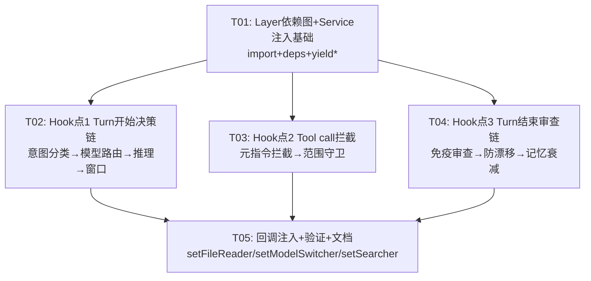

# DeepCode 主流程深接入方案（DEEP_INTEGRATION_PLAN）

> 架构师：高见远（software-architect）
> 日期：2026-07-18
> 基于：REMEDIATION_PLAN.md（上一轮补救）+ 实际代码核查
> 目标：让 14 个 DeepCode 模块在 `llm.ts` 主流程中真正生效（从 TODO 标注 → `yield* Service` 调用）

---

## 一、Layer 依赖图现状

### 1.1 llm.ts 的 Layer 组装机制

`llm.ts` 底部导出 `node`，通过 `makeLocationNode` 将 `layer` + `deps` 打包为 LocationNode：

```typescript
// llm.ts:456-474
export const node = makeLocationNode({
  service: Service,
  layer,
  deps: [
    EventV2.node,
    llmClient,
    AgentV2.node,
    ToolRegistry.node,
    SessionRunnerModel.node,
    SessionStore.node,
    Location.node,
    SystemContextRegistry.node,
    SkillGuidance.node,
    ReferenceGuidance.node,
    Config.node,
    Snapshot.node,
    Database.node,
  ],
})
```

`layer` 定义在 93 行：

```typescript
// llm.ts:93-95
const layer = Layer.effect(
  Service,
  Effect.gen(function* () {
    const events = yield* EventV2.Service       // 96行
    const llm = yield* LLMClient.Service         // 97行
    // ... 共 13 个 yield* Service（96-108行）
    const db = (yield* Database.Service).db      // 108行
```

### 1.2 关键发现：DeepCode node 不在 llm.ts 的依赖图中

**结论：14 个 DeepCode 模块的 node 已注册到 `location-services.ts` 的 `LayerNode.group` 中（100-115行），但不在 `llm.ts` 的 `deps` 数组中。**

这意味着：
- DeepCode 模块的 Service **在 Location 服务图中存在**（编译时会被组装到最终 Layer）
- 但 **不在 `llm.ts` 的 `Layer.effect` 作用域内**（`Effect.gen` 内 `yield*` 获取不到）

### 1.3 LayerNode.compile 的依赖解析机制（为什么 deps 至关重要）

分析 `layer-node.ts` 的 `compile` 函数（250-272行）：

```typescript
export function compile<A, E>(root: Node<A, E, any>, ...): Layer.Layer<A, E> {
  const compileNode = (node: AnyNode) =>
    walk<RuntimeLayer>(node, (node, context) => {
      // 1. 取 node.dependencies（即 deps 数组），递归编译
      const dependencies = node.dependencies.flatMap(flatten).map(context.visit)
      const implementation = node.implementation!
      // 2. 将 deps 编译结果通过 Layer.provide 提供给 implementation
      return dependencies.length === 0
        ? implementation
        : implementation.pipe(Layer.provide(dependencies))
    })

  // 3. 所有 node 编译后，通过 Layer.provideMerge 合并
  const layers = flatten(root).map((node) => compileNode(node))
  const layer = layers.reduce<RuntimeLayer>(
    (result, layer) => layer.pipe(Layer.provideMerge(result)), Layer.empty
  )
  return layer
}
```

**两阶段机制**：
1. **compileNode 阶段**：每个 node 只从自己的 `deps` 数组获取依赖。`llm.ts` 的 layer 只能 `yield*` 到 deps 中声明的 13 个 Service。
2. **provideMerge 阶段**：所有编译后的 layer 按 group 数组顺序合并。`SessionRunnerLLM.node` 在 group 中排第 98 位，DeepCode node 排 100-115 位。provideMerge 按**顺序**累积，先处理的 layer 无法获取后处理 layer 的输出。

**TypeScript 类型保障**：`makeLocationNode` 的 `MakeInput` 类型包含 `CheckDependencies`：

```typescript
type CheckDependencies<Implementation extends Layer.Any, Dependencies extends NodeList> = [
  Missing<Layer.Services<Implementation>, Dependencies>,
] extends [never]
  ? unknown
  : { readonly "Missing dependencies": Missing<Layer.Services<Implementation>, Dependencies> }
```

如果在 `Effect.gen` 中 `yield* DeepCodeIntentRouter.Service` 但 deps 中没有对应 node，**TypeScript 会报 "Missing dependencies" 编译错误**。

### 1.4 结论：深接入的必要条件

要让 DeepCode 模块在 `llm.ts` 主流程中生效，**必须同时修改两处**：

| 修改点 | 位置 | 内容 |
|--------|------|------|
| **deps 数组** | llm.ts:459-473 | 添加需要使用的 DeepCode node |
| **Effect.gen 顶部** | llm.ts:96-108 | 添加 `yield* DeepCodeXxx.Service` 获取实例 |

二者缺一不可：缺 deps → TypeScript 编译失败；缺 yield* → 运行时拿不到 Service 实例。

---

## 二、Service 注入方案

### 2.1 新增 import（llm.ts 顶部）

```typescript
// DeepCode 模块 — 命名空间导入，与现有 AgentV2/ToolRegistry 等风格一致
import * as DeepCodeIntentRouter from "../../deepcode/intent-router/classifier"
import * as DeepCodeModelRouter from "../../deepcode/router/model-router"
import * as DeepCodeReasoningManager from "../../deepcode/reasoning/manager"
import * as DeepCodeWindowManager from "../../deepcode/context-layout/window-manager"
import * as DeepCodeMetaDirectives from "../../deepcode/meta-directives/handlers"
import * as DeepCodeImmuneSystem from "../../deepcode/immune-system/reviewer"
import * as DeepCodeConstraintStore from "../../deepcode/hard-constraint/store"
import * as DeepCodeOKRPlan from "../../deepcode/okr-plan"
import * as DeepCodeReviewAntiDrift from "../../deepcode/review-anti-drift"
import * as DeepCodeScopeCreepGuard from "../../deepcode/scope-creep-guard"
import * as DeepCodeMemoryGranularity from "../../deepcode/memory-granularity"
```

### 2.2 deps 数组扩展（llm.ts:459-473）

```typescript
export const node = makeLocationNode({
  service: Service,
  layer,
  deps: [
    // === 现有 13 个依赖（不变）===
    EventV2.node,
    llmClient,
    AgentV2.node,
    ToolRegistry.node,
    SessionRunnerModel.node,
    SessionStore.node,
    Location.node,
    SystemContextRegistry.node,
    SkillGuidance.node,
    ReferenceGuidance.node,
    Config.node,
    Snapshot.node,
    Database.node,
    // === DeepCode 模块依赖（新增）===
    DeepCodeIntentRouter.node,
    DeepCodeModelRouter.node,
    DeepCodeReasoningManager.node,
    DeepCodeWindowManager.node,
    DeepCodeMetaDirectives.node,
    DeepCodeImmuneSystem.node,
    DeepCodeConstraintStore.node,
    DeepCodeReviewAntiDrift.node,
    DeepCodeScopeCreepGuard.node,
    DeepCodeMemoryGranularity.node,
    // P1 暂缓：DeepCodeOKRPlan.node（需要 Plan tool 配合）
  ],
})
```

**注意**：`DeepCodePrefixNode`、`DeepCodeConstraintContextNode`、`DeepCodeSignalTaggerNode`、`DeepCodeSkillEvolutionNode` 不需要加入 deps——它们已通过 ContextSource 注册机制间接生效，不直接在 runTurnAttempt 中调用。

### 2.3 Effect.gen 顶部 Service 获取（llm.ts:108 之后）

```typescript
// === DeepCode Service 注入（108行 db 之后）===
const intentRouter = yield* DeepCodeIntentRouter.Service
const modelRouter = yield* DeepCodeModelRouter.Service
const reasoningManager = yield* DeepCodeReasoningManager.Service
const windowManager = yield* DeepCodeWindowManager.Service
const metaDirectives = yield* DeepCodeMetaDirectives.Service
const immuneSystem = yield* DeepCodeImmuneSystem.Service
const constraintStore = yield* DeepCodeConstraintStore.Service
const reviewAntiDrift = yield* DeepCodeReviewAntiDrift.Service
const scopeCreepGuard = yield* DeepCodeScopeCreepGuard.Service
const memoryGranularity = yield* DeepCodeMemoryGranularity.Service

// === MetaDirectives 回调注入（一次性，Layer 初始化时设置）===
// need_more_context 需要文件读取能力
metaDirectives.setFileReader((path: string) =>
  Effect.gen(function* () {
    const fs = yield* FileSystem.Service
    return yield* fs.read(path)
  }).pipe(Effect.catchAll(() => Effect.succeed(""))),
)
// request_specialized_model 需要模型切换能力
metaDirectives.setModelSwitcher((tier, _reason) =>
  modelRouter.setOverride(tier),
)
// need_more_context 的 search_terms 需要搜索能力
metaDirectives.setSearcher((terms: string[]) =>
  Effect.gen(function* () {
    const search = yield* FileSystemSearch.Service
    // 简化实现：对每个 term 执行搜索，取 top-3 文件
    const results: Record<string, string> = {}
    for (const term of terms) {
      const files = yield* search.search(term).pipe(Effect.catchAll(() => Effect.succeed([])))
      for (const file of files.slice(0, 3)) {
        const content = yield* metaDirectivesHandleReadFile(file)
        results[file] = content
      }
    }
    return results
  }),
)
```

**注意**：`metaDirectivesHandleReadFile` 是上面的 fileReader 闭包提取版本。实际实现时可将 fileReader 定义为独立变量复用。此外 `FileSystem.Service` 和 `FileSystemSearch.Service` 需要额外加入 deps——但这会扩大依赖图。**替代方案**：回调注入推迟到 T02，先用 Effect.gen 内的闭包捕获已有的 `store`/`db` 来实现简化版 reader。

### 2.4 不需要注入的模块（已通过其他机制生效）

| 模块 | 生效机制 | 是否需要 llm.ts 接入 |
|------|----------|---------------------|
| prefix-context | ContextSource 注册到 SystemContextRegistry | ❌ 已生效 |
| hard-constraint/context-source | ContextSource 注册 | ❌ 已生效 |
| signal-tagger | 通过 prefix-context 间接生效 | ❌ |
| skill-evolution | P2，暂不接入 | ❌ |

---

## 三、3 个 Hook 点深接入代码

### 3.0 Hook 点位置总览

```
runTurnAttempt (llm.ts:173)
  │
  ├─ 199: const model = yield* models.resolve(session)
  │
  ├─ 【Hook 点 1】Turn 开始决策链（原 204 行 TODO）
  │   意图分类 → 模型路由记录 → reasoning_effort → 窗口状态
  │
  ├─ 213-214: entries / context 加载
  ├─ 218-227: request 构建
  │
  ├─ 245-301: Stream.runForEach（provider 事件流）
  │   └─ 256: if (event.type !== "tool-call") return
  │       │
  │       └─ 【Hook 点 2】Tool call 拦截（原 260 行 TODO）
  │           元指令拦截 → 范围守卫检查
  │
  ├─ 342: const stepSettlement = publisher.stepSettlement()
  │
  └─ 【Hook 点 3】Turn 结束审查链（原 346 行 TODO）
      免疫审查 → 防漂移记录 → OKR 评估 → 记忆衰减
```

### 3.1 Hook 点 1：Turn 开始决策链

**位置**：原 204 行 TODO 处，但需调整到 214 行之后（`context` 加载后才能提取用户消息）

**涉及模块**：IntentRouter、ModelRouter、ReasoningManager、WindowManager、ConstraintStore

```typescript
// ============================================================
// DeepCode 深接入 Hook 点 1：Turn 开始决策链
// 位置：context 加载后（214行之后）、request 构建前（218行之前）
// ============================================================
const entries = yield* SessionHistory.entriesForRunner(db, session.id, system.baselineSeq)
const context = entries.map((entry) => entry.message)

// --- 1a. 意图分类 ---
// 从 context 中提取最后一条用户消息
const lastUserEntry = [...entries].reverse().find(
  (e) => e.message.type === "user"
)
const userMessageText = lastUserEntry
  ? extractMessageText(lastUserEntry.message)
  : ""

// 提取约束（从用户消息中提取硬约束，存入 ConstraintStore）
if (userMessageText.length > 0) {
  yield* constraintStore.extractAndAdd(userMessageText).pipe(
    Effect.catchAll(() => Effect.void),  // 约束提取失败不阻断主流程
  )
}

// 意图分类（Code-based 快速规则，零 LLM 成本）
const intentResult = yield* intentRouter.classify(userMessageText).pipe(
    Effect.catchAll(() =>
      Effect.succeed({
        intent: "medium" as const,
        confidence: 0.3,
        reason: "Classification failed, defaulting to medium",
      }),
    ),
  )
yield* intentRouter.setCurrent(intentResult)
const strategy = intentRouter.getStrategy(intentResult.intent)

// --- 1b. 模型路由记录 ---
// 注意：model 已在 199 行 resolve，此处仅记录决策，不改变当前轮模型。
// 模型切换通过 setOverride 影响下一轮的 resolve。
const tier = yield* modelRouter.decide({
    turn: currentStep,
    intent: intentResult.intent,
    isCheckpoint: strategy.checkpointFrequency === "high" && currentStep > 1,
    isPlanning: intentResult.intent === "architecture",
  }).pipe(
    Effect.catchAll(() => Effect.succeed("flash" as const)),
  )

// --- 1c. reasoning_effort 设置 ---
const reasoningEffort = yield* reasoningManager.getEffort(
    intentResult.intent,
    tier,
  ).pipe(
    Effect.catchAll(() => Effect.succeed("low" as const)),
  )

// --- 1d. 窗口状态查询 ---
const windowStatus = yield* windowManager.getWindowStatus(tier).pipe(
    Effect.catchAll(() =>
      Effect.succeed({
        snapshot: { prefixTokens: 0, anchorTokens: 0, activeTokens: 0, compressedTokens: 0, tailTokens: 0, totalTokens: 0 },
        tier,
        activeOverflow: false,
        compressionNeeded: false,
        recommendedMaxOutputTokens: 4096,  // 安全默认值
        criticalInWindow: true,
        budget: tier === "flash"
          ? { anchorMaxTokens: 128, activeMaxTokens: 256, compressedSoftLimit: 512, outputReserveTokens: 64 }
          : { anchorMaxTokens: 256, activeMaxTokens: 640, compressedSoftLimit: 1024, outputReserveTokens: 128 },
      }),
    ),
  )

// --- 1e. 将 reasoning_effort 注入 request ---
// 原 218-227 行的 request 构建修改为：
const promptCacheKey = /^ses_[0-9a-f]{64}$/.test(session.id) ? session.id.slice(4) : session.id
const request = LLM.request({
  model,
  providerOptions: {
    openai: {
      promptCacheKey,
      // DeepSeek V4 thinking mode：reasoning_effort 控制推理深度
      // 注意：实际 provider option key 需确认 DeepSeek API 文档
      ...(reasoningEffort !== "none" ? { reasoning_effort: reasoningEffort } : {}),
    },
  },
  system: [agent.info?.system, system.baseline]
    .filter((part): part is string => part !== undefined && part.length > 0)
    .map(SystemPart.make),
  messages: [...toLLMMessages(context, model), ...(isLastStep ? [Message.assistant(MAX_STEPS_PROMPT)] : [])],
  tools: toolMaterialization?.definitions ?? [],
  toolChoice: isLastStep ? "none" : undefined,
  // 窗口管理器建议的输出限制（如果窗口溢出则限制输出）
  ...(windowStatus.activeOverflow && windowStatus.recommendedMaxOutputTokens > 0
    ? { maxOutputTokens: windowStatus.recommendedMaxOutputTokens }
    : {}),
})
```

**参数来源说明**：

| 调用 | 参数 | 来源 |
|------|------|------|
| `constraintStore.extractAndAdd` | `userMessageText` | 从 `entries` 反向查找最后一条 `type === "user"` 的消息 |
| `intentRouter.classify` | `userMessageText` | 同上 |
| `modelRouter.decide` | `turn: currentStep` | runTurnAttempt 参数 `step` |
| `modelRouter.decide` | `intent: intentResult.intent` | 上一步 classify 返回值 |
| `reasoningManager.getEffort` | `intent, tier` | classify + decide 返回值 |
| `windowManager.getWindowStatus` | `tier` | decide 返回值 |

**返回值使用**：

| 返回值 | 用途 |
|--------|------|
| `intentResult` | 调用 `setCurrent` 存储；传给后续 Hook 点 3 的审查逻辑 |
| `tier` | 传给 `getEffort` 和 `getWindowStatus`；记录路由历史 |
| `reasoningEffort` | 注入 `request.providerOptions.openai.reasoning_effort` |
| `windowStatus.recommendedMaxOutputTokens` | 注入 `request.maxOutputTokens`（仅溢出时） |

**错误兜底**：每个 `yield*` 都包裹 `Effect.catchAll`，失败时返回安全默认值，**不阻断主流程**。

### 3.2 Hook 点 2：Tool call 拦截

**位置**：原 260 行 TODO 处（`Stream.runForEach` 内，`event.type === "tool-call"` 之后）

**涉及模块**：MetaDirectives、ScopeCreepGuard

```typescript
// ============================================================
// DeepCode 深接入 Hook 点 2：Tool call 拦截
// 位置：Stream.runForEach 内，event.type === "tool-call" 之后
// ============================================================
yield* publish(event)
if (event.type !== "tool-call" || event.providerExecuted) return

// --- 2a. 元指令拦截 ---
// 检查是否为 DeepCode 元指令工具调用
const META_DIRECTIVE_TYPES = [
  "need_more_context",
  "request_specialized_model",
  "request_flash_model",
  "trigger_self_review",
  "propose_skill",
] as const

const isMetaDirective = META_DIRECTIVE_TYPES.includes(
  event.name as (typeof META_DIRECTIVE_TYPES)[number],
)

if (isMetaDirective) {
  // 构造 MetaDirective 并交给处理器
  const directive = {
    type: event.name as DeepCodeMetaDirectives.MetaDirectiveType,
    params: (event.input ?? {}) as Record<string, unknown>,
  }
  const directiveResponse = yield* metaDirectives.handle(directive).pipe(
    Effect.catchAll((err) =>
      Effect.succeed({
        type: directive.type,
        success: false,
        message: `Directive handling failed: ${err instanceof Error ? err.message : String(err)}`,
      }),
    ),
  )

  // 将处理结果作为 tool_result 发布，跳过正常工具执行
  yield* withPublication(
    publisher.publish(
      LLMEvent.toolResult({
        id: event.id,
        name: event.name,
        result: { success: directiveResponse.success },
        output: directiveResponse.message,
      }),
    ),
  )
  return  // 跳过后续的正常工具执行
}

// --- 2b. 范围守卫检查 ---
// 仅对写操作工具进行检查（read/glob/grep 等读操作跳过）
const WRITE_TOOLS = ["write", "edit", "apply_patch", "bash"]
if (WRITE_TOOLS.includes(event.name)) {
  // 从 tool call 参数中提取文件路径
  const toolInput = (event.input ?? {}) as Record<string, unknown>
  const filePath = (toolInput.filePath as string) 
    ?? (toolInput.path as string) 
    ?? (toolInput.file_path as string) 
    ?? ""

  if (filePath.length > 0) {
    const accessResult = yield* scopeCreepGuard.checkToolAccess(
      event.name,
      filePath,
    ).pipe(
      Effect.catchAll(() =>
        Effect.succeed({
          allowed: true,
          reason: "Scope check failed, allowing by default",
        }),
      ),
    )

    if (!accessResult.allowed) {
      // 阻止工具执行，返回拒绝原因作为 tool_result
      yield* withPublication(
        publisher.publish(
          LLMEvent.toolResult({
            id: event.id,
            name: event.name,
            result: { success: false, denied: true },
            output: `Access denied by ScopeCreepGuard: ${accessResult.reason ?? "out of scope"}. ${accessResult.needsApproval ? "User approval required." : ""}`,
          }),
        ),
      )
      return  // 跳过工具执行
    }
  }
}

// --- 正常工具执行流程（原 270 行之后的代码不变）---
if (!toolMaterialization) {
  yield* withPublication(publisher.failUnsettledTools("Tools are disabled after the maximum agent steps"))
  return
}
needsContinuation = true
// ... 原有 toolMaterialization.settle 逻辑 ...
```

**参数来源说明**：

| 调用 | 参数 | 来源 |
|------|------|------|
| `metaDirectives.handle` | `directive.type` | `event.name`（LLM 调用的工具名） |
| `metaDirectives.handle` | `directive.params` | `event.input`（LLM 调用的工具参数） |
| `scopeCreepGuard.checkToolAccess` | `toolName` | `event.name` |
| `scopeCreepGuard.checkToolAccess` | `filePath` | `event.input.filePath` / `.path` / `.file_path` |

**返回值使用**：

| 返回值 | 用途 |
|--------|------|
| `directiveResponse` | 作为 `LLMEvent.toolResult` 发布，跳过正常工具执行 |
| `accessResult.allowed` | false 时阻止工具执行，返回拒绝原因 |

**错误兜底**：元指令处理失败 → 返回失败响应（不阻断）；范围检查失败 → 默认允许（安全降级）。

### 3.3 Hook 点 3：Turn 结束审查链

**位置**：原 346 行 TODO 处（`stepSettlement` 之后，`SessionEvent.Step.Ended` 发布之前或之后）

**涉及模块**：ImmuneSystem、ReviewAntiDrift、MemoryGranularity（OKRPlan 为 P1 暂缓）

```typescript
// ============================================================
// DeepCode 深接入 Hook 点 3：Turn 结束审查链
// 位置：stepSettlement 获取后（342行），Step.Ended 发布前后
// ============================================================
const stepSettlement = publisher.stepSettlement()

if (stepSettlement && !publisher.hasProviderError()) {
  const endSnapshot = yield* snapshots.capture()
  const files =
    startSnapshot && endSnapshot
      ? yield* snapshots
          .files({ from: startSnapshot, to: endSnapshot })
          .pipe(Effect.catch(() => Effect.succeed(undefined)))
      : undefined

  // --- 3a. 免疫系统审查 ---
  // 从 ConstraintStore 获取当前硬约束列表
  const constraints = yield* constraintStore.getAll().pipe(
    Effect.catchAll(() => Effect.succeed([])),
  )

  // 从 files diff 提取产出物描述
  const artifacts: string[] = []
  if (files) {
    for (const file of files) {
      artifacts.push(`Modified: ${file.path}`)
    }
  }

  // 执行 Checkpoint 审查（仅在有意图且策略要求审查时）
  const shouldReview = strategy?.reviewStrictness !== "none" && constraints.length > 0
  if (shouldReview) {
    const reviewResult = yield* immuneSystem
      .reviewCheckpoint(
        `step-${currentStep}`,
        constraints,
        artifacts,
      )
      .pipe(
        Effect.catchAll(() =>
          Effect.succeed({
            checkpointId: `step-${currentStep}`,
            timestamp: Date.now(),
            violations: [],
            suggestedSkills: [],
            passed: true,
          }),
        ),
      )

    // 如果发现违规，记录日志（不阻断流程）
    if (!reviewResult.passed) {
      yield* Effect.logWarning("DeepCode ImmuneSystem detected violations", {
        checkpointId: reviewResult.checkpointId,
        violationCount: reviewResult.violations.length,
        violations: reviewResult.violations.map((v) => v.violationDescription),
      })
    }
  }

  // --- 3b. 防漂移记录 ---
  const antiDriftResult = yield* reviewAntiDrift
    .recordToolCall(constraints.length)
    .pipe(
      Effect.catchAll(() =>
        Effect.succeed({
          shouldReview: false,
          tier: 0 as DeepCodeReviewAntiDrift.ReviewTier,
        }),
      ),
    )

  // 如果防漂移建议立即审查，记录日志
  if (antiDriftResult.shouldReview) {
    yield* Effect.logInfo("DeepCode AntiDrift suggests review", {
      tier: antiDriftResult.tier,
      step: currentStep,
    })
  }

  // --- 3c. 记忆衰减 ---
  yield* memoryGranularity.endStep().pipe(
    Effect.catchAll(() => Effect.void),
  )

  // --- 原 Step.Ended 事件发布（不变）---
  yield* withPublication(
    events.publish(SessionEvent.Step.Ended, {
      sessionID: session.id,
      timestamp: yield* DateTime.now,
      assistantMessageID: yield* publisher.startAssistant(),
      finish: stepSettlement.finish,
      cost: 0,
      tokens: stepSettlement.tokens,
      snapshot: endSnapshot,
      files,
    }),
  )
}

// --- P1 暂缓：OKR 评估 ---
// if (okrPlan) {
//   const krResults = yield* okrPlan.evaluateKRs([]).pipe(Effect.catchAll(() => Effect.succeed({ allMet: false, metCount: 0 })))
// }
```

**参数来源说明**：

| 调用 | 参数 | 来源 |
|------|------|------|
| `constraintStore.getAll` | 无 | 返回当前所有硬约束 |
| `immuneSystem.reviewCheckpoint` | `checkpointId` | `step-${currentStep}` |
| `immuneSystem.reviewCheckpoint` | `constraints` | `constraintStore.getAll()` 返回值 |
| `immuneSystem.reviewCheckpoint` | `artifacts` | 从 `snapshots.files()` diff 提取 |
| `reviewAntiDrift.recordToolCall` | `constraintCount` | `constraints.length` |
| `memoryGranularity.endStep` | 无 | 无参数 |

**返回值使用**：

| 返回值 | 用途 |
|--------|------|
| `reviewResult.passed` | false 时记录 warning 日志（不阻断） |
| `reviewResult.suggestedSkills` | 记录日志，后续可外挂到执行流 |
| `antiDriftResult.shouldReview` | true 时记录 info 日志 |
| `memoryGranularity.endStep()` | 返回 promoted/expired 计数，仅日志 |

**错误兜底**：所有 `yield*` 包裹 `Effect.catchAll`，失败时返回安全默认值或 `Effect.void`，**绝不阻断主流程**。

---

## 四、风险评估

### 4.1 最危险的 3 个点

| 危险等级 | 风险点 | 影响 | 缓解措施 |
|----------|--------|------|----------|
| 🔴 高 | **Hook 点 2 改变工具执行流程** | 元指令拦截和范围守卫可能阻止正常工具调用，导致 Agent 无法执行任务 | 每个 `yield*` 包裹 `catchAll`；范围检查失败时默认允许；元指令匹配用精确白名单而非正则 |
| 🟡 中 | **reasoning_effort 注入 request** | 如果 DeepSeek API 不认 `reasoning_effort` 参数，可能导致 API 报错或忽略 | 先验证 DeepSeek V4 API 的 provider option key；失败时 `catchAll` 回退到不设置 |
| 🟡 中 | **Layer 依赖图循环** | 添加 deps 可能引入循环依赖（如果 DeepCode 模块反向依赖 SessionRunner） | 检查所有 DeepCode 模块的 deps——当前全部为 `deps: []`，无循环风险 |

### 4.2 安全测试策略（三步验证）

```
Step 1: TypeScript 编译验证
  └─ cd packages/core && bun typecheck
     └─ 通过 → 继续
     └─ 失败 → 检查 Missing dependencies 错误，补全 deps

Step 2: 现有测试验证
  └─ cd packages/core && bun test
     └─ 通过 → 继续
     └─ 失败 → 检查是否 DeepCode 调用破坏了现有行为

Step 3: 手动验证（端到端）
  └─ 启动 opencode，发送简单消息（如"排序 import"）
     └─ 验证：1) 不报错 2) 正常回复 3) 日志中能看到 DeepCode 模块调用
  └─ 发送复杂消息（如"重构支付模块"）
     └─ 验证：1) 意图分类为 refactor 2) 模型路由记录 3) 工具调用正常
```

### 4.3 回滚策略

每个 Hook 点的 DeepCode 代码用 `Effect.catchAll` 包裹，任何异常都会被吞掉并返回安全默认值。如果出现问题：
- **快速回滚**：将 Hook 点代码注释掉，恢复原流程
- **选择性禁用**：通过 Config 开关控制每个 Hook 点的启用/禁用（P2 增强）

---

## 五、任务列表（按实现顺序）

### 概览

| 任务 | 名称 | 优先级 | 依赖 | 文件数 |
|------|------|--------|------|--------|
| T01 | Layer 依赖图 + Service 注入基础 | P0 | 无 | 3 |
| T02 | Hook 点 1 深接入 — Turn 开始决策链 | P0 | T01 | 5 |
| T03 | Hook 点 2 深接入 — Tool call 拦截 | P0 | T01 | 3 |
| T04 | Hook 点 3 深接入 — Turn 结束审查链 | P0 | T01 | 5 |
| T05 | MetaDirectives 回调注入 + 验证 + 文档 | P1 | T01-T04 | 4 |

### T01: Layer 依赖图 + Service 注入基础

**操作描述**：
1. 在 `llm.ts` 顶部添加 11 个 DeepCode 模块的 `import * as` 声明
2. 在 `Effect.gen` 顶部（108 行 `db` 之后）添加 11 个 `yield* DeepCodeXxx.Service`
3. 在 `node` 的 `deps` 数组中添加 10 个 DeepCode node（不含 OKRPlan）
4. 运行 `bun typecheck` 验证无 "Missing dependencies" 错误
5. **此阶段不添加任何 Hook 点调用代码**——仅验证 Service 能被正确获取

**涉及文件**：
- `packages/core/src/session/runner/llm.ts`（import + deps + yield*）
- `packages/core/src/deepcode/index.ts`（确认 node 导出完整，可能需补充 Service re-export）
- `packages/core/src/location-services.ts`（确认 DeepCode node 已在 group 中——预期无需修改）

**验证标准**：
- `cd packages/core && bun typecheck` 通过
- `grep 'DeepCodeIntentRouter\|DeepCodeModelRouter\|DeepCodeReasoningManager' packages/core/src/session/runner/llm.ts` 有结果
- `grep 'DeepCodeIntentRouter.node' packages/core/src/session/runner/llm.ts` 有结果

**依赖前置任务**：无
**优先级**：P0

---

### T02: Hook 点 1 深接入 — Turn 开始决策链

**操作描述**：
1. 在 `llm.ts` 的 `entries`/`context` 加载后（214 行之后）、`request` 构建前（218 行之前）插入 Hook 点 1 代码
2. 实现 `extractMessageText` 辅助函数（从 session message 提取文本）
3. 调用 `constraintStore.extractAndAdd` → `intentRouter.classify` → `modelRouter.decide` → `reasoningManager.getEffort` → `windowManager.getWindowStatus`
4. 将 `reasoningEffort` 注入 `request.providerOptions`
5. 将 `windowStatus.recommendedMaxOutputTokens` 注入 `request`（仅溢出时）
6. 每个 `yield*` 包裹 `Effect.catchAll`

**涉及文件**：
- `packages/core/src/session/runner/llm.ts`（Hook 点 1 代码）
- `packages/core/src/deepcode/intent-router/classifier.ts`（确认 classify 签名匹配）
- `packages/core/src/deepcode/router/model-router.ts`（确认 decide 签名匹配）
- `packages/core/src/deepcode/reasoning/manager.ts`（确认 getEffort 签名匹配）
- `packages/core/src/deepcode/context-layout/window-manager.ts`（确认 getWindowStatus 签名匹配）

**验证标准**：
- `cd packages/core && bun typecheck` 通过
- `grep 'intentRouter.classify\|modelRouter.decide\|reasoningManager.getEffort' packages/core/src/session/runner/llm.ts` 有结果
- `grep 'reasoning_effort' packages/core/src/session/runner/llm.ts` 有结果
- 手动发送 "排序 import" 消息，日志中能看到 `DeepCodeIntentRouter.classify` 调用

**依赖前置任务**：T01
**优先级**：P0

---

### T03: Hook 点 2 深接入 — Tool call 拦截

**操作描述**：
1. 在 `llm.ts` 的 `Stream.runForEach` 内（260 行 TODO 处）、`event.type === "tool-call"` 检查后插入 Hook 点 2 代码
2. 实现元指令拦截：检查 `event.name` 是否为 5 种元指令之一，如果是则调用 `metaDirectives.handle()` 并将结果作为 `toolResult` 发布
3. 实现范围守卫：对写操作工具调用 `scopeCreepGuard.checkToolAccess()`，不允许时返回拒绝原因
4. 元指令和范围守卫的 `yield*` 包裹 `Effect.catchAll`
5. 确保 `return` 语句正确跳过正常工具执行

**涉及文件**：
- `packages/core/src/session/runner/llm.ts`（Hook 点 2 代码）
- `packages/core/src/deepcode/meta-directives/handlers.ts`（确认 handle 签名 + MetaDirectiveType 导出）
- `packages/core/src/deepcode/scope-creep-guard.ts`（确认 checkToolAccess 签名 + ToolAccessResult 导出）

**验证标准**：
- `cd packages/core && bun typecheck` 通过
- `grep 'metaDirectives.handle\|scopeCreepGuard.checkToolAccess' packages/core/src/session/runner/llm.ts` 有结果
- `grep 'META_DIRECTIVE_TYPES' packages/core/src/session/runner/llm.ts` 有结果
- 手动发送 "读取 package.json" 消息，验证读操作不被拦截
- 手动发送 "写一个测试文件" 消息，验证写操作正常执行（范围守卫默认允许）

**依赖前置任务**：T01
**优先级**：P0

---

### T04: Hook 点 3 深接入 — Turn 结束审查链

**操作描述**：
1. 在 `llm.ts` 的 `stepSettlement` 之后（346 行 TODO 处）、`SessionEvent.Step.Ended` 发布之前插入 Hook 点 3 代码
2. 调用 `constraintStore.getAll()` 获取约束列表
3. 从 `snapshots.files()` diff 提取产出物描述
4. 调用 `immuneSystem.reviewCheckpoint()` 审查（仅当策略要求且约束非空时）
5. 调用 `reviewAntiDrift.recordToolCall()` 记录
6. 调用 `memoryGranularity.endStep()` 衰减
7. 所有 `yield*` 包裹 `Effect.catchAll`，审查失败不阻断 Step.Ended 发布

**涉及文件**：
- `packages/core/src/session/runner/llm.ts`（Hook 点 3 代码）
- `packages/core/src/deepcode/immune-system/reviewer.ts`（确认 reviewCheckpoint 签名）
- `packages/core/src/deepcode/hard-constraint/store.ts`（确认 getAll 签名）
- `packages/core/src/deepcode/review-anti-drift.ts`（确认 recordToolCall 签名）
- `packages/core/src/deepcode/memory-granularity.ts`（确认 endStep 签名）

**验证标准**：
- `cd packages/core && bun typecheck` 通过
- `grep 'immuneSystem.reviewCheckpoint\|reviewAntiDrift.recordToolCall\|memoryGranularity.endStep' packages/core/src/session/runner/llm.ts` 有结果
- 手动发送 "不要修改 config 文件，然后添加一个 util 函数" 消息，验证约束被提取并在 Turn 结束时审查

**依赖前置任务**：T01
**优先级**：P0

---

### T05: MetaDirectives 回调注入 + 验证 + 文档

**操作描述**：
1. 在 `llm.ts` 的 `Effect.gen` 顶部（Service 获取之后）注入 MetaDirectives 回调：
   - `setFileReader`：使用 `FileSystem.Service` 或简化版 `store` 读取
   - `setModelSwitcher`：调用 `modelRouter.setOverride(tier)`
   - `setSearcher`：使用 `FileSystemSearch.Service` 搜索
2. 注意：`FileSystem` 和 `FileSystemSearch` 需要加入 deps（或通过闭包间接获取）
3. 端到端验证：启动 opencode，执行完整对话流程
4. 更新 `docs/checklist-phase32.md` 标注深接入完成状态

**涉及文件**：
- `packages/core/src/session/runner/llm.ts`（回调注入代码 + deps 扩展）
- `packages/core/src/deepcode/meta-directives/handlers.ts`（确认 setFileReader/setModelSwitcher/setSearcher 签名）
- `packages/core/src/effect/app-node.ts`（如需理解 FileSystem node 导出）
- `docs/checklist-phase32.md`（更新状态）

**验证标准**：
- `cd packages/core && bun typecheck` 通过
- `grep 'setFileReader\|setModelSwitcher\|setSearcher' packages/core/src/session/runner/llm.ts` 有结果
- 端到端：LLM 调用 `need_more_context` 元指令时，能正确读取文件并返回
- 端到端：LLM 调用 `request_specialized_model` 时，modelRouter override 被设置

**依赖前置任务**：T01, T02, T03, T04
**优先级**：P1

---

### 任务依赖图



**并行机会**：T02、T03、T04 均只依赖 T01，可并行开发（但都修改 llm.ts，需注意合并冲突）。

---

## 六、验证标准

### 6.1 编译验证

```bash
cd /Volumes/Doc/Code/deepcode/packages/core && bun typecheck
```

预期：无 "Missing dependencies" 错误，无类型错误。

### 6.2 单元测试验证

```bash
cd /Volumes/Doc/Code/deepcode/packages/core && bun test
```

预期：现有测试全部通过（DeepCode 调用不应破坏现有行为）。

### 6.3 手动验证步骤

| 步骤 | 操作 | 预期结果 |
|------|------|----------|
| 1 | 启动 opencode | 正常启动，无 Layer 构建错误 |
| 2 | 发送 "排序 import" | 意图分类为 simple，正常回复 |
| 3 | 发送 "重构支付模块" | 意图分类为 refactor，模型路由记录 Pro |
| 4 | 发送 "读取 package.json" | 读操作不被范围守卫拦截 |
| 5 | 发送 "不要修改 config 文件" | 硬约束被提取，Turn 结束时免疫审查运行 |
| 6 | 观察 LLM 调用元指令 | 元指令被拦截并处理（如有） |
| 7 | 多轮对话 | 记忆衰减正常，无累积错误 |

### 6.4 日志验证

在 opencode 日志中搜索以下关键词确认 DeepCode 模块被调用：

```bash
# 意图分类
grep "DeepCodeIntentRouter.classify" <log-file>
# 模型路由
grep "DeepCodeModelRouter.decide" <log-file>
# 免疫审查
grep "DeepCode ImmuneSystem" <log-file>
# 防漂移
grep "DeepCode AntiDrift" <log-file>
```

---

## 七、待明确事项

### 7.1 reasoning_effort 的 provider option key（需确认）

**问题**：Hook 点 1 将 `reasoning_effort` 注入 `request.providerOptions.openai`。但 DeepSeek V4 使用 `@ai-sdk/openai-compatible` API，实际的 provider option key 可能不是 `reasoning_effort`（OpenAI o1 的 key），可能是 `thinking` 或其他。

**建议**：工程师在实现 T02 时查阅 DeepSeek V4 API 文档，确认 thinking mode 的参数名。如果无法确认，先注释掉该行，不影响其他 Hook 点。

### 7.2 extractMessageText 的消息类型适配（需确认）

**问题**：从 `entries` 中提取用户消息文本时，需要知道 session message 的具体类型结构。`entries` 的 `message` 属性类型取决于 `SessionHistory.entriesForRunner` 的返回类型。

**建议**：工程师在实现 T02 时检查 `entries[0].message` 的实际类型。如果是 `{ type: "user", content: string }` 则直接取 `content`；如果 `content` 是数组（如 `Array<{ type: "text", text: string }>`），需要遍历提取文本。

### 7.3 MetaDirectives 回调的 FileSystem 依赖（需确认）

**问题**：T05 的 `setFileReader` 和 `setSearcher` 回调需要 `FileSystem.Service` 和 `FileSystemSearch.Service`。这两个 Service 是否在 llm.ts 的 deps 中？如果不在，需要添加 `FileSystem.node` 和 `FileSystemSearch.node` 到 deps。

**建议**：工程师在实现 T05 时检查 `location-services.ts` 中 `FileSystem.node` 和 `FileSystemSearch.node` 的导出名，添加到 llm.ts 的 deps 中。或者使用更简单的方案：通过 `db` + `store` 实现简化版文件读取（避免扩大依赖图）。

### 7.4 modelRouter.decide 的实际影响（需主理人决策）

**问题**：`modelRouter.decide()` 返回 `tier`，但 model 在 199 行已 resolve。当前轮的模型无法改变。`decide()` 的返回值仅用于：
1. 记录路由历史
2. 传给 `getEffort()` 和 `getWindowStatus()`
3. 通过 `setOverride()` 影响下一轮

**问题**：是否需要实现真正的模型切换？即当 `decide()` 返回 "pro" 但当前 model 是 flash 时，是否应该中断当前轮并重新 resolve model？

**建议**：第一阶段不实现真正的模型切换（风险太高）。仅记录决策，通过 `setOverride` 影响下一轮。模型切换作为 P2 增强。

### 7.5 OKR Plan 的接入时机（需主理人决策）

**问题**：OKR Plan 需要 Plan tool 配合（`createPlan` 在意图路由后调用，`advanceToNext` 在 TodoWrite 完成后调用）。当前 OpenCode 没有 Plan tool，OKR Plan 的 `createPlan`/`updateStep`/`advanceToNext` 无从触发。

**建议**：OKR Plan 暂不接入主流程（P1）。`evaluateKRs` 在 Hook 点 3 调用，但由于没有 Plan 数据，返回空结果。等 Plan tool 实现后再完整接入。

### 7.6 并行开发的合并策略（需确认）

**问题**：T02、T03、T04 都修改 `llm.ts`，如果并行开发会有合并冲突。

**建议**：串行实现 T02 → T03 → T04（每个完成后合并再开始下一个），或使用 feature branch + rebase 策略。

---

## 附录 A：DeepCode 模块接入状态总览

| # | 模块 | node 导出名 | Service 名 | 接入 Hook 点 | 接入优先级 |
|---|------|------------|-----------|-------------|-----------|
| 1 | prefix-context | DeepCodePrefixNode | — | 已通过 ContextSource 生效 | ✅ 已接入 |
| 2 | hard-constraint/store | DeepCodeConstraintStoreNode | DeepCodeConstraintStore.Service | Hook 1 + Hook 3 | P0 |
| 3 | hard-constraint/context-source | DeepCodeConstraintContextNode | — | 已通过 ContextSource 生效 | ✅ 已接入 |
| 4 | router/model-router | DeepCodeModelRouterNode | DeepCodeModelRouter.Service | Hook 1 | P0 |
| 5 | reasoning/manager | DeepCodeReasoningManagerNode | DeepCodeReasoningManager.Service | Hook 1 | P0 |
| 6 | intent-router/classifier | DeepCodeIntentRouterNode | DeepCodeIntentRouter.Service | Hook 1 | P0 |
| 7 | immune-system/reviewer | DeepCodeImmuneSystemNode | DeepCodeImmuneSystem.Service | Hook 3 | P0 |
| 8 | meta-directives/handlers | DeepCodeMetaDirectivesNode | DeepCodeMetaDirectives.Service | Hook 2 | P0 |
| 9 | context-layout/window-manager | DeepCodeWindowManagerNode | DeepCodeWindowManager.Service | Hook 1 | P0 |
| 10 | prompt-signal/tagger | DeepCodeSignalTaggerNode | — | 通过 prefix 间接生效 | ✅ 已接入 |
| 11 | okr-plan | DeepCodeOKRPlanNode | DeepCodeOKRPlan.Service | Hook 3（暂缓） | P1 |
| 12 | review-anti-drift | DeepCodeReviewAntiDriftNode | DeepCodeReviewAntiDrift.Service | Hook 3 | P0 |
| 13 | scope-creep-guard | DeepCodeScopeCreepGuardNode | DeepCodeScopeCreepGuard.Service | Hook 2 | P0 |
| 14 | skill-evolution | DeepCodeSkillEvolutionNode | — | P2 暂不接入 | P2 |
| 15 | memory-granularity | DeepCodeMemoryGranularityNode | DeepCodeMemoryGranularity.Service | Hook 3 | P0 |

**统计**：
- 已接入（ContextSource）：3 个
- P0 深接入：9 个（T01-T04 覆盖）
- P1 暂缓：1 个（OKR Plan，需 Plan tool）
- P2 暂缓：1 个（Skill Evolution）
- 不需要 llm.ts 接入：4 个（prefix/context-source/signal-tagger/skill-evolution）

---

## 附录 B：extractMessageText 辅助函数（参考实现）

```typescript
/**
 * 从 session message 提取纯文本
 *
 * Session message 的 content 可能是：
 * - string：直接返回
 * - Array<{ type: "text", text: string }>：拼接所有 text
 * - 其他类型：JSON.stringify 作为 fallback
 */
function extractMessageText(message: { type: string; content: unknown }): string {
  const content = message.content
  if (typeof content === "string") return content
  if (Array.isArray(content)) {
    return content
      .filter((part: any) => part?.type === "text" && typeof part.text === "string")
      .map((part: any) => part.text)
      .join("\n")
  }
  try {
    return JSON.stringify(content)
  } catch {
    return ""
  }
}
```

---

*文档状态：架构设计完成，等待主理人确认后交付工程师执行。*
