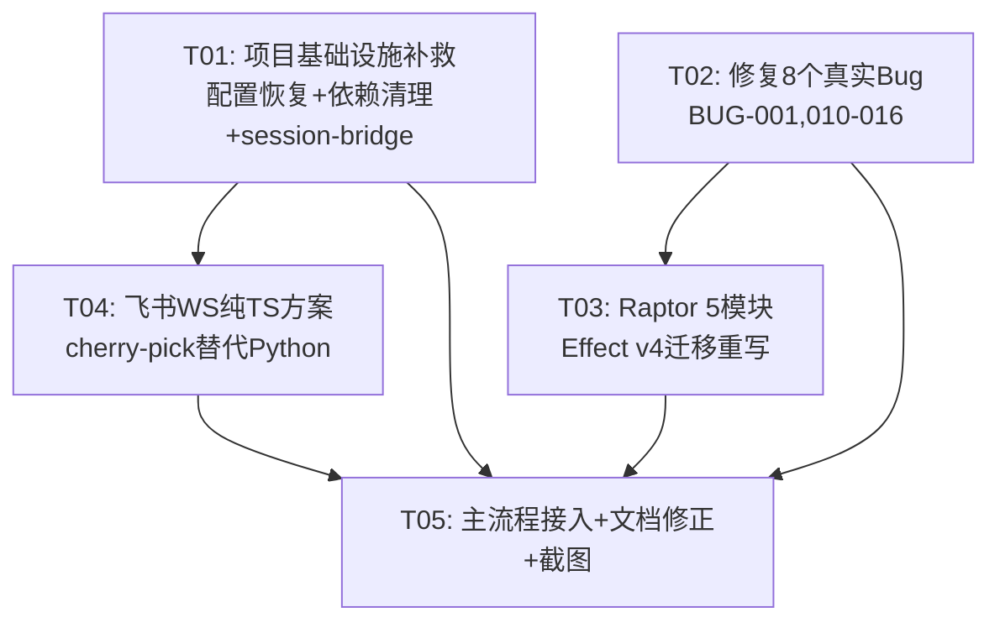

# DeepCode 项目补救方案（REMEDIATION_PLAN）

> 架构师：高见远
> 日期：2026-07-17
> 基于审查报告 DEEPCODE_AUDIT_REPORT.md 和实际代码核查产出
> 主理人已决策补救范围，本文件做增量设计 + 任务分解

---

## 一、实现方案

### 1.1 P0-1：修复 8 个真实 Bug

8 个 Bug 全部在 `packages/core/src/deepcode/` 下已整合的 Saber 模块中。以下是逐个修复方案：

#### BUG-001 P1: require("effect") 应改顶部 import

**文件**: `packages/core/src/deepcode/hard-constraint/context-source.ts:113`

**问题**: `makeStringCodec()` 函数内用 `require("effect")` 动态加载 Schema，应改为顶部静态 import。

**修复方案**:
- 在文件顶部 `import { Effect, Layer } from "effect"` 改为 `import { Effect, Layer, Schema } from "effect"`
- 删除 `makeStringCodec()` 函数内的 `const { Schema } = require("effect")`
- 直接使用顶部 import 的 `Schema`

**验证**: `grep -n 'require(' packages/core/src/deepcode/hard-constraint/context-source.ts` 应无结果

#### BUG-010 P2: trigger_self_review 的 focus/depth 参数未使用

**文件**: `packages/core/src/deepcode/meta-directives/handlers.ts:248-256`

**问题**: `TriggerReviewParams` 定义了 `focus` 和 `depth` 字段，但 `trigger_self_review` case 只返回固定消息，未解析和使用这两个参数。

**修复方案**:
- 在 `trigger_self_review` case 中解析 `directive.params as unknown as TriggerReviewParams`
- 将 `focus` 和 `depth` 传递给消息内容：`Self-review triggered (focus: ${params.focus ?? 'general'}, depth: ${params.depth ?? 'quick'}). Review will run at next checkpoint.`
- 如果 `depth === "thorough"`，在 data 中标记 `priority: "high"` 供免疫系统优先处理

**验证**: `grep -A5 'trigger_self_review' packages/core/src/deepcode/meta-directives/handlers.ts` 能看到 params 解析和使用

#### BUG-011 P3: propose_skill 无持久化

**文件**: `packages/core/src/deepcode/meta-directives/handlers.ts:261-270`

**问题**: `propose_skill` 只有 TODO 占位，Skill 提议未持久化到任何存储。

**修复方案**:
- 新增 `Ref.make<ProposeSkillParams[]>([])` 存储待确认的 Skill 提议
- 在 `propose_skill` case 中将 params 追加到 Ref
- 返回消息中包含待确认 Skill 总数：`Skill '${params.name}' proposed (pending: ${count}). Requires user confirmation before activation.`
- 在 Interface 中新增 `getPendingSkills()` 方法供上层查询

**验证**: `grep 'getPendingSkills\|pendingSkills' packages/core/src/deepcode/meta-directives/handlers.ts` 有结果

#### BUG-012 P2: need_more_context 的 search_terms 未实现搜索

**文件**: `packages/core/src/deepcode/meta-directives/handlers.ts:180-207`

**问题**: `NeedMoreContextParams` 有 `search_terms` 字段，但 handler 只读取 `files`，完全忽略了 `search_terms`，返回时原样传回。

**修复方案**:
- 新增 `setSearcher` 回调注入（类似 `setFileReader` 模式），签名为 `(terms: string[]) => Effect.Effect<Record<string, string>>`
- 在 `need_more_context` case 中，如果有 `search_terms` 且 `searcher` 已注入，调用 searcher 执行搜索
- 将搜索结果合并到 `results` 中
- 在 Interface 中新增 `setSearcher` 方法

**验证**: `grep 'setSearcher\|search_terms.*yield' packages/core/src/deepcode/meta-directives/handlers.ts` 有结果

#### BUG-013 P2: reasoning/manager.ts 三阶段策略只实现两阶段

**文件**: `packages/core/src/deepcode/reasoning/manager.ts`

**问题**: 文档注释描述了三阶段生命周期（当前轮完整 → 下一轮摘要 → 历史轮剥离），但 `shouldStrip` 只返回 boolean（剥离/不剥离），缺少"摘要替换"的中间阶段。当前实现把 Turn N+1 和 Turn N+2 同等对待（都 strip），没有摘要衔接。

**修复方案**:
- 将 `shouldStrip(isToolCallTurn: boolean)` 改为 `getReasoningPolicy(turnOffset: number, isToolCallTurn: boolean)` 返回 `"full" | "summary" | "stripped"`
  - `turnOffset === 0`（当前轮）→ `"full"`（完整保留）
  - `turnOffset === 1`（下一轮）→ `"summary"`（替换为摘要）
  - `turnOffset >= 2`（历史轮）→ `"stripped"`（完全剥离）
  - 工具调用轮次且 `keepFullForToolCalls` → `"full"`（API 协议要求）
- 保留 `shouldStrip` 作为兼容方法：`shouldStrip = (turnOffset, isToolCallTurn) => getReasoningPolicy(turnOffset, isToolCallTurn) === "stripped"`
- 在 Interface 中更新方法签名

**验证**: `grep 'getReasoningPolicy\|"summary".*"stripped"' packages/core/src/deepcode/reasoning/manager.ts` 有结果

#### BUG-014 P2: immune-system/reviewer.ts Skill 重复生成无去重

**文件**: `packages/core/src/deepcode/immune-system/reviewer.ts:238-239`

**问题**: `reviewCheckpoint` 每次发现违规都会 `synthesizeSkill` 并追加到 `skills` Ref，同一约束多次违规会生成重复 Skill。

**修复方案**:
- 在追加 newSkills 前，读取已有 skills 列表
- 用 Skill 的 `name` 字段去重：如果同名 Skill 已存在，跳过追加
- 代码：`const existing = yield* Ref.get(skills); const existingNames = new Set(existing.map(s => s.name)); const deduped = newSkills.filter(s => !existingNames.has(s.name))`
- 只追加 `deduped`

**验证**: `grep 'existingNames\|deduped\|Set.*map.*name' packages/core/src/deepcode/immune-system/reviewer.ts` 有结果

#### BUG-015 P2: context-layout/window-manager.ts 注释数值与实际预算值不符

**文件**: `packages/core/src/deepcode/context-layout/window-manager.ts:122-135`

**问题**: `FLASH_BUDGET` 的 `activeMaxTokens` 注释写 `// ~60% of (512-128)` 但实际值 256 ≠ 60% × 384 = 230。`PRO_BUDGET` 的 `activeMaxTokens` 注释写 `// ~60% of (1024-128) ≈ 537, 取 640 留余量` 但 640 > 896 × 60% = 537，且 640 超过了 (1024-128)=896 的 71%，不是 60%。

**修复方案**:
- 修正 `FLASH_BUDGET.activeMaxTokens` 注释为 `// (512-128)=384, 取 256 留 128 给 anchor+output`
- 修正 `PRO_BUDGET.activeMaxTokens` 注释为 `// (1024-128)=896, 取 640 留 256 给 anchor+output`
- 或者调整数值使其与注释一致（推荐修正注释，保留当前数值——当前数值在实际使用中更合理）

**验证**: `grep -A2 'activeMaxTokens' packages/core/src/deepcode/context-layout/window-manager.ts` 注释与数值一致

#### BUG-016 P3: reasoning/manager.ts 配置硬编码无法动态修改

**文件**: `packages/core/src/deepcode/reasoning/manager.ts:72-76`

**问题**: `DEFAULT_CONFIG` 是模块级常量，无法在运行时修改（如通过 opencode.json 配置 reasoning 摘要长度）。

**修复方案**:
- 将 `DEFAULT_CONFIG` 改为 `Ref.make<ReasoningConfig>(...)` 在 Layer 内创建
- 新增 `setConfig(partial: Partial<ReasoningConfig>)` 方法到 Interface，用 `Ref.update` 合并配置
- `shouldStrip`/`summarize`/`getEffort` 内部从 Ref 读取配置而非引用常量
- 保留 `DEFAULT_CONFIG` 作为导出的默认值常量（供初始化用）

**验证**: `grep 'setConfig\|configRef\|Ref.*ReasoningConfig' packages/core/src/deepcode/reasoning/manager.ts` 有结果

---

### 1.2 P0-2：Raptor 5 模块 Effect v4 迁移重写

**来源**: `<fangzhou-benchmark-output>/第32期/3产物/P5RYWH_raptor_quick/packages/core/src/deepcode/` 下 5 个文件

**目标**: 替换 `packages/core/src/deepcode/` 下 5 个 22 行 stub 文件

#### Effect v4 迁移规则（核心）

Raptor 产物使用废弃的 `Effect.Service(X)()` API，需迁移到当前项目的 `Context.Service` + `Layer.effect` 模式。具体改法：

| 旧 API（Raptor 产物） | 新 API（Effect v4 / 当前项目） | 说明 |
|---|---|---|
| `import { Effect, Layer, Ref, Schema } from "effect"` | `import { Context, Effect, Layer, Ref } from "effect"` | 导入 Context 替代直接用 Effect.Service |
| `export class Service extends Effect.Service<Service>()("@opencode/v2/DeepCode/XXX", { effect: Effect.gen(function*() { ... return { method1, method2 } }), dependencies: [...] })` | 拆为三步：① 定义 `export interface Interface { readonly method1: ... }` ② `export class Service extends Context.Service<Service, Interface>()("@opencode/v2/DeepCodeXXX") {}` ③ `const layer = Layer.effect(Service, Effect.gen(function*() { ... return Service.of({ method1, method2 }) }))` | Effect.Service 的 `effect:` 字段移入 Layer.effect，`dependencies:` 移入 Layer.provide 或 makeLocationNode.deps |
| `dependencies: [Layer.effect(SomeDep, Ref.make<T>(...))]` | 在 `Layer.effect` 内 `yield* Ref.make<T>(...)` 直接创建，或用 `Layer.provide(layer, SomeDepLayer)` | dependencies 字段在 Context.Service 模式下不存在 |
| `import { makeLocationNode } from "../effect/app-node"` | `import { makeLocationNode } from "../../effect/app-node"` | 注意路径差异：Raptor 产物是扁平结构（`../effect/`），当前项目 Saber 模块在子目录中用 `../../effect/`，而 Raptor 5 个文件在 `deepcode/` 根目录用 `../effect/` |
| Service 内方法用 `Effect.fn("name")(...)` 包装 | 保留 `Effect.fn("name")(...)` 包装 | Effect.fn 在 v4 仍然支持 |
| Service 内 `Ref.modify`, `Ref.get`, `Ref.update` | 保留不变 | Ref API 在 v4 兼容 |
| `Schema` 用于类型定义 | 保留，但需 `import { Schema } from "effect"` | Schema 仍然从 effect 导入 |

#### 5 个模块迁移清单

| 模块 | 产物源文件（行数） | 目标文件 | 特殊注意 |
|---|---|---|---|
| okr-plan | P5RYWH_raptor/.../okr-plan.ts (524行) | packages/core/src/deepcode/okr-plan.ts | 无外部依赖，纯 Ref 状态管理 |
| review-anti-drift | P5RYWH_raptor/.../review-anti-drift.ts (308行) | packages/core/src/deepcode/review-anti-drift.ts | 可能依赖 okr-plan Service（检查 deps） |
| scope-creep-guard | P5RYWH_raptor/.../scope-creep-guard.ts (478行) | packages/core/src/deepcode/scope-creep-guard.ts | 可能依赖 hard-constraint Store |
| skill-evolution | P5RYWH_raptor/.../skill-evolution.ts (661行) | packages/core/src/deepcode/skill-evolution.ts | 最大文件，逻辑最复杂 |
| memory-granularity | P5RYWH_raptor/.../memory-granularity.ts (475行) | packages/core/src/deepcode/memory-granularity.ts | 可能依赖 context-layout Service |

#### 迁移步骤（每个模块通用）

1. 读取产物源文件完整代码
2. 提取所有 `interface`/`type` 定义（数据模型部分），原样保留
3. 将 `Effect.Service` 定义拆分为 `Interface` + `Context.Service` + `Layer.effect`
4. 检查 import 路径：`../effect/app-node` → 确认当前文件位置的正确相对路径
5. 检查 `dependencies:` 字段：如果有，将依赖的 Layer 合并到 `makeLocationNode` 的 `deps` 数组
6. 检查 Service 方法签名：确保 `readonly` 修饰符和 `Effect.Effect<T>` 返回类型
7. 保留所有中文注释
8. 确保 `export const node = makeLocationNode({ name, layer, deps })` 导出
9. 运行 `bun typecheck` 验证

---

### 1.3 P0-3：Session-bridge 多轮上下文修复

**文件**: `packages/deepcode-gateway/src/session-bridge.ts:81`

**问题**: `executeCli(text, _sessionId, workdir)` 中 `_sessionId` 被下划线前缀忽略，每条消息启动新 opencode 进程，多轮对话上下文丢失。

**CLI 参数确认**（已读 `packages/opencode/src/cli/cmd/run.ts`）:
- `--session <id>` (alias `-s`): 续接指定 session ID
- `--continue` (alias `-c`): 续接最近一个 session
- `--fork`: 在续接前 fork（不适用于网关场景，会创建新 session）

**修复方案**:
- 将 `executeCli` 签名改为 `executeCli(text: string, sessionId: string, workdir: string)`（去掉下划线前缀）
- 在 `Bun.spawn` 参数中添加 `"--session", sessionId`：
  ```typescript
  const proc = Bun.spawn(
    ["bun", deepcodeCli, "run", "-c", prompt, "--model", "deepseek-v4-flash", "--session", sessionId],
    { cwd: workdir, env: { ...process.env, OPENCODE_NON_INTERACTIVE: "1" }, stdio: ["ignore", "pipe", "pipe"] }
  )
  ```
- 注意：session ID 由 `getOrCreateSession(chatId)` 生成，格式为 `gateway_${chatId}_${Date.now()}`。首次消息创建新 session，后续消息通过 `--session` 续接同一 session
- 但 opencode 的 `--session` 要求 session 已存在。首次消息时 session 不存在，`run.ts` 的 `session()` 函数会报 "Session not found" 并 exit(1)

**首次消息处理策略**:
- 方案 A（推荐）：首次消息不加 `--session`（创建新 session），从 opencode 输出中解析返回的 session ID，存入 `sessionMap`
- 方案 B：首次消息用 `--continue`（如果有历史 session 则续接，否则创建新的）
- 方案 C：在网关侧通过 SDK 创建 session，再传 `--session`

**推荐方案 A 实现**:
```typescript
async function executeCli(text: string, sessionId: string | null, workdir: string): Promise<string> {
  const prompt = `[消息平台转发] ${text}`
  const deepcodeCli = new URL("../../opencode/bin/opencode", import.meta.url).pathname
  const args = ["bun", deepcodeCli, "run", "-c", prompt, "--model", "deepseek-v4-flash"]
  if (sessionId) {
    args.push("--session", sessionId)
  }
  // ... spawn + read output ...
  // 从输出中解析 session ID（opencode run 首次会输出 session 创建信息）
}
```

同时修改 `getOrCreateSession` 逻辑：
```typescript
export function getOrCreateSession(chatId: string): string | null {
  return sessionMap.get(chatId) ?? null  // 首次返回 null
}

export function setSessionId(chatId: string, sessionId: string): void {
  sessionMap.set(chatId, sessionId)  // 首次执行后存储真实 session ID
}
```

---

### 1.4 P0-4：飞书 WS 纯 TS 方案 cherry-pick

**来源**:
- basalt: `<fangzhou-benchmark-output>/第34期/3产物/G6MX33_basalt_quick/packages/deepcode-gateway/src/adapters/feishu-ws.ts`（真机验证通过）
- cipher: `<fangzhou-benchmark-output>/第34期/3产物/G6MX33_cipher_quick/packages/deepcode-gateway/src/ws/feishu-ws-client.ts`（协议常量 + aesCbcDecrypt）

**目标**: 替代当前 `packages/deepcode-gateway/src/feishu/adapter.ts` 中的 Python 桥接方案

#### 当前 feishu/ 目录结构

```
packages/deepcode-gateway/src/feishu/
├── adapter.ts    # 当前用 Python 桥接（违规）
├── api.ts        # REST API（getTenantAccessToken + sendMessage）
└── crypto.ts     # 加密工具
```

#### 改造后目录结构

```
packages/deepcode-gateway/src/feishu/
├── adapter.ts       # 重写：用 FeishuWSClient 替代 Python 桥接
├── ws-client.ts     # 新增：从 basalt feishu-ws.ts cherry-pick，适配当前目录结构
├── api.ts           # 保留：REST API 不变
└── crypto.ts        # 增强：参考 cipher 的 aesCbcDecrypt（如果需要事件解密）
```

#### Cherry-pick 适配要点

1. **basalt feishu-ws.ts → ws-client.ts**:
   - 原文件 `import type { FeishuConfig } from "../adapter"` → 改为 `import type { FeishuConfig } from "./adapter"` 或 `from "../config"`
   - 原文件 `import { FeishuAdapter } from "./feishu"` → 去掉对 FeishuAdapter 的依赖，WSClient 只负责 WS 连接，消息发送由 adapter.ts 处理
   - 保留 `FeishuWSClient` class 完整逻辑（WELCOME/PING/PONG/EVENT/CLIENT_HELLO/CLIENT_PONG 帧处理、心跳、重连）
   - 保留 `getEndpoint` 和 `getAppAccessToken` 方法
   - Bun 原生支持 `WebSocket`（无需 `ws` npm 包）

2. **adapter.ts 重写**:
   - 删除 `getPythonPath()` 方法
   - 删除 `bridgeProcess` 属性和 Python 子进程逻辑
   - `start()` 方法改为创建 `FeishuWSClient` 实例，设置事件回调（将事件 POST 到消息队列）
   - `stop()` 方法改为调用 `wsClient.stop()`
   - `send()` 方法不变（仍走 REST API）
   - WS 事件回调：解析 `im.message.receive_v1` 事件，提取消息内容，推入 `Queue<GatewayMessage>`

3. **cipher 协议常量参考**:
   - basalt 用 `FrameType` 枚举（WELCOME=0, PING=1, PONG=2, EVENT=3, CLIENT_HELLO=10, CLIENT_PONG=11）
   - cipher 用 `WsMessageType` 枚举（Ping=1, Auth=2, Event=3, Control=4）
   - 两套帧类型不同！basalt 的更完整（有 WELCOME 和 CLIENT_HELLO），以 basalt 为主
   - 如果飞书事件需要解密（encrypt_key 配置），参考 cipher 的 `aesCbcDecrypt`，从 `crypto.ts` 增强

4. **依赖变更**:
   - `packages/deepcode-gateway/package.json`: 移除 `@larksuiteoapi/node-sdk` 依赖（不再需要）
   - 不需要新增 `ws` 包（Bun 原生支持 WebSocket）
   - 如果需要 `aesCbcDecrypt`，使用 Node.js 内置 `crypto` 模块（`import { createDecipheriv } from "crypto"`）

---

### 1.5 P0-5：恢复 opencode.jsonc 配置

**文件**: `.opencode/opencode.jsonc`

**问题**: 未提交改动将 gateway 插件配置从带 options 的对象改为裸字符串，丢失了飞书 appId/appSecret 和端口配置。

**修复方案**:
- `git checkout .opencode/opencode.jsonc` 恢复到已提交版本
- 或手动恢复为：
  ```jsonc
  {
    "plugin": [
      {
        "package": "./packages/deepcode-gateway",
        "options": {
          "gateway": {
            "port": 3099,
            "feishu": {
              "enabled": true,
              "appId": "<your-feishu-app-id>",
              "appSecret": "<your-feishu-app-secret>"
            }
          }
        }
      }
    ]
  }
  ```

---

### 1.6 P1-1：主流程接入（8 模块 Hook 点对接）

**核心文件**: `packages/core/src/session/runner/llm.ts`（Provider Turn 边界）

8 个未接入主流程的模块需要在 OpenCode 的 Provider Turn 生命周期中找到 Hook 点：

| 模块 | Hook 时机 | 接入点 | 作用 |
|---|---|---|---|
| intent-router | Provider Turn 开始前 | llm.ts 的 turn 开始处 | 分类意图，绑定策略 |
| model-router | intent-router 之后 | llm.ts 的 model 选择处 | 根据意图+风险路由 Flash/Pro |
| reasoning/manager | model-router 之后 | llm.ts 的 reasoning_effort 设置处 | 按意图+档位设置 reasoning_effort |
| meta-directives | Tool call 拦截 | llm.ts 的 tool call 处理处 | 拦截 4 个元指令 tool_call |
| immune-system | Checkpoint 处 | llm.ts 的 turn 结束处 | 执行约束审查 |
| okr-plan | Plan 模式开始时 | llm.ts 或 plan tool 处 | 创建 OKR 计划 |
| context-layout/window-manager | 每轮 Turn 开始 | llm.ts 的 context 组装处 | 查询窗口状态，设置 max_output |
| hard-constraint/context-source | 已接入（ContextSource 注册） | 无需额外 Hook | 已通过 SystemContextRegistry 注册 |

**接入策略**:
- 在 `llm.ts` 的 Provider Turn 处理流程中注入 DeepCode 模块的 Service 调用
- 使用 `Effect.gen` + `yield* Service` 获取各模块服务实例
- 在关键节点（turn 开始、model 选择、tool call、turn 结束）调用对应模块方法
- 注意：这部分需要详细阅读 `llm.ts` 的实际代码结构才能给出精确的修改位置

---

### 1.7 P1-2：补 cipher BUG_LIST 差异 + 修正 checklist-phase32.md

**文件**:
- `docs/BUG_LIST.md`: 对比 cipher 产物的 BUG_LIST，补充遗漏的 Bug
- `docs/checklist-phase32.md`: 将虚报的 ✅ 改为实际状态 ❌/⚠️

---

### 1.8 P1-3：补网关截图证据

**操作**:
1. 启动网关：`cd packages/deepcode-gateway && bun run src/index.ts`（或通过 opencode plugin 加载）
2. `curl http://localhost:3099/health` 截图
3. `curl -X POST http://localhost:3099/webhook/feishu -H 'Content-Type: application/json' -d '{"challenge":"test_challenge","token":"test"}'` 截图（验证 challenge 回调）
4. 保存到 `screenshots/gateway_health.png` 和 `screenshots/gateway_feishu_webhook.png`

---

## 二、文件列表

### 修改文件

| 文件路径 | 修改内容 | 任务 |
|---|---|---|
| `packages/core/src/deepcode/hard-constraint/context-source.ts` | BUG-001: require→import | T02 |
| `packages/core/src/deepcode/meta-directives/handlers.ts` | BUG-010/011/012 | T02 |
| `packages/core/src/deepcode/reasoning/manager.ts` | BUG-013/016 | T02 |
| `packages/core/src/deepcode/immune-system/reviewer.ts` | BUG-014 | T02 |
| `packages/core/src/deepcode/context-layout/window-manager.ts` | BUG-015 | T02 |
| `packages/core/src/deepcode/okr-plan.ts` | Raptor 迁移重写 | T03 |
| `packages/core/src/deepcode/review-anti-drift.ts` | Raptor 迁移重写 | T03 |
| `packages/core/src/deepcode/scope-creep-guard.ts` | Raptor 迁移重写 | T03 |
| `packages/core/src/deepcode/skill-evolution.ts` | Raptor 迁移重写 | T03 |
| `packages/core/src/deepcode/memory-granularity.ts` | Raptor 迁移重写 | T03 |
| `packages/deepcode-gateway/src/session-bridge.ts` | 多轮上下文修复 | T01 |
| `packages/deepcode-gateway/src/feishu/adapter.ts` | Python→纯TS WS | T04 |
| `packages/deepcode-gateway/src/feishu/crypto.ts` | 增强 aesCbcDecrypt（可选） | T04 |
| `packages/deepcode-gateway/package.json` | 移除 node-sdk 依赖 | T01 |
| `.opencode/opencode.jsonc` | 恢复配置 | T01 |
| `packages/core/src/session/runner/llm.ts` | 主流程接入 Hook | T05 |
| `docs/BUG_LIST.md` | 补 cipher 差异 | T05 |
| `docs/checklist-phase32.md` | 修正虚报状态 | T05 |

### 新增文件

| 文件路径 | 内容 | 任务 |
|---|---|---|
| `packages/deepcode-gateway/src/feishu/ws-client.ts` | basalt 飞书 WS 客户端 | T04 |
| `screenshots/gateway_health.png` | 网关健康检查截图 | T05 |
| `screenshots/gateway_feishu_webhook.png` | 飞书 webhook 截图 | T05 |

### 删除文件

| 文件路径 | 原因 | 任务 |
|---|---|---|
| `packages/deepcode-gateway/scripts/feishu-bridge.py`（如存在） | Python 桥接脚本，违反约束 | T04 |

---

## 三、任务列表（按实现顺序）

### T01: 项目基础设施补救（配置恢复 + 依赖清理 + session-bridge 修复）

**操作描述**:
1. 恢复 `.opencode/opencode.jsonc`：`git checkout .opencode/opencode.jsonc`，确认 gateway 插件配置带 options（port/feishu.appId/appSecret）
2. 修复 `session-bridge.ts` 的 `executeCli` 函数：
   - 去掉 `_sessionId` 的下划线前缀
   - 添加 `--session <sessionId>` 参数传递逻辑
   - 修改 `getOrCreateSession` 返回 `string | null`（首次为 null）
   - 新增 `setSessionId(chatId, sessionId)` 方法存储首次执行后的真实 session ID
   - 从 opencode run 输出中解析 session ID（首次执行时）
3. 清理 `packages/deepcode-gateway/package.json`：移除 `@larksuiteoapi/node-sdk` 依赖（飞书 WS 改用纯 TS，不再需要 Node SDK）
4. 撤销 `packages/deepcode-gateway/src/feishu/adapter.ts` 的未提交改动（`git checkout packages/deepcode-gateway/src/feishu/adapter.ts`），恢复到无 Python 桥接的版本（T04 会重写）

**涉及文件**:
- `.opencode/opencode.jsonc`
- `packages/deepcode-gateway/src/session-bridge.ts`
- `packages/deepcode-gateway/package.json`
- `packages/deepcode-gateway/src/feishu/adapter.ts`（撤销未提交改动）

**验证标准**:
- `git diff .opencode/opencode.jsonc` 无差异（已恢复）
- `grep '_sessionId' packages/deepcode-gateway/src/session-bridge.ts` 无结果
- `grep '\-\-session' packages/deepcode-gateway/src/session-bridge.ts` 有结果
- `grep '@larksuiteoapi/node-sdk' packages/deepcode-gateway/package.json` 无结果
- `cd packages/deepcode-gateway && bun typecheck` 通过
- `git diff packages/deepcode-gateway/src/feishu/adapter.ts` 无差异（已撤销）

**commit 格式**:
```
fix(gateway): restore config, fix session-bridge multi-turn context, remove node-sdk dep | 恢复网关配置，修复会话桥接多轮上下文，移除Node SDK依赖
```

**依赖前置任务**: 无

**优先级**: P0

---

### T02: 修复 8 个真实 Bug（BUG-001, 010-016）

**操作描述**:

1. **BUG-001** `hard-constraint/context-source.ts`:
   - 顶部 import 添加 `Schema`：`import { Effect, Layer, Schema } from "effect"`
   - 删除 `makeStringCodec()` 内的 `const { Schema } = require("effect")`
   - 改为 `return Schema.toCodecJson(Schema.String)`（直接用顶部 import）

2. **BUG-010** `meta-directives/handlers.ts` `trigger_self_review` case:
   - 解析参数：`const params = directive.params as unknown as TriggerReviewParams`
   - 使用 focus/depth：消息改为 `Self-review triggered (focus: ${params.focus ?? 'general'}, depth: ${params.depth ?? 'quick'}). Review will run at next checkpoint.`
   - depth=thorough 时 data 加 `priority: "high"`

3. **BUG-011** `meta-directives/handlers.ts` `propose_skill` case:
   - 在 Layer 内新增 `const pendingSkills = yield* Ref.make<ProposeSkillParams[]>([])`
   - propose_skill 时 `yield* Ref.update(pendingSkills, (s) => [...s, params])`
   - 返回消息包含待确认数量
   - Interface 新增 `getPendingSkills: () => Effect.Effect<ProposeSkillParams[]>`

4. **BUG-012** `meta-directives/handlers.ts` `need_more_context` case:
   - Interface 新增 `setSearcher: (searcher: (terms: string[]) => Effect.Effect<Record<string, string>>) => void`
   - Layer 内新增 `let searcher: ((terms: string[]) => ...) | undefined`
   - need_more_context 中：有 search_terms && searcher 时执行搜索，合并结果

5. **BUG-013** `reasoning/manager.ts`:
   - 新增 `getReasoningPolicy(turnOffset: number, isToolCallTurn: boolean): "full" | "summary" | "stripped"`
   - 保留 `shouldStrip` 作为兼容：返回 `getReasoningPolicy(...) === "stripped"`
   - Interface 更新

6. **BUG-014** `immune-system/reviewer.ts`:
   - 追加 newSkills 前去重：读取已有 skills，用 Set 检查 name，过滤重复

7. **BUG-015** `context-layout/window-manager.ts`:
   - 修正 FLASH_BUDGET 和 PRO_BUDGET 的 activeMaxTokens 注释，使其与实际数值一致

8. **BUG-016** `reasoning/manager.ts`:
   - `DEFAULT_CONFIG` 改为 Layer 内 `Ref.make<ReasoningConfig>({...})`
   - 新增 `setConfig(partial: Partial<ReasoningConfig>)` 方法
   - shouldStrip/summarize/getEffort 从 Ref 读取配置

**涉及文件**:
- `packages/core/src/deepcode/hard-constraint/context-source.ts`
- `packages/core/src/deepcode/meta-directives/handlers.ts`
- `packages/core/src/deepcode/reasoning/manager.ts`
- `packages/core/src/deepcode/immune-system/reviewer.ts`
- `packages/core/src/deepcode/context-layout/window-manager.ts`

**验证标准**:
- `grep -rn 'require(' packages/core/src/deepcode/hard-constraint/context-source.ts` 无结果
- `grep 'getReasoningPolicy' packages/core/src/deepcode/reasoning/manager.ts` 有结果
- `grep 'getPendingSkills\|setSearcher' packages/core/src/deepcode/meta-directives/handlers.ts` 有结果
- `grep 'existingNames\|deduped' packages/core/src/deepcode/immune-system/reviewer.ts` 有结果
- `grep 'setConfig\|configRef' packages/core/src/deepcode/reasoning/manager.ts` 有结果
- `cd packages/core && bun typecheck` 通过

**commit 格式**:
```
fix(deepcode): fix 8 real bugs (BUG-001,010-016) in Saber modules | 修复Saber模块8个真实Bug（BUG-001,010-016）
```

**依赖前置任务**: 无（T01 和 T02 可并行）

**优先级**: P0

---

### T03: Raptor 5 模块 Effect v4 迁移重写

**操作描述**:

对 5 个模块逐一执行迁移（顺序：okr-plan → review-anti-drift → scope-creep-guard → skill-evolution → memory-granularity）：

1. 读取产物源文件完整代码
2. 提取数据模型（interface/type），原样保留
3. 将 `Effect.Service<Service>()("id", { effect: ..., dependencies: ... })` 拆分为：
   - `export interface Interface { ... }`（从 effect 返回值提取方法签名）
   - `export class Service extends Context.Service<Service, Interface>()("id") {}`
   - `const layer = Layer.effect(Service, Effect.gen(function*() { ... return Service.of({ ... }) }))`
4. 修正 import 路径（`../effect/app-node` 确认正确——5 个文件在 `deepcode/` 根目录）
5. 如有 `dependencies:`，将依赖 Layer 提取为独立变量，在 `makeLocationNode` 的 `deps` 中引用
6. 保留所有中文注释
7. 每个 module 迁移后单独 typecheck 验证

**产物源文件路径**:
- `<fangzhou-benchmark-output>/第32期/3产物/P5RYWH_raptor_quick/packages/core/src/deepcode/okr-plan.ts`
- `<fangzhou-benchmark-output>/第32期/3产物/P5RYWH_raptor_quick/packages/core/src/deepcode/review-anti-drift.ts`
- `<fangzhou-benchmark-output>/第32期/3产物/P5RYWH_raptor_quick/packages/core/src/deepcode/scope-creep-guard.ts`
- `<fangzhou-benchmark-output>/第32期/3产物/P5RYWH_raptor_quick/packages/core/src/deepcode/skill-evolution.ts`
- `<fangzhou-benchmark-output>/第32期/3产物/P5RYWH_raptor_quick/packages/core/src/deepcode/memory-granularity.ts`

**涉及文件**:
- `packages/core/src/deepcode/okr-plan.ts`
- `packages/core/src/deepcode/review-anti-drift.ts`
- `packages/core/src/deepcode/scope-creep-guard.ts`
- `packages/core/src/deepcode/skill-evolution.ts`
- `packages/core/src/deepcode/memory-granularity.ts`

**验证标准**:
- `grep 'Context.Service' packages/core/src/deepcode/okr-plan.ts` 有结果（已迁移）
- `grep 'Effect.Service' packages/core/src/deepcode/okr-plan.ts` 无结果（旧 API 已清除）
- 对 5 个文件都执行上述 grep
- 每个文件行数 ≥ 200（确认不是 stub）
- `cd packages/core && bun typecheck` 通过

**commit 格式**:
```
feat(deepcode): migrate 5 Raptor modules from Effect.Service to Context.Service (Effect v4) | 迁移5个Raptor模块从Effect.Service到Context.Service（Effect v4）
```

**依赖前置任务**: T02（参考 Saber 模块的正确 Context.Service 模式，T02 修复后的模块作为迁移模板）

**优先级**: P0

---

### T04: 飞书 WS 纯 TS 方案 cherry-pick 替代 Python 桥接

**操作描述**:

1. **创建 `ws-client.ts`**:
   - 从 basalt 产物 `feishu-ws.ts` 复制完整代码
   - 修改 import 路径：`import type { FeishuConfig } from "../adapter"` → `import type { FeishuConfig } from "../config"` 或从 adapter 导入
   - 去掉对 `FeishuAdapter` 的依赖（WSClient 只负责 WS 连接和事件回调，不负责发消息）
   - 保留 `FeishuWSClient` class、`FrameType` 枚举、`getEndpoint`、`getAppAccessToken`、心跳/重连逻辑
   - 确保 Bun 原生 `WebSocket` 可用（不需要 `ws` npm 包）

2. **重写 `adapter.ts`**:
   - 删除 `getPythonPath()` 方法
   - 删除 `bridgeProcess` 属性和 Python 子进程逻辑
   - `start()` 方法改为：
     ```typescript
     const wsClient = new FeishuWSClient(this.cfg)
     wsClient.setEventHandler((event) => {
       // 解析 im.message.receive_v1 事件
       // 提取消息内容
       // 推入 Queue<GatewayMessage>
     })
     await wsClient.start()
     ```
   - `stop()` 改为 `wsClient.stop()`
   - `send()` 不变（REST API）

3. **增强 `crypto.ts`**（如需要）:
   - 如果飞书事件配置了 `encrypt_key`，参考 cipher 的 `aesCbcDecrypt`
   - 使用 Node.js 内置 `crypto`：`import { createDecipheriv } from "crypto"`

4. **删除 Python 桥接脚本**（如存在 `scripts/feishu-bridge.py`）

5. **更新 `package.json`**: 移除 `@larksuiteoapi/node-sdk`（T01 已做，此处确认）

**涉及文件**:
- `packages/deepcode-gateway/src/feishu/ws-client.ts`（新增）
- `packages/deepcode-gateway/src/feishu/adapter.ts`（重写）
- `packages/deepcode-gateway/src/feishu/crypto.ts`（增强，可选）
- `packages/deepcode-gateway/src/feishu/api.ts`（确认无需修改）

**验证标准**:
- `grep 'python\|Python\|lark_oapi\|bridgeProcess' packages/deepcode-gateway/src/feishu/adapter.ts` 无结果
- `grep 'FeishuWSClient\|WebSocket' packages/deepcode-gateway/src/feishu/ws-client.ts` 有结果
- `grep 'FrameType\|WELCOME\|CLIENT_HELLO' packages/deepcode-gateway/src/feishu/ws-client.ts` 有结果
- `ls packages/deepcode-gateway/scripts/feishu-bridge.py 2>/dev/null` 无结果（已删除）
- `cd packages/deepcode-gateway && bun typecheck` 通过

**commit 格式**:
```
feat(gateway): replace Python bridge with pure TypeScript Feishu WebSocket client | 用纯TypeScript飞书WebSocket客户端替代Python桥接
```

**依赖前置任务**: T01（配置已恢复 + 依赖已清理）

**优先级**: P0

---

### T05: 主流程接入 + 文档修正 + 截图证据

**操作描述**:

1. **主流程接入**（`packages/core/src/session/runner/llm.ts`）:
   - 阅读 `llm.ts` 的 Provider Turn 处理流程
   - 在 Turn 开始处注入：intent-router 分类 → model-router 路由 → reasoning/manager 设置 effort → window-manager 查询状态
   - 在 Tool call 处理处注入：meta-directives 拦截元指令
   - 在 Turn 结束/Checkpoint 处注入：immune-system 审查
   - 使用 `yield* Service` 获取各模块服务实例
   - 注意：需先读 `llm.ts` 完整代码才能确定精确修改位置

2. **修正 `docs/checklist-phase32.md`**:
   - 第 8 项"设计自我评审"：✅→❌（8 真实 Bug 未修）
   - 第 19 项"端到端集成测试"：⚠️→❌（8 模块未接入主流程）
   - 第 20 项"TASK_LOG.md"：⏳→❌（未见）
   - Raptor 5 模块：✅→⚠️（stub→已迁移，但未接入主流程）

3. **补充 `docs/BUG_LIST.md`**:
   - 对比 cipher 产物的 BUG_LIST（`<fangzhou-benchmark-output>/第34期/3产物/G6MX33_cipher_quick/` 下的 BUG_LIST）
   - 补充 cipher 发现但 dynamo 漏掉的 Bug
   - 标注 8 个虚假 Bug（BUG-002~009）为"基于 stub 分析的虚假 Bug"

4. **网关截图证据**:
   - 启动网关
   - `curl http://localhost:3099/health` 截图 → `screenshots/gateway_health.png`
   - `curl -X POST http://localhost:3099/webhook/feishu -H 'Content-Type: application/json' -d '{"challenge":"test","token":"test"}'` 截图 → `screenshots/gateway_feishu_webhook.png`

**涉及文件**:
- `packages/core/src/session/runner/llm.ts`
- `docs/checklist-phase32.md`
- `docs/BUG_LIST.md`
- `screenshots/gateway_health.png`（新增）
- `screenshots/gateway_feishu_webhook.png`（新增）

**验证标准**:
- `grep 'DeepCodeIntentRouter\|DeepCodeModelRouter\|DeepCodeReasoningManager' packages/core/src/session/runner/llm.ts` 有结果（主流程已接入）
- `grep '❌' docs/checklist-phase32.md` 有结果（虚报已修正）
- `ls screenshots/gateway_*.png` 有 2 个文件
- `cd packages/core && bun typecheck` 通过

**commit 格式**:
```
feat(deepcode): integrate 8 modules into main flow, fix docs, add gateway screenshots | 8模块接入主流程，修正文档，补网关截图
```

**依赖前置任务**: T01, T02, T03, T04（全部完成后才能做主流程接入和最终验证）

**优先级**: P1

---

## 四、依赖包列表

| 包名 | 版本 | 用途 | 操作 |
|---|---|---|---|
| `@larksuiteoapi/node-sdk` | ^1.36.0 | 飞书 Node SDK（WS 收不到事件） | **移除**（T01） |

**无需新增依赖**：
- 飞书 WS 使用 Bun 原生 `WebSocket`（无需 `ws` npm 包）
- `aesCbcDecrypt` 使用 Node.js 内置 `crypto` 模块
- `Context.Service`/`Layer.effect`/`Ref` 均已在 `effect` 包中（已在 dependencies）

---

## 五、共享知识

### 5.1 Effect v4 迁移规则（详细）

Raptor 产物使用废弃的 `Effect.Service(X)()` API，当前项目 Saber 模块使用 `Context.Service` + `Layer.effect` 模式。迁移规则：

#### 模式对照

**旧（Raptor 产物）**:
```typescript
import { Effect, Layer, Ref, Schema } from "effect"
import { makeLocationNode } from "../effect/app-node"

export class Service extends Effect.Service<Service>()("@opencode/v2/DeepCode/XXX", {
  effect: Effect.gen(function* () {
    const ref = yield* Ref.make<SomeType>(initial)
    // ... 方法定义 ...
    return { method1, method2, ... }
  }),
  dependencies: [Layer.effect(SomeDep, Ref.make<DepType>(...))],
})
```

**新（Effect v4 / 当前项目）**:
```typescript
import { Context, Effect, Layer, Ref } from "effect"
import { Schema } from "effect"  // 如果需要 Schema
import { makeLocationNode } from "../effect/app-node"  // 注意路径

// 1. 定义接口
export interface Interface {
  readonly method1: (arg: string) => Effect.Effect<Result>
  readonly method2: () => Effect.Effect<void>
}

// 2. 定义 Service token
export class Service extends Context.Service<Service, Interface>()(
  "@opencode/v2/DeepCodeXXX",  // 注意：去掉路径中的 / 分隔，用驼峰
) {}

// 3. 定义 Layer
const layer = Layer.effect(
  Service,
  Effect.gen(function* () {
    const ref = yield* Ref.make<SomeType>(initial)
    // ... 方法定义 ...
    return Service.of({ method1, method2, ... })
  }),
)

// 4. 导出 LocationNode
export const node = makeLocationNode({
  name: "deepcode-xxx",
  layer,
  deps: [],  // dependencies 字段的内容移到这里
})
```

#### 关键差异

| 维度 | Effect.Service（旧） | Context.Service（新） |
|---|---|---|
| Service 定义 | 一体式（class + effect + dependencies） | 拆分式（Interface + class + layer） |
| 依赖注入 | `dependencies: [Layer.effect(...)]` | `makeLocationNode({ deps: [...] })` 或 Layer.provide |
| 方法返回 | 直接 return 对象 | `return Service.of({ ... })` |
| Service ID | `"@opencode/v2/DeepCode/XXX"` | `"@opencode/v2/DeepCodeXXX"`（参考 Saber 模块的命名） |
| import | `Effect` from "effect" | `Context, Effect` from "effect" |

#### 注意事项

1. **import 路径**: Raptor 产物在 `deepcode/` 根目录，import `../effect/app-node`。当前项目 5 个 stub 文件也在 `deepcode/` 根目录，路径一致。但 Saber 模块在子目录（如 `hard-constraint/`），用 `../../effect/app-node`。迁移时确认文件位置。
2. **Service ID 命名**: 参考已整合的 Saber 模块：
   - `hard-constraint` → `"@opencode/v2/DeepCodeHardConstraints"`（无斜杠分隔）
   - `reasoning` → `"@opencode/v2/DeepCodeReasoningManager"`
   - `immune-system` → `"@opencode/v2/DeepCodeImmuneSystem"`
   - Raptor 模块应改为：`"@opencode/v2/DeepCodeOKRPlan"` 等
3. **Effect.fn 包装**: `Effect.fn("name")(...)` 在 v4 仍然支持，保留不变
4. **Ref API**: `Ref.make`/`Ref.get`/`Ref.update`/`Ref.modify` 在 v4 兼容
5. **Schema**: 如果产物用了 `Schema` 做 codec，保留 `import { Schema } from "effect"`

### 5.2 文件命名约定

- 模块文件在 `packages/core/src/deepcode/` 下：
  - 子目录模块（Saber）：`hard-constraint/`、`reasoning/`、`immune-system/` 等，内含 `index.ts` 或具体文件
  - 根目录模块（Raptor）：`okr-plan.ts`、`review-anti-drift.ts` 等（单文件模块）
- 网关文件在 `packages/deepcode-gateway/src/` 下：
  - `feishu/` 子目录：飞书相关（adapter.ts, ws-client.ts, api.ts, crypto.ts）
  - `wechat/` 子目录：微信相关
  - 根目录：核心文件（server.ts, router.ts, session-bridge.ts, plugin.ts 等）
- 截图在项目根 `screenshots/` 下

### 5.3 opencode run CLI 参数

- `opencode run [message..]`: 发送消息
- `-c, --continue`: 续接最近一个 session
- `-s, --session <id>`: 续接指定 session ID
- `--fork`: 续接前 fork（创建新 session）
- `-m, --model <provider/model>`: 指定模型
- `--format json`: 输出 JSON 事件流
- `--command <cmd>`: 执行 slash 命令
- 环境变量 `OPENCODE_NON_INTERACTIVE=1`: 非交互模式

### 5.4 commit 规范

- 格式：`type(scope): English description | 中文描述`
- type: feat / fix / docs / chore / config / test
- scope: deepcode / gateway / docs / config
- 双语标题，用 `|` 分隔

---

## 六、任务依赖图



**并行机会**：
- T01 和 T02 可并行（无依赖关系）
- T03 依赖 T02（需要 Saber 模块的正确 Context.Service 模式作为迁移模板）
- T04 依赖 T01（需要配置已恢复 + 依赖已清理）
- T05 依赖全部前序任务

---

## 七、待明确事项

### 7.1 Session ID 解析（需主理人确认）

**问题**: opencode run 首次执行时会创建新 session，但 `--session <id>` 要求 session 已存在。首次消息如何获取真实 session ID？

**方案 A（推荐）**: 首次不加 `--session`，从 stdout 输出中解析 session ID（opencode run 首次会输出 session 创建信息）。需要确认 opencode run 的输出格式中是否包含 session ID。

**方案 B**: 网关侧通过 SDK API 创建 session，获取 ID 后传给 `--session`。但这需要网关引入 opencode SDK 依赖。

**方案 C**: 用 `--continue` 代替 `--session`。如果有历史 session 则续接，否则创建新的。但不保证续接的是正确的 chatId 对应的 session。

**建议**: 工程师在实现 T01 时先跑一次 `opencode run -c "test" --format json`，观察 JSON 输出中是否包含 session ID 字段，以此确定解析方案。

### 7.2 主流程接入深度（需主理人确认）

**问题**: T05 的主流程接入需要修改 `packages/core/src/session/runner/llm.ts`，这是 OpenCode 核心代码。接入深度有两种选择：

**方案 A（浅接入）**: 只在 llm.ts 的 Turn 边界加几个 `yield* Service` 调用，不改变核心流程。风险低，但接入不完整。

**方案 B（深接入）**: 重构 llm.ts 的 Provider Turn 处理流程，深度集成 DeepCode 模块。风险高，可能引入回归。

**建议**: 先做浅接入（方案 A），确保模块能被调用到，再根据测试结果决定是否深接入。

### 7.3 飞书事件解密（需确认配置）

**问题**: basalt 的 feishu-ws.ts 没有实现事件解密（直接用 `frame.event`）。cipher 的 feishu-ws-client.ts 有 `aesCbcDecrypt`。是否需要解密取决于飞书 App 是否配置了 `encrypt_key`。

**建议**: 工程师在实现 T04 时检查当前飞书 App 配置。如果配置了 encrypt_key，需要从 cipher 参考解密逻辑；如果没配置，不需要。

### 7.4 Raptor 模块间依赖（需迁移时确认）

**问题**: Raptor 5 个模块之间可能存在依赖关系（如 review-anti-drift 可能依赖 okr-plan 的 Service）。产物的 `dependencies:` 字段需要逐一检查。

**建议**: 迁移时先做 okr-plan（最基础），再依次做其他模块，遇到 `dependencies:` 时检查是否依赖前序模块的 Service，在 `makeLocationNode` 的 `deps` 中引用对应 node。

### 7.5 网关截图环境（需主理人确认）

**问题**: 截图需要启动网关，但网关启动需要飞书 App 配置有效。当前 `appId` 和 `appSecret` 是否仍然有效？

**建议**: 如果 App 凭据已失效，截图可以只做 `/health` 端点（不需要飞书连接）。`/webhook/feishu` 的 challenge 验证也可以在无飞书连接的情况下测试（只是 HTTP 路由验证）。

---

*文档状态：架构设计完成，等待主理人确认后交付工程师执行。*
