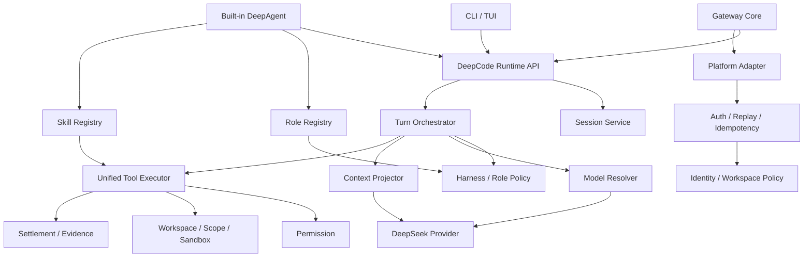

# DeepCode 技术架构

> 版本：2.1
> 状态：Phase 0 范围冻结
> 详细冻结版本：[10_V0.1_TECHNICAL_ARCHITECTURE.md](./10_V0.1_TECHNICAL_ARCHITECTURE.md)

## 1. 架构原则

1. **Single Runtime**：CLI、TUI、Gateway 和 Built-in DeepAgent 使用同一生产 Runtime。
2. **OpenCode-first**：复用并收敛 OpenCode Session、Provider、Tool、Permission、Compaction 和 UI 能力。
3. **Protocol correctness first**：DeepSeek 请求、Reasoning、Tool Continuation 和 Usage 必须经过 Contract Test。
4. **Decision must be applied**：Role、Model、Reasoning、Scope 和 Review 均记录 decided 与 applied。
5. **Unified Tool Chain**：所有入口只能使用同一个 Tool Executor。
6. **Enforcement fail-closed**：Permission、Workspace、Webhook、Replay、Secret 等安全控制失败时拒绝。
7. **Gateway is an entry, not another runtime**。
8. **Roles are policies, not separate agent processes**。
9. **Migration before deletion**：重复实现只在替代路径和回归测试完成后删除。
10. **Open-source reproducibility**：全新环境可安装、测试、构建和验证。

## 2. 目标系统



## 3. 唯一 Runtime API

内部 API 至少支持：

- createSession
- resumeSession
- prompt
- cancel
- getSession
- subscribeEvents

Runtime Input 统一携带：

- workspace
- entry source
- identity（Gateway 可选）
- role
- model override
- permission profile
- abort signal

Runtime Event 统一服务本地 UI 和 Gateway：

- session / role / model
- reasoning / text
- tool / permission
- review / evidence
- usage / completion / error

## 4. Built-in DeepAgent 边界

`packages/oh-my-deepagent` 目标保留：

- Role Definition / Registry。
- Skill Definition / Registry。
- Prompt 和 Agent Policy。
- Role Selection / Switching。
- Agent Tests。

迁移到统一 Runtime：

- Session。
- Message Loop。
- Provider Invocation。
- Tool Executor。
- Permission。
- Memory / History。
- Cancellation。

Role Tools 必须执行：

```text
Registry
∩ Role Tools
∩ Skill Tools
∩ Permission
∩ Runtime Capability
```

## 5. Gateway 边界

Gateway Core 负责：

- HTTP / WebSocket 生命周期。
- Adapter Registry。
- Auth、Replay、Idempotency、Limits。
- Message Normalization。
- Identity、Workspace 和 Role Policy。
- Session Resolution。
- Runtime Bridge。
- Delivery 和 Health。

Gateway 不直接调用 Provider、执行 Tool 或维护 Agent Message Loop。

正式路径：

```text
Gateway Consumer
→ DeepCodeRuntime.prompt()
→ Runtime Events
→ Response Aggregator
→ sourceAdapter.send()
```

## 6. Adapter Contract

每个 Adapter 必须实现：

- start / stop。
- verifyInbound。
- parse，支持返回多条消息。
- send。
- health。
- capability metadata。

鉴权必须在解析和入队前发生。

## 7. Session 和 Identity

本地 Session 绑定 Workspace。

Gateway Session Key 至少包括：

```text
platform / tenant / bot / user / chat / thread / workspace
```

同 Session 保序，不同 Session 受控并发。

## 8. Unified Tool Executor

```text
Lookup
→ Role / Skill Tool Filter
→ Schema Validation
→ Permission
→ Workspace / Scope / Sandbox
→ Execute with Abort / Timeout
→ Output Limit
→ Settlement
→ Evidence
```

Workflow、Gateway 和 DeepAgent 不得维护执行特例。

## 9. Provider 和 Context

### Provider

- 内部字段 camelCase。
- Protocol Layer 转换 wire field。
- Model Capability 限制 reasoning effort。
- Text、Reasoning、Tool、Usage、Cache、Error 和 Abort Contract Tests。

### Context

- Stable Baseline。
- Dynamic Role / Skill / Constraint Context。
- History Projection。
- Reasoning Lifecycle。
- Compaction。
- 跨 Provider Metadata 清理。

## 10. Harness 应用

v0.1 优先真实接入：

- Intent Router。
- Model Router。
- Hard Constraints。
- Reasoning Manager。
- Scope Guard。
- Context Window Manager。
- Review / Immune。

其余模块继续预装和渐进集成，但不能把日志或 Service 注册冒充为 Applied Behavior。

## 11. 安全边界

### Enforcement

- Permission deny。
- Workspace / Symlink。
- Shell Policy。
- Gateway Auth / Replay。
- User / Workspace Allowlist。
- Secret Redaction。

全部 fail-closed。

### Advisory

- Model Cost Recommendation。
- Memory Promotion。
- Anti-drift Suggestion。
- Skill Proposal。

可降级但必须可观察。

## 12. Package 定位

| Package | v0.1 职责 |
|---|---|
| `packages/core` | Runtime、Session、Harness、Permission、Tool Policy |
| `packages/opencode` | 正式 CLI/TUI 入口 |
| `packages/llm` | Provider Protocol 和 Contract |
| `packages/oh-my-deepagent` | 内置 Role/Skill/Policy，不独立运行或发布 |
| `packages/deepcode-gateway` | Gateway Core 和 Adapter，调用统一 Runtime |

## 13. 迁移顺序

```text
准确盘点
→ Runtime API
→ Agent Role/Skill 集成
→ Unified Tool / Permission
→ Gateway Runtime Bridge
→ Adapter Security / Session
→ Harness Applied
→ 删除重复实现
```

完整清单见 [13_V0.1_MIGRATION_MANIFEST.md](./13_V0.1_MIGRATION_MANIFEST.md)。

## 14. 架构退出条件

1. 只有一个生产 Session Runtime。
2. 只有一个生产 Provider 调用入口。
3. 只有一个 Tool Executor 和 Permission Service。
4. 13 个 Role 通过 Registry 接入同一 Runtime。
5. Gateway 直接调用 Runtime，不启动 CLI 子进程。
6. Adapter 鉴权先于入队。
7. sourceAdapter 回包。
8. Session 无跨平台、跨租户、跨 Workspace 串话。
9. Harness 决策有 applied 证据。
10. 重复实现删除具有替代路径和回归测试。

## 15. 相关文档

- [08_V0.1_SCOPE.md](./08_V0.1_SCOPE.md)
- [10_V0.1_TECHNICAL_ARCHITECTURE.md](./10_V0.1_TECHNICAL_ARCHITECTURE.md)
- [11_V0.1_AGENT_INTEGRATION_PLAN.md](./11_V0.1_AGENT_INTEGRATION_PLAN.md)
- [12_V0.1_GATEWAY_PLAN.md](./12_V0.1_GATEWAY_PLAN.md)
- [13_V0.1_MIGRATION_MANIFEST.md](./13_V0.1_MIGRATION_MANIFEST.md)
