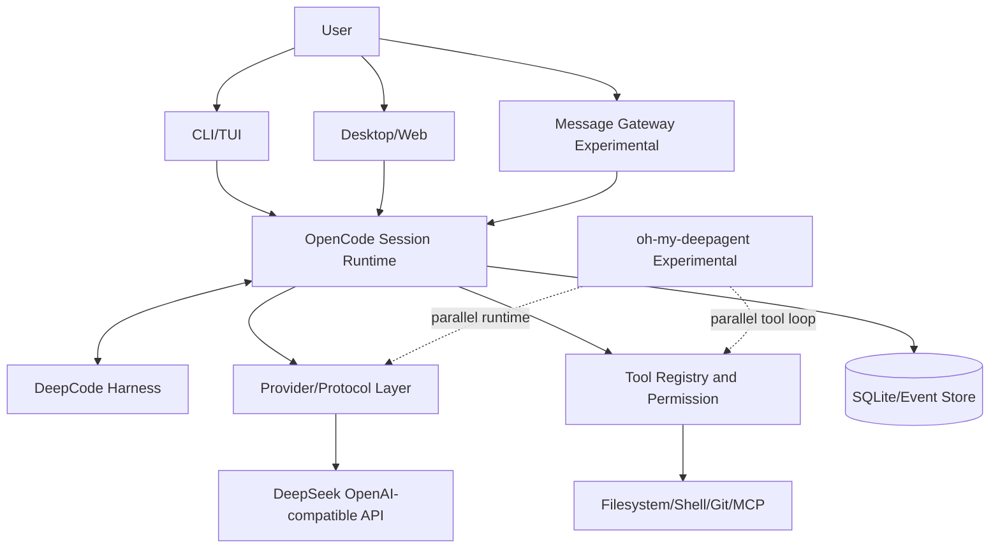
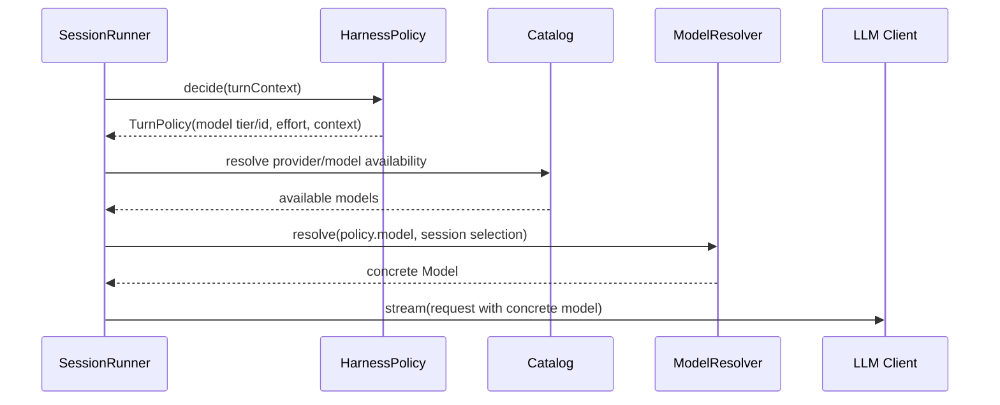
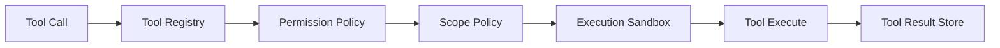
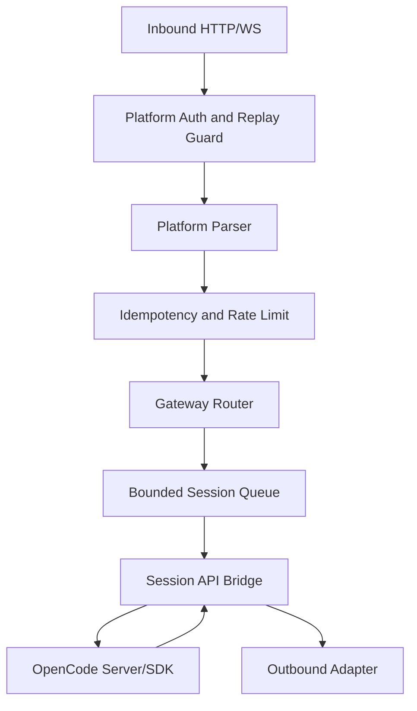

# DeepCode 技术架构

> 版本：2.0
> 状态：开源准备基线
> 目标：明确当前架构、目标架构、主链路和安全边界，避免“模块存在即能力生效”

## 1. 架构原则

1. **OpenCode-first**：优先复用 OpenCode 的 Session、Provider、Tool、Permission、Compaction 和 UI。
2. **Protocol correctness first**：模型协议正确性高于 Harness 创新数量。
3. **Single execution path**：同一能力不得在 V1、V2、Gateway、DeepAgent 中各自实现不同版本。
4. **Decision must be applied**：路由、约束、Scope、Reasoning 决策必须改变实际请求或执行。
5. **Enforcement fail-closed**：权限、路径、Webhook、Secret 等安全控制失败时拒绝。
6. **Advisory observable**：路由建议、记忆、审查失败可降级，但必须可观测。
7. **Local-first**：默认本地、单节点、单用户；远程入口显式启用。
8. **Open-source reproducibility**：全新环境可安装、测试、构建和验证。

## 2. 当前系统边界



`oh-my-deepagent` 当前是另一套轻量 Agent Runtime。它与 OpenCode Session Runtime 存在职责重叠。首个开源版本不应同时把两套 Runtime 都作为主产品入口。

建议：

- OpenCode Session Runtime 为唯一生产主链路。
- oh-my-deepagent 作为实验包或角色/策略来源。
- 能力成熟后逐步适配到 OpenCode，不形成第二套 Session/Tool/Memory 真相源。

## 3. 目标分层

### 3.1 Entry Layer

- CLI
- TUI
- Desktop/Web（继承上游）
- Gateway（Experimental）

职责：

- 收集用户输入。
- 选择 workspace/session。
- 展示模型、权限、工具、测试和 Harness 决策。
- 不实现 Provider 或 Tool 业务逻辑。

### 3.2 Session Orchestration Layer

核心位置：OpenCode V2 Session Runner。

职责：

- 获取 Session/Agent/Model/Context。
- 进行一轮 Turn 编排。
- 启动 Provider Stream。
- 持久化 Assistant/Reasoning/Usage/Tool Events。
- 等待 Tool Settlement。
- 决定继续、压缩、结束或失败。

Session Runner 应保持“编排器”角色，不应持续膨胀为所有 Harness 逻辑的实现文件。

### 3.3 Harness Decision Layer

统一输入：

```ts
interface TurnContext {
  sessionId: string
  turn: number
  workspace: string
  userText: string
  currentModel?: ModelRef
  history: readonly Message[]
  constraints: readonly Constraint[]
  plan?: Plan
  previousFailures: readonly Failure[]
  usage: UsageSnapshot
}
```

统一输出：

```ts
interface TurnPolicy {
  intent: IntentDecision
  model: ModelDecision
  reasoning: ReasoningDecision
  context: ContextPolicy
  scope: ScopePolicy
  review: ReviewPolicy
}
```

要求：

- 所有决策在构建 LLM Request 前完成。
- 具体 Model Resolver 消费 ModelDecision。
- Message Projection 消费 ReasoningDecision/ContextPolicy。
- Tool Executor 消费 ScopePolicy/Permission。
- 每项决策写入统一审计事件。

### 3.4 Model Resolution Layer

目标链路：



优先级：

1. 用户显式选择具体模型。
2. 用户临时 override。
3. Harness 自动路由。
4. Provider 默认模型。
5. 无可用模型时明确失败。

禁止：先 resolve model，再记录“应该用另一个模型”。

### 3.5 Protocol Layer

`@opencode-ai/llm` 负责：

- 通用 LLMRequest。
- Provider Route。
- Request Lowering。
- Streaming Framing。
- Response Parsing。
- Usage 归一化。

DeepSeek OpenAI-compatible Chat 应只在 Protocol Layer 做 wire translation：

```text
internal reasoningEffort
→ protocol validation
→ wire reasoning_effort
```

内部字段统一使用 camelCase；snake_case 只存在于 wire body。

必须支持 Contract Test：捕获最终 HTTP Request Body 和 SSE Response，不仅测试中间对象。

### 3.6 Context Assembly Layer

目标消息构建顺序：

```text
Stable System Baseline
→ Dynamic System Updates
→ Compacted History
→ Projected Recent History
→ Current User Message
→ Max-step/Safety Control Message
```

Context 策略职责：

- Prefix 稳定。
- 约束不丢失。
- Reasoning 生命周期处理。
- Tool Call/Result 协议完整。
- Token 预算与压缩。
- 跨模型时清理 Provider Metadata。

Reasoning 生命周期应在 `toLLMMessages()` 或其前置 projector 中应用，而不是作为孤立 Service 存在。

建议接口：

```ts
interface HistoryProjector {
  project(input: {
    history: readonly SessionMessage[]
    model: Model
    policy: ContextPolicy
  }): Effect<readonly LLMMessage[]>
}
```

### 3.7 Tool Execution Layer

目标链路：



顺序必须固定：

1. Tool 是否存在。
2. Schema 校验。
3. Role/Agent 是否允许。
4. 用户 Permission 是否允许。
5. Scope 是否允许。
6. Sandbox/路径边界检查。
7. 执行。
8. 结果持久化。

所有入口（OpenCode、Workflow、Gateway、DeepAgent）必须复用同一安全执行器。

### 3.8 Persistence Layer

持久化对象：

- Session/Message/Event。
- Provider Usage。
- Tool Invocation/Settlement。
- Snapshot/Patch。
- Harness Decision。
- Constraint/Scope/Plan。
- Gateway Session Mapping（启用 Gateway 时）。

内存 Ref 只允许存放可重建 Cache，不允许作为关键产品状态唯一来源。

## 4. DeepCode Harness 模块重组

现有 14 个模块建议从“平铺功能列表”重组为 4 个子系统。

### 4.1 Decision System

- Intent Router
- Model Router
- Reasoning Effort
- OKR/Plan

输出：本轮执行策略。

### 4.2 Context System

- Byte-stable Prefix
- Hard Constraints
- Window Manager
- Reasoning Lifecycle
- Memory Granularity
- Prompt Signals

输出：模型可见上下文。

### 4.3 Control System

- Permission
- Scope Creep Guard
- Review Anti-drift
- Immune Review

输出：允许/拒绝/需要确认/需要审查。

### 4.4 Evolution System

- Meta-directives
- Skill Evolution
- Proposed Skills

首个开源版本统一标记 Experimental，默认不能自动写入或激活 Skill。

## 5. Gateway 架构

### 5.1 当前风险

- 所有平台共用无界 Queue。
- 回复 Adapter 固定取第一个。
- Session Key 只用 chatId。
- 多个平台缺少实际签名验证。
- 子进程执行存在超时和阻塞问题。

### 5.2 目标架构



Gateway 不应通过每条消息启动 `bun opencode run` 子进程。目标应调用稳定的 OpenCode Server/SDK API，复用长期进程、Session 和取消机制。

### 5.3 Gateway Session Key

```ts
interface GatewaySessionKey {
  platform: PlatformType
  tenantId: string
  botId: string
  userId: string
  chatId: string
  workspaceId: string
}
```

### 5.4 Gateway 安全要求

- 默认 disabled。
- 默认 bind `127.0.0.1`。
- 明确的 allowlist。
- 每个平台签名验证。
- 请求时间窗口。
- Message ID 幂等。
- 单用户/单会话速率限制。
- 只允许绑定预配置 workspace。
- 远程用户不能任意指定 cwd。
- 高风险 Tool 默认 ask/deny。

## 6. oh-my-deepagent 架构定位

当前包提供：

- AgentRuntime
- Message Loop
- Tool Registry/Runner
- Memory
- Roles
- Skills
- Planning

与 OpenCode 重叠：

| 能力 | OpenCode | oh-my-deepagent |
|---|---|---|
| Session | 完整持久化 Session | 内存 Session ID |
| Tool Loop | Stream/Event/Settlement | 简化 Promise Loop |
| Permission | 完整 ask/allow/deny | 未形成同等级权限层 |
| Provider | 多 Provider Protocol | LLMProvider 接口 |
| Memory | Event/DB/Compaction | MemoryStoreLike |
| UI | CLI/TUI/Desktop/Web | 无 |

建议：

1. 不将 oh-my-deepagent 作为第二个正式运行时发布。
2. 保留为实验包和单元测试友好的 Harness Sandbox。
3. Role/System Prompt 可迁移为 OpenCode Agent 定义。
4. Tool/Skill 权限语义必须与 OpenCode 统一。

## 7. 可观察性

### 7.1 结构化事件

至少记录：

- `harness.intent.decided`
- `harness.model.decided`
- `harness.model.applied`
- `harness.reasoning.applied`
- `harness.scope.checked`
- `permission.evaluated`
- `tool.started/completed/failed`
- `context.compacted`
- `provider.usage`
- `gateway.auth.rejected`

### 7.2 关键一致性指标

```text
RouteAppliedRate
= model.applied 与 model.decided 一致的 turn 数 / 有路由决策的 turn 数
```

```text
ClaimEvidenceCoverage
= 有代码+测试+运行证据的公开主张数 / README 主张总数
```

## 8. 配置架构

配置优先级：

```text
CLI 临时参数
> Workspace Config
> User Config
> Environment Variables
> Built-in Defaults
```

Secret 必须只来自：

- 环境变量。
- 系统 Keychain/Secret Store。
- 明确排除 Git 的本地配置。

禁止：

- Secret 写入文档示例真实值。
- Secret 写入 Session/Event/Telemetry。
- Secret 通过错误信息原样输出。

## 9. 测试架构

```text
Unit
├── pure routing/policy functions
├── schema/validation
├── parser/protocol
└── state transitions

Integration
├── SessionRunner + fake LLM
├── Tool permission/scope
├── history projection
├── gateway auth/router
└── persistence

Contract
├── DeepSeek request body
├── DeepSeek SSE stream
├── tool-call continuation
└── usage/cache mapping

E2E
├── install and first run
├── repository task
├── long session
└── gateway signed message
```

## 10. 部署架构

### v0.1 推荐部署

- 单机。
- 单用户。
- 本地 SQLite。
- 本地 filesystem/shell。
- DeepSeek Remote API。
- Gateway 默认关闭。

### 非目标

- Kubernetes。
- 多节点 Session ownership。
- 多租户数据库。
- 云端 Secret 管理。
- 企业 SSO。

## 11. 迁移路径

### Phase A：协议和安全收敛

- 修复 reasoning effort。
- 修复 permission deny。
- 关闭不安全 Gateway。
- 建立 Contract Test。

### Phase B：单一主链路

- Router 前置 Model Resolve。
- Reasoning Policy 接入 History Projection。
- Scope 接入统一 Tool Executor。
- DeepAgent 降级为 Experimental。

### Phase C：开源工程化

- 可发布 Package。
- 统一 CI。
- 安全扫描。
- 安装 Smoke Test。
- 文档追踪矩阵。

## 12. 架构完成定义

一个模块只有同时满足以下条件，才能标记“已集成”：

```text
Service/Code 存在
+ 被主链路调用
+ 输出被下游消费
+ 改变可观察行为
+ 有自动化测试
+ 有失败策略
```

仅注册 Node、写日志、保存 Ref、返回建议，不等于完成集成。