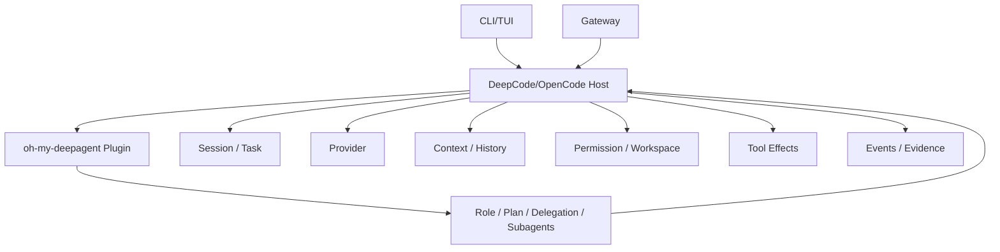

# DeepCode 分阶段技术架构

> 版本：3.0
> 状态：Target Architecture；v0.1 发行隔离优先
> 核心约束：单一宿主治理边界，允许插件实现独立编排循环
> 关联勘误：[14_PHASE0_ERRATA_AGENT_RUNTIME.md](./14_PHASE0_ERRATA_AGENT_RUNTIME.md)

## 更新记录（Update Log）

| 时间 | 更新内容 | 来源 |
|---|---|---|
| 2026-07-27 | 标注目标拓扑；加入 v0.1 Release Identity/Coexistence，Host-Plugin/Gateway 后移 | 开源准备复核与用户确认 |

## 1. 架构原则

1. **Release identity is isolated**：v0.1 的 CLI、配置、数据、数据库、环境变量和生命周期不得默认复用 OpenCode。
2. **Host governs effects**：真实工作区副作用、权限和审计由宿主最终治理。
3. **Plugin owns orchestration**：v0.2 的 oh-my-deepagent 可以实现 Role、Plan、Subagent 和 Multi-Agent 循环。
4. **Do not infer duplication from names**：存在 `AgentRuntime` 或 `runMessageLoop` 不等于存在第二套生产 Runtime。
5. **Audit before migration**：先确认调用图、来源和用途，再决定 Keep/Adapt/Bridge/Replace/Remove。
6. **Fail closed for enforcement**：Permission、Workspace、Webhook、Secret 失败时拒绝。
7. **Applied behavior over declarations**：代码存在、日志输出或 Role 注册不能替代行为证据。

## 2. 目标拓扑



该图表达 v0.2/v0.3 的目标治理与调用关系，不代表 Plugin/Gateway 当前已接入，也不要求插件内部没有自己的状态机或循环。

### 2.1 v0.1 发行边界

```text
deepcode CLI
→ deepcode config/data/cache/state/database
→ DEEPCODE_* environment
→ Host Session/Provider/Tool/Permission
```

默认不得发现 `.opencode`、`opencode.json(c)`、`OPENCODE_*` 或现有 Oh-my-OpenAgent。兼容只能通过显式导入实现。

## 3. 循环模型

### 3.1 Host Execution Loop

宿主可能承担：

```text
Prompt Projection
→ Provider Request
→ Tool Call
→ Permission / Workspace Check
→ Tool Execution
→ Tool Result Settlement
→ History / Evidence
```

### 3.2 Plugin Orchestration Loop

插件可能承担：

```text
Task Classification
→ Role Selection
→ Planning
→ Delegate to Agent/Subagent
→ Review
→ Retry / Escalate / Aggregate
```

两种 Loop 可以嵌套或协作，不是互斥关系。

## 4. 当前源码事实与未知项

已确认 `packages/oh-my-deepagent` 提供：

- AgentRuntime；
- runMessageLoop；
- ToolRunner；
- MemoryStore；
- OpenAI/Anthropic Compatible Provider；
- InProcess/HTTP/CLI Transport；
- Role、Skill、Planning 等模块。

尚未确认：

- 哪些由 DeepCode 当前生产入口调用；
- 哪些源自原始 oh-my-OpenAgent 插件架构；
- 哪些用于独立测试或兼容；
- 哪些与宿主基础设施重复；
- 是否存在真正绕过宿主安全治理的生产路径。

因此，技术架构不预先要求删除上述实现。

## 5. Host Contract

v0.2 应定义或核对宿主对插件开放的 Contract，而不是先重写插件。

### 5.1 Session Contract

应明确：

- Host Session ID；
- Parent Task / Subagent Task 关系；
- Plugin Orchestration ID；
- Workspace 绑定；
- Resume/Cancel 语义；
- History 与插件工作记忆的边界。

插件可以维护独立工作状态，但不得让真实任务在不可追踪的孤立历史中产生副作用。

### 5.2 Tool Contract

应明确：

- 插件如何发现 Tool；
- Role/Skill 如何过滤 Tool；
- Permission 谁负责最终裁决；
- Workspace/Sandbox 谁负责执行；
- Tool Result 如何回传插件；
- 子 Agent 的权限是否继承、收缩或重新确认。

插件可以有 ToolRunner 包装器或测试执行器；只有生产副作用路径绕过治理时才构成缺陷。

### 5.3 Provider Contract

应明确：

- 插件是否通过宿主 Provider；
- 独立 Provider 是否只用于测试、兼容或特定 Subagent；
- Reasoning、Tool Call、Usage 和 Abort 如何传播；
- 多模型路由如何记录 decided/applied。

禁止在未审计原始插件契约前直接删除 Provider Adapter。

### 5.4 Memory / History Contract

区分：

- Canonical Conversation History；
- Plugin Orchestration State；
- Subagent Scratch Memory；
- Durable User Memory；
- Test Fixture Memory。

“存在 MemoryStore”不等于与宿主 Session 冲突。冲突只在两个状态源对同一事实都自称权威且无法一致恢复时成立。

## 6. Gateway Contract（v0.3）

```text
Platform Request
→ Adapter Authentication
→ Identity / Workspace Policy
→ Host Session Mapping
→ Role / Plugin Orchestration
→ Host-governed Effects
→ Adapter Delivery
```

Gateway 不应复制权限、Workspace 和业务状态；但它可以维护：

- 入站幂等状态；
- 平台会话映射；
- Delivery 状态；
- Queue 和 Rate Limit 状态。

## 7. Security Invariants

无论由 Host Loop 还是 Plugin Orchestration 发起，以下约束必须成立：

1. deny 不可绕过。
2. Workspace 外写默认拒绝。
3. Symlink 逃逸被阻止。
4. Gateway 未鉴权请求不能创建任务。
5. Subagent 权限不高于父任务，除非用户重新批准。
6. Secret 不进入日志和 Evidence。
7. Cancel/Timeout 能终止相关 Provider/Tool/Transport。

## 8. 事件模型

建议统一相关性字段：

```ts
interface RuntimeCorrelation {
  workspaceId: string
  sessionId: string
  taskId: string
  parentTaskId?: string
  orchestrationId?: string
  agentId?: string
  roleId?: string
  gatewayIdentity?: string
}
```

事件至少覆盖：

- role.decided / role.applied；
- agent.spawned / agent.completed；
- model.decided / model.applied；
- permission.requested / resolved；
- tool.started / settled；
- gateway.received / delivered；
- review.completed。

## 9. v0.2/v0.3 技术审计

### 9.1 来源审计

- 对照原始 OpenCode 和 oh-my-OpenAgent 架构。
- 标注当前 fork 的新增、改名和偏离。

### 9.2 调用图

生成：

- CLI/TUI → Host 调用图；
- Gateway → Host/Plugin 调用图；
- oh-my-deepagent 内部调用图；
- Provider、Tool、Memory、Transport 调用方清单。

### 9.3 分类

每个组件标记为：

- Host Execution；
- Plugin Orchestration；
- Compatibility/Test；
- Unused/Deprecated；
- Unknown。

### 9.4 决策

仅在证据完成后给出：

- Keep；
- Adapt；
- Bridge；
- Replace；
- Remove。

## 10. 删除门槛

任何 Runtime、Loop、Provider、ToolRunner、Memory 或 Transport 删除都必须满足：

- 已确认没有独立产品价值；
- 已确认生产调用方；
- 已提供替代或确认无调用；
- 插件行为测试不回退；
- Host 安全测试通过；
- Gateway 和角色场景通过。

## 11. 目标结果

最终架构不是“所有东西压进一条 Loop”，而是：

```text
清晰的宿主治理
+ 保留插件编排能力
+ 明确状态权威性
+ 可测试的边界 Contract
+ 可观察的跨 Loop 事件
```
