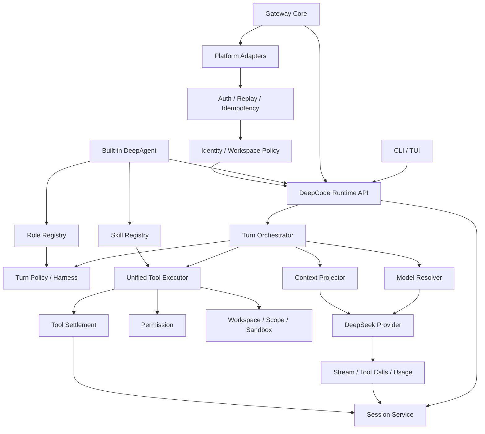

# DeepCode v0.1 技术架构

> 状态：Phase 0 已确认
> 核心约束：单一生产 Runtime，所有入口共享 Session、Provider、Tool、Permission、Context 和 Harness

## 1. 目标架构



## 2. 单一 Runtime API

必须形成内部稳定接口，供 CLI、TUI、Gateway 和 Built-in DeepAgent 共同调用。

建议接口：

```ts
interface DeepCodeRuntime {
  createSession(input: CreateSessionInput): Effect<Session>
  resumeSession(input: ResumeSessionInput): Effect<Session>
  prompt(input: PromptInput): Stream<RuntimeEvent>
  cancel(input: CancelInput): Effect<void>
  getSession(input: GetSessionInput): Effect<Session>
  subscribe(input: SubscribeInput): Stream<RuntimeEvent>
}
```

### CreateSessionInput

- workspace
- entrySource: cli | tui | gateway
- identity（Gateway 可选）
- roleId
- model override
- permission profile

### PromptInput

- sessionId
- text / attachments
- requested role
- gateway delivery context（可选）
- abort signal

### RuntimeEvent

- session.created
- role.decided / role.applied
- model.decided / model.applied
- reasoning.delta
- text.delta
- tool.requested / permission.requested / tool.completed
- review.completed
- usage.updated
- task.completed / task.failed

## 3. Runtime 分层

### 3.1 Entry Adapter

只负责将入口输入转换为 Runtime Input：

- CLI/TUI 输入。
- Gateway Message。
- Agent Role 切换。

不得在入口层自行实现 Provider 调用、Tool Loop 或 Permission。

### 3.2 Session Service

唯一 Session 真相源：

- Session 创建、恢复和绑定 Workspace。
- Message、Reasoning、Tool Call、Tool Result 持久化。
- Role、Model、Constraint、Scope、Evidence 状态。
- Gateway Identity 与 Session 的映射引用。

### 3.3 Turn Orchestrator

只负责流程编排：

```text
Input
→ Role Policy
→ Intent / Constraints
→ Model Decision
→ Context Projection
→ Provider Stream
→ Tool Executor
→ Review
→ Persistence
```

不在单一文件中继续堆积所有 Harness 逻辑。

### 3.4 Turn Policy / Harness

输出结构化决策：

```ts
interface AppliedDecision<T> {
  decided: T
  applied?: T
  reason: string
  status: "applied" | "degraded" | "rejected" | "advisory"
  evidence?: Record<string, unknown>
}
```

安全 Enforcement 失败时 fail-closed；成本、记忆等 Advisory 失败可降级但必须记录。

### 3.5 Model Resolver

顺序必须为：

```text
Turn Context
→ Role / Intent / Risk
→ Model Decision
→ Concrete Provider + Model Resolve
→ Request
```

禁止先 Resolve Model 再记录一个不会生效的 Router 结果。

### 3.6 Context Projector

负责：

- Stable Baseline。
- Dynamic Context。
- Hard Constraints。
- Role Prompt 和 Skill Prompt。
- History Projection。
- Reasoning Lifecycle。
- Compaction。
- Provider Metadata Compatibility。

### 3.7 Unified Tool Executor

唯一执行链：

```text
Tool Registry
∩ Role Tools
∩ Skill Tools
∩ Runtime Capability
→ Schema Validation
→ Permission
→ Workspace / Scope / Sandbox
→ Execute with Abort / Timeout
→ Output Limit
→ Settlement
→ Evidence
```

CLI、Workflow、Gateway、DeepAgent 均不得绕过。

## 4. Built-in DeepAgent 技术边界

### 保留

- Role Definition。
- Role Registry。
- Skill Definition / Registry。
- Agent Prompt 和 Policy。
- Role Selection 和 Role Switching。
- Agent 测试资产。

### 迁移到 Runtime

- Session。
- Message Loop。
- Provider Invocation。
- Tool Executor。
- Permission。
- Memory / History Storage。
- Cancellation。

### 目标调用关系

```text
Role Registry
→ RolePolicy
→ Runtime Prompt
→ Unified Tool Executor
```

Role 不直接调用 Provider 和 Tool。

## 5. Gateway 技术边界

### 5.1 Gateway Core

负责：

- HTTP / WebSocket 生命周期。
- Adapter 注册。
- Raw Body 保留。
- 鉴权和 Replay。
- Message Normalization。
- Identity 和 Workspace Policy。
- Session Resolution。
- Runtime 调用。
- Delivery。

### 5.2 Adapter Contract

```ts
interface PlatformAdapter {
  readonly name: PlatformName
  start(ctx: AdapterContext): Effect<void, GatewayError>
  stop(): Effect<void>
  verifyInbound(input: RawInbound): Effect<VerifiedInbound, AuthError>
  parse(input: VerifiedInbound): Effect<readonly GatewayMessage[], ParseError>
  send(input: OutboundMessage): Effect<SendResult, GatewayError>
  health(): Effect<AdapterHealth>
}
```

要求：

- Parser 可返回多条消息。
- 鉴权在解析和入队前完成。
- 所有平台显式实现或声明不支持某种接入方式。
- 不允许通过注释代替鉴权实现。

### 5.3 Gateway Message

```ts
interface GatewayMessage {
  id: string
  platform: string
  tenantId?: string
  botId?: string
  userId: string
  chatId: string
  threadId?: string
  content: MessageContent
  timestamp: number
  sourceAdapter: string
  rawRef?: string
}
```

不默认将完整 Raw Body 长期保存在日志或 Session 中。

### 5.4 Session Key

```text
platform / tenant / bot / user / chat / thread / workspace
```

采用规范化编码或哈希，不使用简单字符串拼接造成碰撞。

### 5.5 Queue 和并发

- 入站 Queue 有界。
- 超限时返回平台可理解的 busy / retry。
- 同 Session 使用串行执行锁。
- 不同 Session 有并发上限。
- Runtime 支持取消和超时。
- Outbound 有重试和幂等策略。

### 5.6 Runtime Bridge

正式架构：

```text
Gateway Consumer
→ DeepCodeRuntime.prompt()
→ Runtime Events
→ Response Aggregator
→ Adapter.send()
```

CLI 子进程桥只作为迁移期兼容实现，不得进入 v0.1 正式路径。

## 6. Provider 架构

### 请求

- 内部字段统一 camelCase。
- Protocol Lowering 转换 wire field。
- Model Capability 决定 reasoning effort 和内容类型。
- Wire Body Contract Test 捕获最终请求。

### 响应

- Text / Reasoning / Tool Call 独立事件。
- Tool Arguments 流式拼接。
- Usage 和 Cache 指标。
- Provider Error 结构化。
- Abort 传播到网络请求。

## 7. Role 和 Skill 架构

### RoleDefinition

```ts
interface RoleDefinition {
  id: string
  displayName: string
  description: string
  systemPrompt: string
  tools: readonly string[]
  skills: readonly string[]
  risk: "low" | "medium" | "high"
  maturity: "stable" | "beta" | "experimental"
  scenarios: readonly string[]
}
```

### Tool 可见性

```text
Registry
∩ Role.tools
∩ LoadedSkill.tools
∩ Permission-visible
∩ Runtime-capable
```

### 角色切换

- 在同一个 Session 内记录 role-switched event。
- 新 Role Prompt 以动态 Context Update 进入。
- 不重放不兼容的 Provider Metadata。
- 不自动继承上一个 Role 的临时 Tool Approval，除非 Permission Pattern 明确允许。

## 8. 安全架构

### Enforcement

- Webhook Auth。
- Replay / Idempotency。
- Permission deny。
- Workspace Boundary。
- Symlink Boundary。
- Shell Sandbox / Policy。
- Secret Redaction。
- User / Workspace Allowlist。

全部 fail-closed。

### Advisory

- Model Cost Recommendation。
- Memory Promotion。
- Anti-drift Suggestion。
- Skill Proposal。

失败可降级，但必须产生结构化事件。

## 9. 数据边界

### 本地持久化

- Session、Message、Tool、Role、Decision、Evidence。
- Gateway Identity 映射。
- Adapter Delivery State。

### 禁止默认持久化

- API Key。
- Authorization Header。
- Platform Secret。
- 完整环境变量。
- 无必要的完整 Webhook Raw Body。
- 未经用户允许的完整源码 Telemetry。

## 10. Package 目标定位

| Package | v0.1 定位 |
|---|---|
| `packages/core` | Runtime、Session、Harness、Permission、Tool Policy 核心 |
| `packages/opencode` | DeepCode CLI/TUI 生产入口 |
| `packages/llm` | Provider Protocol 和 Contract |
| `packages/oh-my-deepagent` | 内置 Role/Skill/Agent Policy 包，不独立运行或发布 |
| `packages/deepcode-gateway` | Gateway Core 与 Platform Adapter，调用统一 Runtime |
| UI / Desktop 等 | 继承上游能力，非 Phase 0 重构目标 |

实际 Package 路径在 Phase 1 仓库扫描后确认；本表描述职责而非立即移动文件。

## 11. 迁移顺序

```text
Runtime API
→ DeepAgent 接入
→ Unified Tool Executor
→ Gateway Runtime Bridge
→ Adapter 安全
→ Harness Applied
→ 删除重复实现
```

禁止先删除旧实现再补统一 Runtime。

## 12. 架构验收

1. CLI、Gateway、Role 场景使用相同 Session ID 语义。
2. 只有一个生产 Tool Executor。
3. 只有一个生产 Permission Service。
4. 只有一个 Provider 调用入口。
5. Gateway 不启动 CLI 子进程。
6. Role Tool 白名单真实生效。
7. Adapter 鉴权在入队前完成。
8. Model Decision 的 decided 与 applied 可对照。
9. Runtime 事件可用于本地 UI 和 Gateway Delivery。
10. 对重复代码的删除均有替代路径和回归测试。
