# DeepCode 三阶段交付总计划（Implementation-ready Master Plan）

> 文档版本：1.4
> 基线日期：2026-07-29
> 当前状态：Gate 1 GO（第一阶段完成，第二阶段可启动）
> 分支拓扑：`develop` 为实施基线；`master` 为 GitHub 默认/发布分支；里程碑通过审查后从 `develop` 合入 `master`
> 文档定位：本目录唯一的跨阶段执行总计划
> 目标读者：后续实现人员与 AI；本文不依赖口头上下文即可执行

## 更新记录（Update Log）

| 日期       | 版本 | 变更                                                                                                            | 依据                                     |
| ---------- | ---: | --------------------------------------------------------------------------------------------------------------- | ---------------------------------------- |
| 2026-07-29 |  1.4 | 回填 PR #9 合并收口、最终远程基线与父级任务卡计数；新增 canonical 会话交接提示词并固化五仓开发流程规范 | PR #9、typecheck #124、test #126、GitHub 远程状态 |
| 2026-07-28 |  1.3 | 完成 S1-02-D/E 与父任务验收；回填 PR #6/#7、双平台全链 CI、字符串分类和下一唯一任务 S1-03 | PR #6、PR #7、typecheck #120、test #122 与 evidence |
| 2026-07-28 |  1.2 | 回填实际实施进度、PR/CI 基线与远程交接入口；明确 S1-02-D 为 IN_REVIEW、S1-02-E 为下一执行点 | PR #2、PR #6、GitHub Actions 与远程分支复核 |
| 2026-07-27 |  1.1 | 明确 `develop` 开发、`master` 发布的分支拓扑；将 S1-01 拆为仓库基线与官网止损，解除外部官网权限对代码任务的依赖死锁 | 远端仓库元数据与执行一致性复核 |
| 2026-07-27 |  1.0 | 将交付重构为“官网可安装 → 完整能力 → 设计驱动的 WebUI/Electron”三阶段，并补齐任务级输入、步骤、测试、证据和门禁 | 用户目标澄清、源码与现有开源准备文档复核 |


## 当前执行快照（2026-08-04）

> 本节记录实施事实，不替代各任务卡验收条件。CI、PR 和分支状态变化时，后续执行者必须以 GitHub 实时状态复核。

| 范围 | 当前状态 | 已完成 | 当前执行点 / 阻塞 |
| --- | --- | --- | --- |
| 产品发布判断 | `GO` | Gate 1 全部条件满足：VM E2E 全绿、真实 DeepSeek 首任务成功、CI 全绿、Release 证据齐全 | 第二阶段可启动 |
| 第一阶段 | `DONE` | 父级任务卡 9/9 完成：S1-01A、S1-01B、S1-02、S1-03、S1-04、S1-05、S1-06、S1-07、S1-08 | Gate 1 GO，第二阶段可启动 |
| 第二阶段 | `NOT_STARTED` | 父级任务卡 0/8 `DONE` | 受 Gate 1 阻塞，不得提前宣称完整 Provider/Harness/Agent/Gateway 能力 |
| 第三阶段 | `NOT_STARTED` | 父级任务卡 0/8 `DONE` | 受 Gate 2 和 Design Gate 阻塞，不得提前大规模改造 WebUI/Electron |

> 按父级任务卡计数，当前为 2/25 `DONE`。该计数仅表示门禁任务完成数量，不代表加权工程量百分比；S1-02 是已完成的高风险基础任务。

### 已落入远程的实施基线

- PR #2 / S1-02-C 已通过完整门禁并 squash 合入 `develop@babc3080f9d5c5c90dcf4abb16a0149e6dbc1eb8`。
- PR #6 / S1-02-D 已通过完整门禁并 squash 合入 `develop@c848bc537e8c5677c36a360dd00122745a2f5b2e`。
- PR #7 / S1-02-E 已通过完整门禁并 squash 合入 `develop@1ad663ee07aa5ba72a333f9d2dc1ba3fe981be90`。
- PR #7 最终 clean docs head：`ebc6365f4b110bb90e56abc48daf8dc9cf00fe30`；typecheck #120 / `30355593747`、test #122 / `30355593871` 全部 SUCCESS。HttpApi 首次尝试在 Effect phase 遭遇 runner stall 并触发 15 分钟 timeout；同一 run 仅重跑失败的 Linux unit job后，HttpApi artifact `httpapi-2` 成功，未修改或放宽门禁。
- PR #8 因分支名不符合根 `AGENTS.md` 且遗漏生成的 `.pyc` 清理而关闭、未合并；由合规分支上的 PR #9 取代。
- PR #9 / S1-02 post-merge closeout 已通过 typecheck #124 / `30359898506`、test #126 / `30359898493`，并 squash 合入 `develop@ea9d848e29dc9ae04ace7c5e1f12921157c224ed`。
- 代码、测试、CI boundary gate、inventory、evidence 与交接基线均已推送到 GitHub 远程，不依赖旧容器中的未提交文件。

### S1-02 当前完成度

| 子任务 | 状态 | 结果 |
| --- | --- | --- |
| S1-02-A | `DONE` | 建立共存失败基线与 fixture |
| S1-02-B | `DONE` | Core 路径、数据库与用户环境入口切换至 DeepCode |
| S1-02-C | `DONE` | 配置发现、CLI/TUI/MDM/Server Auth 和公共测试基础设施完成身份隔离；已合入 `develop` |
| S1-02-D | `DONE` | 安装检测、升级和卸载边界 fail-closed；PR #6 已合入 `develop@c848bc537e8c5677c36a360dd00122745a2f5b2e` |
| S1-02-E | `DONE` | 全链共存回归、4,168 行字符串分类、双平台最终验收；PR #7 |

S1-02-A/B/C/D/E 与父任务已完成。下一唯一代码执行点是 **S1-03**。S1-03 完成前，不得发布 DeepCode launcher/归档或恢复任何上游 updater。

远程交接状态：[HANDOFF_2026-07-28.md](./HANDOFF_2026-07-28.md)。可直接粘贴到新会话的 canonical 提示词：[SESSION_HANDOFF_PROMPT.md](./SESSION_HANDOFF_PROMPT.md)。新会话必须先读取 GitHub 实时状态，不能把旧容器或提示词中的 SHA 当作高于远程的事实源。

### 统一开发流程与远程保存纪律

- 第一优先始终是：合规功能分支 → Pull Request → 完整 CI → squash 合入 `develop`。
- PR/CI 持续异常时，必须先定位根因并区分代码、测试、环境或规则问题；能修复则修复，不能解决才允许直推 `develop`。
- 直推 commit 必须包含 `## 问题原因` 和 `## 技术债务`；技术债务还可按项目约定写入 `TECH_DEBT.md` / `BUG_LIST.md`。
- 无论是否完成合并，每次会话结束前都必须把有效代码、测试、证据、计划和交接信息推送到远程分支；不得把旧容器作为唯一保存位置。
- 五仓统一规范及完整 commit 模板见 [SESSION_HANDOFF_PROMPT.md](./SESSION_HANDOFF_PROMPT.md)。

---

## 0. 一页执行结论

### 0.1 用户目标的最终解释

DeepCode 不是“先做一个永久缩水版，再决定是否继续”，而是按价值和风险拆成三个连续阶段：

| 阶段                       | 用户结果                                                                                                                                      | 版本建议                                        | 是否阻塞下一阶段                         |
| -------------------------- | --------------------------------------------------------------------------------------------------------------------------------------------- | ----------------------------------------------- | ---------------------------------------- |
| 第一阶段：立即可安装使用   | 用户从 `https://deepcode.starseas.org` 获取本项目制品，在 macOS/Linux 安装 `deepcode`，完成首个真实任务，且不影响 OpenCode 与 Oh-my-OpenAgent | `v0.1.0-alpha.1` → `v0.1.0-beta.1`              | 是；未形成可信安装闭环，不扩张能力面     |
| 第二阶段：完整能力交付     | Provider、Harness、Agent、Subagent/Multi-Agent、Gateway、飞书及安全治理按本文定义达到 Stable/Beta 证据标准                                    | `v0.2.x` → `v0.3.x`                             | 是；核心契约不稳定时不发布桌面正式版     |
| 第三阶段：设计驱动的产品化 | 先完成用户研究、信息架构、交互原型、视觉系统和设计验收，再改造共享 WebUI，最后用 Electron 打包并发布                                          | Desktop Preview → Desktop Beta → Desktop Stable | 终局阶段，仍按设计/实现/发行三道门禁推进 |

### 0.2 三个不能被误解的边界

1. **“马上上线”不等于跳过安全与隔离。** 第一阶段可以缩小功能面，但官网来源、制品可追踪、DeepCode/OpenCode 隔离、权限边界和安装/卸载验证不能降级。
2. **“第二阶段实现全部”不是无限范围。** 本文中的“全部”指当前 DeepCode 产品承诺：完整 Provider/Harness、内置 Agent 插件、角色/技能/规划/委派、多 Agent、Gateway Core 与飞书 Stable；其他平台按证据分级，不等于把仓库中每段实验代码都宣布为 Stable。
3. **官网、产品 WebUI、Electron 是三套边界。** 官网候选位于 `packages/web`，产品 WebUI 位于 `packages/app` 与 `packages/ui`，Electron 位于 `packages/desktop` 并复用 `AppInterface`。不得复制一份 WebUI 到 Desktop 内单独维护。

### 0.3 当前判断与置信度

| 判断                             | 结论                           |        置信度 | 证据                                                                                |
| -------------------------------- | ------------------------------ | ------------: | ----------------------------------------------------------------------------------- |
| 当前能否公开引导安装             | NO-GO                          |          确定 | 官网命令指向已被第三方占用的 npm 包；本项目尚无可信 Release                         |
| 第一阶段是否应 CLI-first         | 是                             | 大概率（95%） | CLI 已有主体实现，Desktop 仍复用 OpenCode 的 App ID、协议、产品名和更新源           |
| 当前仓库是否包含官网源码         | 不确定                         |        不确定 | `packages/web` 是 Astro 站点，但尚无证据证明它就是 `deepcode.starseas.org` 的部署源 |
| 产品 WebUI 的共享实现位置        | `packages/app` + `packages/ui` |          确定 | Desktop renderer 直接导入 `@opencode-ai/app` 的 `AppInterface`                      |
| 是否已有 Electron 外壳           | 有，但不能以 DeepCode 名义发布 |          确定 | `packages/desktop` 已有构建/打包配置，但身份、协议和更新仓库仍属于 OpenCode         |
| Agent/Gateway 是否已进入生产主链 | 尚无充分证据                   | 大概率（90%） | 独立包和测试存在，但未发现稳定生产消费者与完整宿主桥接证据                          |

---

## 1. 文档权威性与使用方法

### 1.1 权威顺序

发生冲突时按以下顺序处理：

1. 当前用户明确要求；
2. 仓库根 `AGENTS.md`；
3. 本文件 `PLAN.md`；
4. [15_V0.1_RELEASE_AND_COEXISTENCE_PLAN.md](./15_V0.1_RELEASE_AND_COEXISTENCE_PLAN.md) 等阶段专项计划；
5. 其余开源准备文档；
6. 历史分析文档。

`06_ITERATION_PLAN.md` 是路线摘要，`11_*`、`12_*`、`15_*` 是专项背景和核对清单；跨阶段状态、依赖、开工条件与最终验收以本文为准。

### 1.2 后续 AI 的强制执行方法

每次只领取一个任务 ID，并严格执行：

```text
读取任务卡
→ 核对前置任务和证据
→ 写出“假设 / 依据 / 反证条件 / 置信度”
→ 只修改任务卡允许的文件范围
→ 运行任务卡测试
→ 保存证据
→ 更新任务状态
→ 原子提交
```

禁止：

- 跨过门禁，用“代码已存在”代替“产品链路已验证”；
- 同时改官网、运行时和 UI，形成无法回滚的大提交；
- 从仓库根目录运行测试；
- 直接编辑生成目录 `packages/client/src/generated` 或 `generated-effect`；
- 为了通过测试删除失败用例、放宽权限、关闭校验或静默吞错；
- 把 `input/oh-my-openagent` 中的代码直接复制进发布制品，除非来源和许可证任务已通过；
- 把内部 `@opencode-ai/*` 包名的全面重命名塞进第一阶段；第一阶段只处理用户可见和持久化边界。

### 1.3 状态值

任务只允许使用以下状态：

- `NOT_STARTED`：未开始；
- `IN_PROGRESS`：已声明假设并开始执行；
- `BLOCKED`：存在外部依赖，且已记录阻塞证据和解除条件；
- `IN_REVIEW`：实现与本地验证完成，等待审查；
- `DONE`：验收条件、测试、证据、文档全部完成；
- `REOPENED`：门禁或回归使任务重新打开。

### 1.4 每个任务的证据目录

实现阶段为每个任务创建：

```text
docs/open-source-readiness/evidence/<TASK-ID>/
├── README.md          # 假设、环境、Commit、命令、结果、结论、置信度
├── test-results/      # 可公开的测试摘要/JUnit/截图索引
└── artifacts.txt      # 制品名、SHA-256、Release URL；无制品则省略
```

不得提交 API Key、Cookie、完整用户目录、私有仓库 URL 或含个人数据的原始日志。真实 Provider 测试只记录脱敏请求元数据、响应类型、耗时和结果。

### 1.5 Git 与提交规则

- 分支名最多三个短词、用连字符、不使用斜杠，例如 `release-isolation`、`fix-provider-contract`。
- 一个提交只完成一个任务或一个可独立回滚的子任务。
- 标题同时满足 Conventional Commit 与双语规范：
  `type(scope): English summary | 简体中文摘要`
- 正文顺序固定：

```text
English:
<what, why, verification>

简体中文:
<做了什么、为什么、如何验证>
```

### 1.6 大任务的拆分规则

本文的 `Sx-yy` 是可验收的父任务，不要求塞进一个 PR。若一个父任务满足任一条件，必须按执行步骤拆成 `Sx-yy-A`、`Sx-yy-B` 等子任务：

- 修改两个以上 Package；
- 同时涉及契约、实现和迁移；
- 预计产生三个以上独立提交；
- 单次审查无法完整理解或回滚；
- 前一部分能形成独立测试证据。

拆分时遵守：

1. 先在父任务 evidence 的 `README.md` 写子任务表、依赖和文件所有权，再动代码；
2. 每个子任务有独立假设、测试、证据和原子提交；
3. 子任务只允许缩小父任务范围，不能扩大范围或降低父任务验收；
4. 父任务只有全部子任务 `DONE` 且完成一次整链回归后才能 `DONE`；
5. 多个 AI 并行时，同一文件在同一批次只分配给一个执行者。

---

## 2. 全局产品与技术契约

### 2.1 独立身份与共存契约

| 边界                  | DeepCode 默认值                          | 默认禁止读取/写入      |
| --------------------- | ---------------------------------------- | ---------------------- |
| CLI                   | `deepcode`                               | `opencode`、`omo` 命令 |
| 安装目录              | `~/.deepcode/bin`                        | `~/.opencode/bin`      |
| 全局配置              | 平台等价的 `deepcode` 配置目录           | OpenCode 配置目录      |
| 项目配置              | `.deepcode/`                             | `.opencode/`           |
| 配置文件              | `deepcode.json`、`deepcode.jsonc`        | `opencode.json(c)`     |
| 数据/缓存/状态/日志   | `deepcode` 命名空间                      | `opencode` 命名空间    |
| 数据库                | `deepcode.db` 或带 DeepCode channel 后缀 | `opencode.db`          |
| 环境变量              | `DEEPCODE_*`                             | `OPENCODE_*`           |
| URL Scheme（Desktop） | `deepcode`，各 channel 可独立            | `opencode`             |
| Desktop App ID        | DeepCode 自有反向域名，各 channel 独立   | `ai.opencode.desktop*` |

兼容 OpenCode 只能通过用户主动执行的显式命令，例如 `deepcode import opencode`。该命令不属于第一阶段必需范围；若实现，必须先显示来源、目标、冲突和写入清单。

### 2.2 单一宿主治理契约

DeepCode 允许插件拥有规划或编排循环，但所有真实副作用必须回到宿主：

```text
用户/平台输入
→ Host Session / Context / Provider
→ Built-in Agent Plugin 规划、角色、委派
→ Host Tool / Permission / Workspace 执行
→ Evidence / Session 持久化
→ CLI、WebUI 或 Gateway 输出
```

任何插件、Subagent 或 Gateway Adapter 均不得：

- 自行绕过 Host Permission；
- 在未知 Workspace 执行文件或 Shell；
- 私自保存另一套不可审计的生产 Session；
- 直接使用平台身份作为本地文件权限；
- 将未鉴权消息送入执行链。

### 2.3 能力成熟度契约

| 等级         | 必须满足                                                                  |
| ------------ | ------------------------------------------------------------------------- |
| Experimental | 默认关闭；文档写明限制；无安全旁路；可单独启用                            |
| Beta         | 生产入口接入；契约测试和主链 E2E；失败可诊断；升级兼容已定义              |
| Stable       | Beta 全部条件；真实环境验证；安全/性能/恢复门禁；文档主张与证据 100% 对应 |

### 2.4 发布与回滚契约

- Release 必须可追踪到唯一 Commit 和 CI Run；
- 制品包含 SHA-256、SBOM、第三方许可证清单；
- 官网安装器固定到版本或解析本项目受控 manifest，不执行第三方 npm 包；
- 安装脚本幂等，失败不留下半安装；
- 升级保留前一版本以便回滚；
- 卸载仅删除 DeepCode 所有物，不通过模糊匹配删除目录；
- 能力门禁失败时回滚 Release/manifest，不修改用户 OpenCode 数据。

---

## 3. 总体依赖与里程碑

```mermaid
flowchart LR
  S1A["S1-01A 仓库与分支基线"] --> S1B["S1-02 身份隔离"]
  S1A --> S1W["S1-01B 官网定位与止损"]
  S1B --> S1C["S1-03 安装与制品"]
  S1A --> S1D["S1-04 P0 运行链"]
  S1A --> S1E["S1-05 开源治理"]
  S1C --> S1F["S1-06 CI/Release"]
  S1D --> S1F
  S1E --> S1F
  S1W --> S1G["S1-07 官网安装"]
  S1F --> S1G
  S1G --> S1H["S1-08 Parallels 验收"]
  S1H --> G1["Gate 1 官网公开"]
  G1 --> S2A["S2-01 架构与来源审计"]
  S2A --> S2B["S2-02 Provider/Harness"]
  S2A --> S2C["S2-03 Agent 宿主桥"]
  S2C --> S2D["S2-04 角色/技能/规划"]
  S2D --> S2E["S2-05 Subagent/Multi-Agent"]
  S2A --> S2F["S2-06 Gateway Core"]
  S2F --> S2G["S2-07 飞书"]
  S2E --> S2H["S2-08 可靠性与发布"]
  S2G --> S2H
  S2B --> S2H
  S2H --> G2["Gate 2 核心能力完成"]
  G2 --> S3A["S3-01 UX 研究与设计简报"]
  S3A --> S3B["S3-02 IA/流程/原型"]
  S3B --> S3C["S3-03 DESIGN.md 与设计验收"]
  S3C --> GD["Design Gate"]
  GD --> S3D["S3-04 UI 基础与组件"]
  S3D --> S3E["S3-05 核心 WebUI"]
  S3E --> S3F["S3-06 可访问性/性能"]
  S3F --> S3G["S3-07 Electron 身份与集成"]
  S3G --> S3H["S3-08 打包/签名/桌面验收"]
  S3H --> G3["Gate 3 Desktop Stable"]
```



### 3.1 三个阶段的 Definition of Done

| 门禁        | 完成定义                                                                                                                              |
| ----------- | ------------------------------------------------------------------------------------------------------------------------------------- |
| Gate 1      | 官网命令能在干净 macOS 快照安装本项目 Release，完成真实最小任务；升级/卸载可用；与 OpenCode、Oh-my-OpenAgent 共存；公开主张全部有证据 |
| Gate 2      | 本文定义的核心能力进入真实生产调用链；P0/P1 安全问题为 0；关键 Agent、Subagent/Multi-Agent、Gateway Core 与飞书按声明等级通过 E2E     |
| Design Gate | 用户批准设计方向；用户流程、线框、交互原型、视觉 Token、组件映射、响应式与可访问性标准全部可验收；此门禁前禁止大规模 UI 实现          |
| Gate 3      | WebUI 达到设计验收；Electron 拥有完整 DeepCode 身份、签名、公证、更新、回滚和共存证据；可同时安装 OpenCode Desktop                    |

---

# 第一阶段：官网立即可安装并正常使用

## 4. 阶段目标与范围

### 4.1 交付范围

- 官方网站提供本项目控制的安装入口；
- CLI 名称为 `deepcode`；
- macOS arm64/x64、Linux arm64/x64 至少有可校验制品；
- 用户配置 DeepSeek Key 后可完成一次真实的读取、修改、Shell/测试任务；
- Session 可恢复，错误可诊断；
- 安装、升级、回滚、卸载清晰；
- 与 OpenCode 和 Oh-my-OpenAgent 共存；
- 官网明确标注 Alpha/Beta 能力边界。

### 4.2 明确不阻塞本阶段

- 全部 13 个角色 Stable；
- Subagent/Multi-Agent 正式承诺；
- Gateway/飞书 Stable；
- UI 重设计；
- Electron 桌面制品；
- 无作用域 npm 包。

## 5. 第一阶段任务卡

### S1-01A 冻结仓库、分支与发行基线

**状态**：`DONE`
**优先级**：P0
**依赖**：无
**可并行**：不可；完成后立即解锁 S1-02、S1-04、S1-05

**已知证据**：

- 官方代码仓库为 `yuanchenglu/deepcode`；
- 远端仅有 `develop`、`master`，不存在 `dev`；
- GitHub 当前默认分支为 `master`，当前实施基线为 `develop`。

**开工假设**：`develop` 承载实施，阶段里程碑经审查后合入 `master`；Alpha Release 归属 `yuanchenglu/deepcode`。置信度：确定。

**允许修改**：

- 根 `AGENTS.md`、`README.md`；
- `.github/workflows/*` 中的分支触发与 Release 目标；
- `docs/open-source-readiness/*`；
- 不修改运行时代码。

**执行步骤**：

1. 用 GitHub 仓库元数据核实 owner/repo、权限、远端分支和默认分支。
2. 将已验证值写入 `evidence/S1-01A/README.md`，并记录核验时间和证据 URL。
3. 统一仓库内分支说明：实现默认在 `develop`，发布/默认分支为 `master`，里程碑从 `develop` 合入 `master`。
4. 确认 Alpha 命名为 `v0.1.0-alpha.N`，Release owner/repo 为 `yuanchenglu/deepcode`。
5. 盘点 CI 分支触发；实现 CI 覆盖 `develop` 和 `master`，发布仅由 `master` 上受保护的 tag/workflow 触发。

**验收**：

- 后续任务不再出现 `dev` 或模糊 owner/repo；
- `develop`、`master` 的职责及合入方向唯一明确；
- S1-02、S1-04、S1-05 不依赖官网权限即可开始。

**反证/停止条件**：若仓库元数据与本文记录不一致，先更新事实基线；不得凭文档覆盖 GitHub 实际状态。

---

### S1-01B 定位官网源码并停止错误公开信息

**状态**：`NOT_STARTED`
**优先级**：P0
**依赖**：`S1-01A`
**可并行**：可与 S1-02、S1-04、S1-05 并行；只阻塞 S1-07 和 Gate 1

**已知证据**：

- `https://deepcode.starseas.org` 当前公开 `npm install -g deepcode`；该无作用域包不属于本项目；
- `packages/web` 存在，但尚不能证明是线上域名的部署源。

**开工假设**：第一阶段以 GitHub Release 二进制为唯一可信源；npm scoped 包延后。置信度：大概率（95%）。

**允许修改**：

- 根 `README.md`；
- `docs/open-source-readiness/*`；
- 经核实后的官网源码仓库/目录；
- 必要的部署说明，不修改运行时代码。

**执行步骤**：

1. 用 DNS/部署平台记录核实官网源码位置、部署动作所有者和部署命令。
2. 将结论写入 `evidence/S1-01B/README.md`；每项必须是“已验证值”，不得写“应该”。
3. 在 Release 产生前，把官网错误 npm 命令替换为“Alpha 准备中”或关闭安装按钮；根 README 同步。
4. 确认 manifest URL；若 `packages/web` 不是线上源码，记录实际仓库与部署入口。
5. 未经部署后验证，不得把本地页面修改记为线上止损完成。

**验收**：

- 公开页面不再引导安装第三方包；
- 官网源码、部署所有者、部署命令均有可复核证据；
- S1-07 使用已验证的真实官网源码。

**反证/停止条件**：如果域名部署权限或源码无法定位，将本任务标记 `BLOCKED`；S1-02、S1-04、S1-05 继续执行，但不得宣称官网上线。

---

### S1-02 建立 DeepCode 用户边界与共存隔离

**状态**：`DONE`
**子任务进度**：S1-02-A/B/C/D/E `DONE`；PR #6 已合入，PR #7 完成最终验收
**优先级**：P0
**依赖**：`S1-01A`
**可并行**：可与 `S1-04`、`S1-05` 并行，但修改重叠文件时必须串行

**主要证据/文件**：

- `Product` 统一 DeepCode 产品名、CLI、路径、配置文件/目录、环境变量前缀和 MDM domain；Core/CLI/TUI/MDM 不再默认发现 OpenCode 用户配置。
- Global Path、数据库、日志、项目缓存、插件、Agent/Plan/Session、MCP/ACP/OAuth 与用户网络身份已切换为 DeepCode。
- 安装、升级和卸载只处理 DeepCode；可信 Release 建立前 upgrade fail-closed，不执行上游下载或包管理器。
- DeepCode-only、OpenCode-only、双配置并存、目录树 SHA-256、RuntimeFlags、完整 config/permission 和 lifecycle 已在 Linux/Windows 通过。
- `opencode|OPENCODE` inventory 4,168 行全部分类，未分类用户边界为 0；launcher/build/publish 的 29 行由 S1-03 接管。
- 最终证据：[S1-02 README](./evidence/S1-02/README.md) 与 [S1-02-E boundary audit](./evidence/S1-02/test-results/S1-02-E-boundary-audit.md)。

**开工假设**：内部 `@opencode-ai/*` 包名暂不影响磁盘共存；第一阶段只改用户可见、持久化、进程和安装边界。置信度：确定。

**执行步骤**：

1. 先新增失败的“共存契约测试”，覆盖 CLI、Global.Path、DB、配置发现、环境变量、升级、卸载目标。
2. 建立单一产品身份定义，避免每个包各写一套字符串；具体位置先遵守现有依赖方向，不能让 Core 反向依赖 Server/Client。
3. 将默认路径、数据库、临时文件、日志、配置、CLI help/version 和用户环境变量切换为 DeepCode。
4. 默认停止发现 `.opencode`、`opencode.json(c)` 与其插件；不添加静默 fallback。
5. 审核 `rg -n 'opencode|OPENCODE' packages/core packages/opencode` 结果：逐条分类为内部命名、上游兼容、用户边界或遗漏；分类记录进证据。
6. 为明确保留的内部命名写出理由；用户边界不得仅靠“暂时兼容”保留。
7. 增加两个隔离 fixture：只有 OpenCode 配置时 DeepCode 不加载；DeepCode/OpenCode 配置并存时各读各的。

**必须测试**（从对应包目录运行）：

```bash
cd packages/core && bun typecheck
cd packages/opencode && bun typecheck
cd packages/opencode && bun test test/installation test/config test/permission
```

若实际测试目录不同，先用 `rg --files test | rg '(install|config|permission)'` 定位，证据中记录替代命令。

**验收**：

- `deepcode --help`、`deepcode --version` 不暴露 OpenCode CLI 身份；
- 全新 DeepCode 运行只创建 DeepCode 路径和 `deepcode.db`；
- 存在 `.opencode`、Oh-my-OpenAgent 时 DeepCode 默认不加载；
- OpenCode 目录树在 DeepCode 安装、首次任务、升级、卸载前后哈希不变；
- 允许保留的 `opencode` 字符串都有分类证据。

**禁止捷径**：不得先删除 OpenCode 目录再测试；不得通过读取 OpenCode 配置来“兼容”；不得模糊删除包含 `opencode` 的路径。

---

### S1-03 统一 CLI 构建、安装、升级与卸载

**状态**：`DONE`
**优先级**：P0
**依赖**：`S1-02`

**主要证据/文件**：

- `packages/opencode/package.json`：bin `deepcode` 仍映射到 `./bin/opencode`；
- `packages/opencode/script/build.ts`：构建输出仍为 `bin/opencode`；
- `packages/opencode/script/publish.ts`：制品、仓库、Homebrew、容器仍指向 OpenCode；
- `packages/opencode/src/installation/index.ts`、`packages/opencode/src/cli/cmd/uninstall.ts`：渠道和命令仍属 OpenCode。

**执行步骤**：

1. 定义唯一制品命名：`deepcode-<os>-<arch>.<ext>`，内部二进制名 `deepcode`。
2. 修复 build、package bin、postinstall、版本检测、upgrade、rollback、uninstall 的名称和下载源。
3. Alpha 只实现 GitHub Release/curl 渠道；暂时禁用或清楚标记未迁移的 brew/npm/choco/scoop 分支，不能退回上游目标。
4. 安装器下载到临时目录，先验证 SHA-256，再原子替换 `~/.deepcode/bin/deepcode`。
5. 升级时保留上一版本，失败自动恢复；重复安装同版本必须幂等。
6. 卸载只处理 DeepCode manifest 中列出的文件；默认保留用户数据，并提供显式 `--purge`，其删除清单需二次确认。
7. 加入 fake release server/fixture 测试：错误哈希、下载中断、权限不足、重复安装、升级回滚、卸载。

**测试**：

```bash
cd packages/opencode && bun typecheck
cd packages/opencode && bun test test/installation
cd packages/opencode && ./script/build.ts
```

构建后检查每个平台归档的文件清单和 `deepcode --version`；不得只检查文件名。

**验收**：

- 包名、归档名、内部二进制名、CLI 名完全一致；
- installer/updater/uninstaller 不请求 anomalyco/opencode 或第三方 npm 包；
- 错误哈希不会安装；升级失败可回滚；卸载不碰 OpenCode。

---

### S1-04 修复 Alpha 最小运行链的 P0 缺陷

**状态**：`DONE`
**优先级**：P0
**依赖**：`S1-01A`
**可并行**：可与 `S1-02`、`S1-05` 并行

**主要证据/文件**：

- `packages/core/src/session/runner/llm.ts`：Router 决策晚于 Model 解析；`reasoning_effort` 与内部读取键名不一致；
- `packages/opencode/src/session/llm.ts`：非 `ask` 分支包含 deny 预批准风险；
- 相关 Provider、Permission、Session 和 Workspace 测试。

**开工假设**：Alpha 可以关闭未验证的自动模型路由主张，但不能保留“显示已路由、实际没生效”的行为。置信度：大概率（90%）。

**执行步骤**：

1. 先写 Provider Wire Contract 测试，断言 DeepSeek 请求中 reasoning、model、stream、tool 字段的最终线格式。
2. 决定 Router 在当前 turn 生效，或 Alpha 明确关闭并移除对应用户主张；不得只改日志。
3. 为 permission `allow`、`ask`、`deny` 写参数化回归；deny 永不进入 preapproved。
4. 验证文件、Shell、符号链接和路径穿越均保持 Workspace 边界。
5. 验证 timeout、abort、最大输出和错误映射；失败应指向可操作原因。
6. 用无网络 Mock 完成读取→修改→测试链；再在受控环境执行一次真实 DeepSeek 请求，API Key 只通过环境注入。

**测试**：

```bash
cd packages/core && bun typecheck
cd packages/opencode && bun typecheck
cd packages/opencode && bun test test/provider test/permission
```

**验收**：

- Provider Contract 测试能在字段回归时失败；
- deny 旁路为 0；
- 最小 Coding/Build Agent 完成真实任务；
- 真实请求证据已脱敏；
- Alpha 暴露面 P0 安全缺陷为 0。

---

### S1-05 完成 Alpha 必需的开源治理与来源审计

**状态**：`DONE`
**优先级**：P0
**依赖**：`S1-01A`
**可并行**：可与 `S1-02`、`S1-04` 并行

**范围**：根 LICENSE/NOTICE/README、SECURITY、CONTRIBUTING、SUPPORT、CODE_OF_CONDUCT、UPSTREAM、依赖和来源清单。

**执行步骤**：

1. 确认 DeepCode 自有代码、OpenCode 上游代码、Oh-my-OpenAgent 输入代码的来源、Commit、许可证与变更说明。
2. 若某输入目录只有源码副本而无许可证据，将其排除在发行制品之外并记录阻塞，不得猜测许可证兼容。
3. 更新 SECURITY 报告入口、受支持版本、响应预期；去除上游私有联系人。
4. 补齐 CONTRIBUTING、SUPPORT、CODE_OF_CONDUCT、UPSTREAM、NOTICE/第三方清单。
5. 对当前历史执行 Secret 扫描；若发现真实凭据，只记录路径/类型和轮换状态，不在文档复制秘密。
6. 建立自动化 dependency/license/secret scan；将高危发现接入发布门禁。

**验收**：

- 发布制品内每个第三方组件有来源和许可证；
- DeepCode 的漏洞报告与贡献入口真实可达；
- 未处置真实 Secret 为 0；
- 不确定来源代码未进入 Release。

---

### S1-06 建立可重建的 CI 与 GitHub Release

**状态**：`DONE`
**优先级**：P0
**依赖**：`S1-03`、`S1-04`、`S1-05`

**主要证据/文件**：`.github/workflows/test.yml`、`typecheck.yml`、`publish.yml`、`deploy.yml`、`packages/opencode/script/build.ts`、`publish.ts`。

**执行步骤**：

1. 让 PR 与唯一默认分支运行 Required CI；测试必须从包目录调用。
2. 移除或替换 `github.repository == 'anomalyco/opencode'` 等上游发布限制。
3. 将 CLI Release 与 Desktop Release 解耦；第一阶段不得因 Desktop 未完成而失败，也不得顺带发布 Desktop。
4. 构建 macOS arm64/x64、Linux arm64/x64；Windows 可作为非阻塞实验制品，但不得伪报已验证。
5. 对每个归档执行启动/版本 smoke；生成 SHA-256、SBOM、license manifest。
6. 用受保护的 tag/workflow_dispatch 生成 Draft Release；人工核对后再发布。
7. 验证同一 Commit 的两次干净构建产生等价文件清单；若不能字节级可复现，记录非确定字段和原因。

**验收**：

- 所有制品可追踪到 Commit、CI Run、构建环境；
- Draft Release 不含 `opencode` 二进制或指向上游的 updater；
- checksum、SBOM、license manifest 齐全；
- CI 不需要发布者本机的未记录状态。

---

### S1-07 发布官网安装器与第一任务文档

**状态**：`DONE`
**优先级**：P0
**依赖**：`S1-01B`、`S1-06`

**执行步骤**：

1. 在 `S1-01B` 已确认的真实官网源码中实现 `/install`；不得假设一定是 `packages/web`。
2. 安装器只读取本项目 Release/manifest，按 OS/arch 选择制品并校验 SHA-256。
3. 官网提供复制按钮与完整文档：系统要求、安装、配置 DeepSeek、首个任务、升级、回滚、卸载、故障排查。
4. 明示 Alpha 状态：当前 Stable、Experimental、未交付能力各自列表。
5. 页面显示最新版本、发布日期、Commit/Release 链接；缓存不得让旧脚本与新 checksum 混用。
6. 为 installer 和文档链接增加部署后 smoke；失败时回滚 manifest/页面。

**验收**：

- 官网命令下载到本项目制品；
- 不需要用户预装 OpenCode 或 Oh-my-OpenAgent；
- 从页面复制命令可走完整安装、首任务、升级、卸载链；
- 页面主张与 [07_REQUIREMENT_TRACEABILITY.md](./07_REQUIREMENT_TRACEABILITY.md) 的证据一致。

---

### S1-08 在 Parallels macOS 完成共存验收并公开 Alpha

**状态**：`DONE`（VM-003/004 install.sh E2E 完成，Release v0.1.0-alpha.1 验证通过；真实 DeepSeek 首任务待 API key）
**优先级**：P0
**依赖**：`S1-07`

**安全前提**：仅操作用户明确授权且带快照的测试虚拟机；操作前记录 VM 名称、macOS 版本、芯片架构和快照 ID。不得操作宿主机的真实 OpenCode 数据。

**矩阵**：

| 用例   | 初始快照                   | 操作                                 | 必须证明                          |
| ------ | -------------------------- | ------------------------------------ | --------------------------------- |
| VM-001 | 干净 macOS                 | 官网安装→配置→首任务→卸载            | 安装闭环、无残留错误              |
| VM-002 | 已有 OpenCode              | 记录哈希→安装 DeepCode→同时运行→卸载 | OpenCode 命令/配置/DB 不变        |
| VM-003 | OpenCode + Oh-my-OpenAgent | 安装→启动→插件发现→任务              | DeepCode 不默认加载既有插件       |
| VM-004 | 旧 DeepCode Alpha          | 升级→模拟失败→回滚→卸载              | 版本正确、回滚可用、只删 DeepCode |

**每个用例记录**：

- Release tag、Commit、SHA-256、官网脚本 SHA；
- `which deepcode`、`which opencode`、`which omo`；
- 测试前后目录树与关键文件哈希；
- 进程、端口、实际读写路径；
- 安装/任务/升级/卸载结果和截图；
- 快照恢复结果。

**Gate 1 / Go 条件**：

- VM-001~004 全绿；
- 真实 DeepSeek 首任务成功；
- OpenCode/Oh-my-OpenAgent 校验值不变；
- Required CI 全绿；
- Release 证据齐全；
- 官网 Claim Evidence Coverage = 100%；
- 已知限制公开。

任一项失败即 `NO-GO`，不得以“仅 Alpha”为理由豁免隔离、安全或来源问题。

---

# 第二阶段：把核心产品能力完整实现

## 6. 阶段范围与完成口径

第二阶段的“完整”由以下能力树定义：

```text
DeepCode Host
├── Provider Contract / Routing / Reasoning / Failure Mapping
├── Harness / Evidence / Context / Memory / Session
├── Tool / Permission / Workspace / Cancellation
├── Built-in oh-my-deepagent Plugin
│   ├── Roles and Skills
│   ├── Planning and Review
│   ├── Delegation and Subagents
│   └── Multi-Agent Orchestration
└── Gateway
    ├── Core: Auth / Replay / Mapping / Queue / Delivery
    ├── Feishu Stable
    └── Other adapters: evidence-based Experimental/Beta/Stable
```

第二阶段不包括视觉重设计和 Electron 正式发行；但后端 API、事件、权限和 Session 必须为第三阶段提供稳定契约。

## 7. 第二阶段任务卡

### S2-01 重建真实调用图、来源图与契约清单

**状态**：`DONE`（2026-08-05，证据：evidence/S2-01/README.md + HOST_PLUGIN_CONTRACT.md + HOST_GATEWAY_CONTRACT.md + 13_V0.1_MIGRATION_MANIFEST.md 更新）
**依赖**：Gate 1（已满足）
**范围**：`packages/core/src/deepcode`、`packages/oh-my-deepagent`、`packages/deepcode-gateway`、Host Session/Tool/Permission/Provider 入口、`input/oh-my-openagent` 来源。

**执行步骤**：

1. 从 CLI/Server 生产入口反向追踪到 DeepCode Router、Harness、插件和 Gateway；区分“被生产调用”“仅测试调用”“零消费者”。
2. 对 `AgentRuntime`、message loop、Provider、Memory、Tool、Transport 做 Keep/Adapt/Bridge/Replace/Remove 分类。
3. 对每项分类记录源码调用者、状态所有者、副作用执行者、权限检查点和许可证来源。
4. 更新 [13_V0.1_MIGRATION_MANIFEST.md](./13_V0.1_MIGRATION_MANIFEST.md)；不得因同名 Runtime 就预设删除。
5. 冻结 Host↔Plugin、Host↔Gateway 的输入/输出/错误/取消/证据契约。

**验收**：所有目标能力都能指向一个生产入口或明确标为未接入；不存在“代码存在即完成”的状态。

---

### S2-02 完成 Provider、Routing 与 Harness 契约

**状态**：`DONE`（2026-08-05，证据：evidence/S2-02/README.md；Route→Session 证据 + 30 Contract 测试全绿，1105 全量测试通过）
**依赖**：`S2-01`
**主要范围**：Host Provider/Session runner、`packages/core/src/deepcode/router`、reasoning、hard-constraint、immune-system、review、scope guard、evidence。

**执行步骤**：

1. 建立 provider-independent 请求模型和 DeepSeek wire lowering；覆盖 reasoning、tool、stream、usage、finish reason、错误和重试。
2. Router 必须在 model 解析前生效，并在 Session 证据中记录“为什么选该模型”；不可只改变 UI 标签。
3. 对上下文窗口、hard constraint、review/anti-drift、scope guard 定义触发条件和可观察输出。
4. 同一 Provider turn 保持一次明确的 stream 调用；取消、重试和继续不能产生重复副作用。
5. 建立 Mock Contract、recorded fixture 与受控真实 DeepSeek E2E 三层测试。

**验收**：声明启用的 Harness 模块均有正例、反例、边界和真实链证据；Provider 行为变化能被 Contract 测试捕获。

---

### S2-03 接通 Built-in Agent Plugin 与宿主安全桥

**状态**：`DONE`（2026-08-05，证据：evidence/S2-03/README.md；deepagentPlugin 注册 coding/planner 为 Host Agent，权限空安全桥，7 测试全绿，1108 core + 214 plugin）
**依赖**：`S2-01`、`S2-02`
**主要范围**：`packages/oh-my-deepagent/src/runtime`、tool、memory、transport 与 Host Session/Tool/Permission/Workspace。

**执行步骤**：

1. 以最小 Adapter 将插件的规划/角色请求映射到 Host Session；不要复制 Host Provider/Tool 执行层。
2. 插件所有 Tool 调用统一进入 Host Permission 与 Workspace；写入证据包含 parent session、agent、tool、decision、workspace。
3. 定义插件 Memory 与 Host Session/Context 的所有权；删除或降级生产中重复且不可审计的持久化。
4. 定义取消、超时、错误和进度事件映射；Host 取消必须传播到插件循环和子任务。
5. 为一次 Plan→Build→Review 建立真实 E2E，并证明副作用只经过 Host。

**验收**：生产入口可选择内置插件；权限、工作区、取消和 Evidence 不可绕过；插件关闭时 Host 基础能力仍可用。

---

### S2-04 完成角色、技能、规划与评审能力

**状态**：`DONE`（2026-08-05，证据：evidence/S2-04/README.md；reviewer 角色 + 三角权限矩阵 + skill 受控目录契约，223 plugin + 1108 core 全绿）
**依赖**：`S2-03`
**主要范围**：`packages/oh-my-deepagent/src/role`、`skill`、`planning`、`memory`。

**执行步骤**：

1. 为每个角色定义：用户价值、输入、输出、允许工具、默认权限、模型要求、失败/退出条件。
2. 先交付 Coding/Planner/Reviewer 三角闭环，再逐个接入其他角色；不得一次把 13 个角色全部标为 Stable。
3. Skill loader 只加载 DeepCode 受控目录；外部 Skill 需显式来源和权限提示。
4. Planner 输出必须可执行、可恢复、可取消；Reviewer 结论必须引用 diff/test/evidence。
5. 对每个角色建立 Contract + 场景 E2E；根据证据标记 Experimental/Beta/Stable。

**验收**：对外列出的每个角色均有实际入口、权限定义、至少一个成功和一个失败场景；角色数不作为完成指标。

---

### S2-05 完成 Delegation、Subagent 与 Multi-Agent

**状态**：`DONE`（2026-08-05，证据：evidence/S2-05/README.md；delegation 规则层：权限只缩不扩 + workspace 校验 + 冲突检测，12 测试全绿，235 plugin + 1108 core）
**依赖**：`S2-04`

**执行步骤**：

1. 定义 parent/child Session、Agent ID、任务 ID、Workspace、Permission 和 Evidence 的继承规则。
2. 定义并发上限、预算、深度、取消、重复任务、冲突写入和合并策略。
3. 子 Agent 只能缩小权限，不能扩大 parent 权限；跨 Workspace 必须重新授权。
4. 并行修改同一文件时必须检测冲突并交回协调者，不能后写覆盖。
5. 覆盖：单子任务、并行独立任务、冲突任务、失败重试、用户取消、进程恢复。

**验收**：所有子任务可追踪到 parent；取消无孤儿进程；权限不可升级；冲突不会静默丢修改；多 Agent 提升来自任务证据而非演示日志。

---

### S2-06 完成 Gateway Core 安全和生命周期

**状态**：`NOT_STARTED`
**依赖**：`S2-01`、`S2-03`
**主要范围**：`packages/deepcode-gateway/src/server.ts`、`lifecycle.ts`、`router.ts`、`session-bridge.ts`、`connection.ts`、`adapter.ts`、`config.ts`。

**已知风险**：Adapter 未完整传入 server、鉴权可旁路、Queue 无界、首 Adapter 抢回复、timeout 发生在 stream 读取后。

**执行步骤**：

1. 默认关闭 Gateway；启用时默认 loopback，公网监听必须显式配置和警告。
2. 在消息进入 Session 前完成平台签名、时间窗、Replay、Idempotency 和大小限制。
3. 建立平台身份→DeepCode 用户→Workspace→Session 的显式映射；未知映射拒绝执行。
4. Queue 必须有界，定义背压、并发、公平性和过载响应。
5. timeout/abort 覆盖整个流生命周期；shutdown 等待或取消 in-flight，不丢幂等状态。
6. Delivery 必须路由回原 source adapter；多 Adapter 并存不得由第一个 Adapter 抢回复。
7. Gateway Tool 调用仍进入 Host Permission/Workspace，不能变成远程安全旁路。

**测试**：

```bash
cd packages/deepcode-gateway && bun typecheck
cd packages/deepcode-gateway && bun test
```

**验收**：未鉴权执行路径为 0；重复事件不重复副作用；过载有界；优雅停机；多 Adapter 回复正确；Host 安全契约不被绕过。

---

### S2-07 交付飞书 Stable，并对其他 Adapter 分级

**状态**：`NOT_STARTED`
**依赖**：`S2-06`

**飞书步骤**：

1. 按官方协议完成鉴权、challenge、事件幂等、私聊/群聊身份和重连。
2. 显式完成飞书用户/群→Workspace/Session 策略；默认不得操作任意本地目录。
3. 支持多轮、长回复分段、错误回执、取消、重复投递和进程重启。
4. 建立 fixture Contract、沙盒 E2E、真实飞书 E2E；真实凭据不入库。
5. 给出部署、密钥轮换、权限最小化和故障排查文档。

**其他 Adapter**：Telegram、Slack、WhatsApp、微信、企微、QQ、钉钉、Signal、Matrix、Email 逐个应用同一成熟度契约；未完成真实 E2E 的不得标 Stable。

**验收**：飞书 Stable 门禁全绿；其他平台状态与证据匹配；任何平台失败不影响 Gateway Core 或 CLI。

---

### S2-08 可靠性、可观察性、性能与核心能力发布

**状态**：`NOT_STARTED`
**依赖**：`S2-02`、`S2-05`、`S2-07`

**执行步骤**：

1. 建立可关联的 Session/turn/agent/tool/gateway event ID；日志默认脱敏。
2. 定义 SLO 基线：任务成功率、恢复成功率、取消延迟、Gateway 投递延迟、队列深度、Provider 错误率；先测基线再定阈值。
3. 运行长会话、并发 Session、崩溃恢复、网络抖动、Provider 限流、Gateway 重投、磁盘不足测试。
4. 执行全量安全、依赖、许可证、Secret 扫描；P0/P1 为 0。
5. 更新 PRD、架构、测试报告、追踪矩阵和官网能力表；Claim Evidence Coverage=100%。
6. 先发 RC，在真实试用反馈关闭阻断问题后再标 Stable。

**Gate 2 / Go 条件**：

- Host、插件、Gateway 的生产调用图与文档一致；
- Provider/Harness Contract 全绿；
- Plan→Build→Review 与 Subagent/Multi-Agent E2E 全绿；
- Gateway Core 与飞书达到声明等级；
- P0/P1 安全问题为 0；
- 失败、取消、恢复和过载均有证据；
- 官网没有把 Experimental/Beta 写成 Stable。

---

# 第三阶段：先完成设计，再改造 WebUI 并发布 Electron

## 8. 阶段原则

### 8.1 设计先行硬门禁

在 `S3-03` 完成并获得用户批准前，只允许：

- 研究与可用性测试；
- 信息架构、用户流程、线框和原型；
- 建立视觉基线与组件清单；
- 修复独立 P0 可访问性/安全问题。

禁止大规模改 `packages/app`、`packages/ui` 的视觉和布局代码。原因是当前已经同时存在 `LegacyLayout` 与 `NewLayout`；无设计决策就继续叠加会形成第三套 UI 和更高迁移成本。

### 8.2 实现边界

| 产品面       | 位置                                | 第三阶段职责                                     |
| ------------ | ----------------------------------- | ------------------------------------------------ |
| 产品 WebUI   | `packages/app`                      | 页面、路由、工作区、Session、设置、交互状态      |
| 共享 UI 系统 | `packages/ui`                       | Token、主题、基础组件、可访问性约束              |
| 组件演示     | `packages/storybook`                | 组件状态、视觉回归、交互示例                     |
| Electron     | `packages/desktop`                  | 主进程、preload、窗口、深链、sidecar、更新、打包 |
| 官网/文档    | 已确认的官网源；候选 `packages/web` | 品牌同步、下载入口、桌面文档；不承载产品 WebUI   |

Electron renderer 已导入 `AppInterface`，因此桌面版必须复用 `packages/app`；不得复制组件或在 renderer 内重写另一套主题。

## 9. 第三阶段任务卡：设计阶段

### S3-01 建立 UX 基线和产品设计简报

**状态**：`NOT_STARTED`
**依赖**：Gate 2
**允许修改**：仅设计文档、研究材料和必要测试工具；不做视觉重构。

**交付文件**：

- `docs/design/PRODUCT_UI_BRIEF.md`；
- `docs/design/CURRENT_UX_AUDIT.md`；
- `docs/design/UX_RESEARCH.md`；
- `docs/design/COMPONENT_INVENTORY.md`；
- 当前关键页面截图与 viewport/版本索引。

**执行步骤**：

1. 定义目标用户和前三个核心任务：首次连接/打开项目、发起并掌控 Agent 任务、审查/接受修改；Gateway/多 Agent 管理作为次级流程。
2. 对现有 Legacy/New Layout 分别完成启发式审计：导航、信息密度、层级、反馈、错误恢复、键盘、响应式、可读性。
3. 复用 `packages/app/e2e` 记录核心任务完成路径、步骤数、失败点和当前耗时基线。
4. 访谈或观察至少 5 名目标用户；不足 5 名时明确写为方向性研究，不声称统计结论。
5. 列出 `packages/ui` 组件和 Token 的 Keep/Adapt/Replace；列出 app 页面到用户任务的映射。
6. 形成 Design Principles、非目标、平台差异、内容语气和成功指标。

**验收**：每个设计问题都能引用用户证据、行为数据或界面审计；不能用“我觉得不好看”直接推出实现方案。

---

### S3-02 完成信息架构、流程、线框和可测试原型

**状态**：`NOT_STARTED`
**依赖**：`S3-01`

**交付文件**：

- `docs/design/INFORMATION_ARCHITECTURE.md`；
- `docs/design/USER_FLOWS.md`；
- `docs/design/WIREFRAMES.md`；
- `docs/design/PROTOTYPE_TEST_REPORT.md`；
- 原型链接/导出物及版本号。

**执行步骤**：

1. 为核心任务画 current-state 与 proposed-state 流程，标出 permission、loading、empty、offline、error、cancel、recovery 状态。
2. 提供 2~3 个有实质差异的布局方向；说明信息密度、学习成本、扩展性和桌面窗口适配取舍。
3. 经用户选择一个方向后做低保真线框，再做可点击原型；不得直接从概念图跳到代码。
4. 原型覆盖：首次启动/配置 Provider、主页/项目、Session/消息、任务计划与子 Agent、diff/review、权限确认、终端、设置、更新。
5. 至少用 5 名目标用户执行核心任务；记录成功率、错误、犹豫点、主观反馈和变更结论。
6. 对 1024×700、1440×900、1728×1117 等目标 viewport 验证信息层级；最小支持尺寸由测试结果冻结。

**验收**：用户批准一个主方向；核心任务原型可完成；所有关键状态有线框；重大问题已迭代而不是留给实现阶段猜测。

---

### S3-03 冻结 DESIGN.md、组件规格和设计验收

**状态**：`NOT_STARTED`
**依赖**：`S3-02`

**交付文件**：

- 仓库根 `DESIGN.md`：唯一机器可读/人可读设计系统规范；
- `docs/design/COMPONENT_SPEC.md`；
- `docs/design/MOTION_AND_FEEDBACK.md`；
- `docs/design/ACCESSIBILITY.md`；
- `docs/design/DESIGN_ACCEPTANCE.md`；
- 高保真原型与视觉基线。

**`DESIGN.md` 必须包含**：

- YAML frontmatter：color、typography、spacing、radius、shadow、motion 等 Token；
- Product Context、Design Principles、视觉方向、布局语法；
- Color、Typography、Spacing、Layout、Component、Interaction、Content、Accessibility；
- 深色/浅色主题、状态色、语义色和对比要求；
- Token 到 `packages/ui` 现有变量/组件的迁移映射；
- 禁止用法与例外流程。

**质量标准**：

- WCAG 2.2 AA；键盘可完成核心任务；焦点可见；支持 reduced motion；
- 正文和控件对比度满足 AA，不能只凭肉眼判断；
- 每个组件定义 default/hover/focus/active/disabled/loading/error/empty；
- 动效服务于状态和空间关系，不以装饰延迟任务；
- 文案明确动作和后果，危险操作显示对象与可恢复性。

**校验**：

```bash
npx -y @google/design.md lint DESIGN.md
```

如需在隔离环境下载 CLI，先取得网络权限；如果工具不可用，记录阻塞，不能跳过 lint 并称门禁通过。

**Design Gate / Go 条件**：

- 用户明确批准主方向和高保真原型；
- `DESIGN.md` lint 通过；
- 组件与页面迁移映射完整；
- 关键流程、异常状态、响应式和可访问性均有规格；
- `DESIGN_ACCEPTANCE.md` 中每项都有验证方法。

未满足时，任务保持 `IN_REVIEW`，不得进入 `S3-04`。

## 10. 第三阶段任务卡：实现与桌面发行

### S3-04 实现共享 Token、主题和基础组件

**状态**：`NOT_STARTED`
**依赖**：Design Gate
**主要范围**：`packages/ui/src/theme`、styles/components、`packages/storybook`；不改业务流程。

**执行步骤**：

1. 从 `DESIGN.md` 生成或人工严格映射 Token；不得在页面散落新增 magic color/spacing。
2. 按 Keep/Adapt/Replace 清单改组件；优先兼容迁移，破坏性 API 必须有 codemod 或调用点清单。
3. Storybook 覆盖所有组件状态、主题和高对比/缩放场景。
4. 加入组件级键盘、ARIA、对比度和视觉回归测试。
5. 先迁移一条代表性垂直切片，经设计验收后再扩展。

**测试**：

```bash
cd packages/ui && bun typecheck
cd packages/ui && bun test
cd packages/ui && bun run build
cd packages/storybook && bun run build
```

**验收**：新 UI 只使用批准 Token；组件规格与实现一一对应；视觉/交互/可访问性回归可自动检测。

---

### S3-05 改造核心 WebUI 与应用壳

**状态**：`NOT_STARTED`
**依赖**：`S3-04`
**主要范围**：`packages/app/src/app.tsx`、`pages/layout-new.tsx`、home/new-session/session、context/layout/settings；按设计决定收敛 Legacy/New Layout。

**执行步骤**：

1. 根据 Design Gate 明确最终 Layout；不得长期维持两套等价生产 UI。迁移期间 feature flag 必须有删除日期和回滚条件。
2. 按垂直切片实施：应用壳/导航→首次启动→Session/Composer→计划/子 Agent→diff/review→权限/错误→设置。
3. 保持业务状态、Server API 与 UI 表现分离；不为视觉效果复制 Session/Permission 逻辑。
4. 每个切片完成 unit、browser/E2E、visual、keyboard 和设计走查，再进入下一个切片。
5. 复用现有 timeline、layout、accessibility 和 visual stability 测试；只在行为确实变化时更新基线并附 before/after。

**测试**：

```bash
cd packages/ui && bun typecheck
cd packages/ui && bun test
cd packages/app && bun typecheck
cd packages/app && bun test
cd packages/app && bun run typecheck:e2e
cd packages/app && bun run test:e2e
cd packages/app && bun run test:stability
```

执行者需在证据中记录浏览器版本、viewport、测试配置和视觉基线 Commit。

**验收**：核心任务全部通过；没有第三套隐藏布局；新旧数据/Session 可正常打开；设计验收差异有明确批准。

---

### S3-06 完成可访问性、响应式、性能与可用性回归

**状态**：`NOT_STARTED`
**依赖**：`S3-05`

**执行步骤**：

1. 自动 + 人工验证 WCAG 2.2 AA：键盘顺序、焦点、语义、屏幕阅读器、缩放 200%、reduced motion、对比度。
2. 在冻结 viewport 矩阵执行所有核心任务；小窗口不允许隐藏关键权限、取消和错误恢复动作。
3. 先用 `S3-01` 基线比较启动、Session 打开、长时间线滚动、输入响应和内存；若退化超过 10%，必须解释并经批准，否则修复。
4. 复测至少 5 名目标用户；与原型和旧 UI 比较任务成功率、错误数和完成时间。
5. 完成视觉回归审阅；基线更新必须附设计依据，不能批量接受差异。

**验收**：无阻断级可访问性问题；性能无未经批准的 >10% 退化；核心任务成功率不低于基线且主要可用性问题关闭。

---

### S3-07 建立 DeepCode Electron 身份并接入共享 WebUI

**状态**：`NOT_STARTED`
**依赖**：`S3-06`
**主要范围**：`packages/desktop/electron-builder.config.ts`、`package.json`、`src/main`、`src/preload`、`src/renderer`、resources。

**已知证据**：当前 App ID 为 `ai.opencode.desktop*`、产品名为 OpenCode、scheme 为 `opencode`、publish owner/repo 指向 anomalyco；renderer storage/deep-link 也含 OpenCode key。

**执行步骤**：

1. 冻结 prod/beta/dev 的 DeepCode App ID、Product Name、scheme、executable、artifact、userData、store key 和 update channel。
2. 审核并迁移所有 `opencode` 持久化键、深链事件、图标 URL、菜单、About、通知、日志、sidecar 名称。
3. renderer 继续使用 `AppInterface`；Desktop 只实现平台接口，不复制 WebUI。
4. 禁止默认读取 OpenCode Desktop userData/store；如需迁移，提供显式导入并展示清单。
5. sidecar 必须使用 Stage 1 的 DeepCode CLI 制品和路径；版本握手失败时停止启动并显示诊断。
6. 为多窗口、深链、文件选择、更新、崩溃恢复、offline、窗口状态建立测试。

**测试**：

```bash
cd packages/desktop && bun typecheck
cd packages/desktop && bun test src
cd packages/desktop && bun run build
```

若 `bun test src` 暴露与任务无关的既有失败，按 §11.1 分类并记录；不得删除测试或把失败计为通过。

**验收**：系统进程、应用列表、协议、数据目录、日志、更新源全部显示 DeepCode；与 OpenCode Desktop 同时运行时无共享锁、端口、数据或 scheme。

---

### S3-08 打包、签名、公证、更新并发布 Desktop

**状态**：`NOT_STARTED`
**依赖**：`S3-07`

**执行步骤**：

1. 先生成未签名内部 Preview，运行 app 启动、sidecar、WebUI、任务和退出 smoke。
2. 建立 macOS arm64/x64 签名与公证；校验 hardened runtime、entitlements、下载隔离属性和 Gatekeeper。
3. 建立独立更新仓库/channel、签名 manifest、增量/全量更新、失败回滚；不得使用 OpenCode update feed。
4. Windows/Linux 包按各自签名、安装、卸载和协议规范验证；未验证平台不标 Stable。
5. 在 Parallels/macOS 快照执行：干净安装、与 OpenCode Desktop 共存、升级、回滚、卸载、用户数据保留/清除。
6. 官网增加 Desktop 下载入口、系统要求、签名说明、隐私/数据路径、升级与卸载文档。

**候选包验证命令**：

```bash
cd packages/desktop && bun typecheck
cd packages/desktop && bun run package:mac
```

签名、公证和跨平台打包必须在具备对应凭据/Runner 的受控环境执行；缺少外部条件时标记 `ENV_BLOCKED`，不能在本地生成未签名包后宣称 Stable。

**Gate 3 / Go 条件**：

- Design Acceptance 全绿；
- WebUI unit/E2E/visual/accessibility/performance 全绿；
- macOS 签名、公证、Gatekeeper、升级、回滚全绿；
- DeepCode/OpenCode Desktop 可同时安装、运行、打开各自 scheme、升级和卸载；
- Desktop 仅访问 DeepCode 数据与更新源；
- 官网制品、版本、checksum、签名和 Commit 可追踪。

---

## 11. 跨阶段测试矩阵

| 层级             | 无网络测试                   | 契约测试                  | 集成/E2E              | 真实环境         |
| ---------------- | ---------------------------- | ------------------------- | --------------------- | ---------------- |
| 安装/发行        | manifest、checksum、失败回滚 | installer↔release schema | 本地 fake release     | 官网 + Parallels |
| 共存             | path/config fixtures         | 生命周期不变量            | OpenCode fixture 并存 | VM-002/003/004   |
| Provider/Harness | lowering unit                | DeepSeek wire contract    | Mock task chain       | 脱敏真实请求     |
| Agent            | role/plan/tool unit          | Host↔Plugin contract     | Plan→Build→Review     | 真实代码任务     |
| Multi-Agent      | graph/budget/conflict unit   | parent/child contract     | 并发/取消/恢复        | 代表性复杂任务   |
| Gateway          | parser/crypto/queue unit     | 平台 webhook/ws contract  | adapter→host→delivery | 飞书沙盒/真机    |
| WebUI            | state/component unit         | UI↔Server/Session event  | Playwright 核心任务   | 用户可用性测试   |
| Electron         | main/preload/renderer unit   | sidecar/update/deeplink   | 打包应用 smoke        | 签名包 + 共存 VM |

### 11.1 测试失败分类

- `PRODUCT_DEFECT`：产品行为错误，必须修复；
- `TEST_DEFECT`：测试与已批准契约不一致，修改测试前需引用契约；
- `ENV_BLOCKED`：端口、权限、网络、签名凭据等环境阻塞，需给出复现证据；
- `FLAKY`：连续运行可重复波动；在修复前不能计入通过率；
- `OUT_OF_SCOPE`：只有任务卡明确排除且不构成安全/数据风险时可用。

`ENV_BLOCKED` 不等于通过。此前出现的 `EADDRINUSE` 必须在可控端口/干净环境复测后才能关闭。

---

## 12. 实现交接模板

当前远程续作提示词见 [HANDOFF_2026-07-28.md](./HANDOFF_2026-07-28.md)。新会话必须先复核 GitHub 实时状态，再按本节模板领取下一任务。

后续 AI 领取任务时，将以下内容复制到任务说明并填写：

```markdown
# 执行任务：<TASK-ID> <标题>

## 输入

- 基线 Commit：
- 前置任务证据：
- 允许修改文件：
- 禁止修改文件：

## 假设

- 假设：
- 依据：
- 反证条件：
- 置信度：确定 / 大概率（\_\_%） / 不确定

## 最小实施

1.
2.
3.

## 验证

- 命令：
- 预期：
- 实际：
- 未运行项及原因：

## 证据

- evidence 目录：
- Commit：
- 制品/截图/日志索引：

## 结论

- 状态：IN_REVIEW / BLOCKED
- 验收条件逐项：
- 剩余风险与置信度：
```

### 12.1 审查者清单

- 改动是否严格落在任务范围；
- 是否先有失败测试或可复核基线；
- 源码实现是否真的进入生产调用链；
- 是否出现权限、Workspace、数据迁移或卸载旁路；
- 文档主张是否高于证据等级；
- 测试是否在正确 package 目录运行；
- 生成代码是否通过规定生成命令更新；
- 是否有原子、双语、可回滚提交；
- evidence 是否脱敏且能由第三人复核。

---

## 13. 风险登记表

| ID   | 风险                               | 概率/影响 | 早期信号                                  | 处理                                       | 所有阶段 |
| ---- | ---------------------------------- | --------- | ----------------------------------------- | ------------------------------------------ | -------- |
| R-01 | 官网源码或部署权限不在当前仓库     | 中/高     | 无法把 commit 映射到线上                  | S1-01B 先核实；缺权限则 BLOCKED，不伪报上线 | 1        |
| R-02 | DeepCode 默认读取 OpenCode 数据    | 高/严重   | 测试中出现 `.opencode`/`opencode.db` 访问 | 共存契约测试 + VM 哈希                     | 1/3      |
| R-03 | 发行仍下载上游或第三方包           | 高/严重   | URL/npm 名仍指向 OpenCode/占用包          | Release URL allowlist + checksum           | 1        |
| R-04 | 实验代码被当作完整能力             | 高/高     | 只有包内测试，无生产消费者                | S2-01 调用图 + Claim Evidence              | 2        |
| R-05 | 插件/Gateway 绕过宿主权限          | 中/严重   | 独立 Tool/Workspace 执行                  | Host bridge contract + 安全 E2E            | 2        |
| R-06 | 多 Agent 并发覆盖用户修改          | 中/严重   | 同文件最后写入获胜                        | 冲突检测、权限继承、可取消                 | 2        |
| R-07 | UI 未设计先重写导致三套布局        | 高/高     | Legacy/New 之外出现新壳                   | Design Gate；冻结单一迁移路线              | 3        |
| R-08 | Electron 与 OpenCode 共享身份/数据 | 高/严重   | 同 App ID/scheme/store/update feed        | S3-07 身份矩阵 + 共存 VM                   | 3        |
| R-09 | 签名/公证在发布末期阻塞            | 中/高     | 无证书/entitlement/CI secrets             | S3-08 Preview 前先验证签名路径             | 3        |
| R-10 | 弱执行者用“测试受限”跳过验证       | 中/高     | ENV_BLOCKED 被写成 pass                   | 强制失败分类和 evidence                    | 全部     |

---

## 14. 待管理员确认的外部决策

这些决策不能靠修改本地代码自动完成；对应任务可以先收集证据，但外部变更需管理员授权：

| 决策                      | 推荐默认                                                         | 截止任务       | 未确认影响                       |
| ------------------------- | ---------------------------------------------------------------- | -------------- | -------------------------------- |
| GitHub 分支拓扑           | `develop` 实施、`master` 默认/发布；CI 覆盖两者，里程碑从前者合入后者 | S1-01A       | 已核实；后续只需校验 CI 配置     |
| 官网源码和部署入口        | 使用能映射到 `deepcode.starseas.org` 的真实部署源                | S1-01B         | Gate 1 阻塞                      |
| GitHub Release owner/repo | `yuanchenglu/deepcode`                                           | S1-01A         | 已核实                           |
| npm scope                 | 延后，只有验证所有权后启用                                       | 第二阶段后评估 | 不影响 Stage 1                   |
| Desktop App ID/签名主体   | 设计阶段前由项目主体确认                                         | S3-07          | Desktop Beta/Stable 阻塞         |
| UI 视觉方向               | 经 S3-02 的原型测试后由用户批准                                  | S3-03          | UI 实现阻塞，这是预期门禁        |

---

## 附录 A：源码证据索引

| 主题             | 关键源码                                                                                                                     |
| ---------------- | ---------------------------------------------------------------------------------------------------------------------------- |
| CLI/发行身份     | `packages/opencode/package.json`、`src/index.ts`、`script/build.ts`、`script/publish.ts`                                     |
| 路径/数据库/配置 | `packages/core/src/global.ts`、`database/database.ts`、`config.ts`、`flag/flag.ts`、`packages/opencode/src/config/config.ts` |
| 安装/升级/卸载   | `packages/opencode/src/installation/index.ts`、`src/cli/cmd/uninstall.ts`                                                    |
| Provider/P0      | `packages/core/src/session/runner/llm.ts`、`packages/opencode/src/session/llm.ts`                                            |
| DeepCode Harness | `packages/core/src/deepcode/*`                                                                                               |
| Agent 插件       | `packages/oh-my-deepagent/src/*`                                                                                             |
| Gateway          | `packages/deepcode-gateway/src/*`                                                                                            |
| 产品 WebUI       | `packages/app/src/app.tsx`、`src/pages/*`、`src/context/*`                                                                   |
| UI 系统          | `packages/ui/src/*`、`packages/storybook`                                                                                    |
| Electron         | `packages/desktop/electron-builder.config.ts`、`src/main/*`、`src/preload/*`、`src/renderer/*`                               |
| 官网候选         | `packages/web`；是否为线上源码待 S1-01B 证实                                                                                  |
| CI/Release       | `.github/workflows/test.yml`、`typecheck.yml`、`publish.yml`、`deploy.yml`                                                   |

## 附录 B：讨论债务

- Windows CLI 是否进入 Stage 1 Stable，取决于可用的干净环境和签名/安装证据；默认不阻塞 macOS/Linux Alpha。
- OpenCode 显式导入命令的产品价值、迁移范围和许可证提示待 Stage 2 单独立项；默认隔离不依赖它。
- Gateway 除飞书外的平台优先级由真实用户需求决定；代码存在不代表必须全部 Stable。
- 第三阶段最终视觉风格不在本计划中预设；必须由研究、原型和用户批准产生。

## 附录 C：Q&A 过程记录

#### Q#1：为什么从原来的 v0.1/v0.2/v0.3 改成三个大阶段？

> 2026-07-27 | 用户澄清目标

**问题**：原计划容易被理解为“只做 CLI Alpha、后续功能零散补齐”，没有完整表达用户先上线、再补全、最后重做 UI/桌面的意图。

**答案**：版本号仍可用于发行，但执行管理统一为三个用户结果阶段。第一阶段解决真实安装闭环，第二阶段交付完整核心能力，第三阶段以正式设计为前置条件完成 WebUI 与 Electron 产品化。

> [→ 正文 §0、§3 已体现]

#### Q#2：为什么 Electron 不在第一阶段？

> 2026-07-27 | 源码边界复核

**问题**：仓库已经有 `packages/desktop`，是否可以直接打包上线？

**答案**：现有 Electron 外壳仍使用 OpenCode App ID、产品名、scheme、存储键和更新源；直接发布会违反共存目标。同时用户明确要重做 UI，因此先以 CLI 建立安装闭环，等核心契约稳定并完成设计后再发布桌面版，返工更少。

> [→ 正文 §8~§10 已体现]

#### Q#3：第三阶段的“设计先做好”如何判定？

> 2026-07-27 | 用户明确要求

**问题**：只做几张视觉稿是否算完成设计？

**答案**：不算。必须包含研究、信息架构、完整状态流程、线框、可测试原型、机器可校验的 `DESIGN.md`、组件映射、响应式/可访问性标准和用户批准；全部通过 Design Gate 后才进入 UI 实现。

> [→ 正文 §9 已体现]
